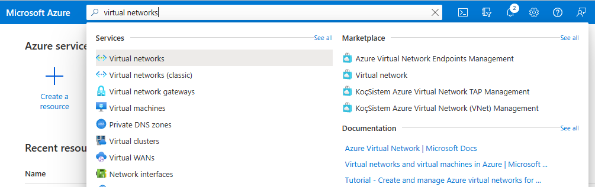
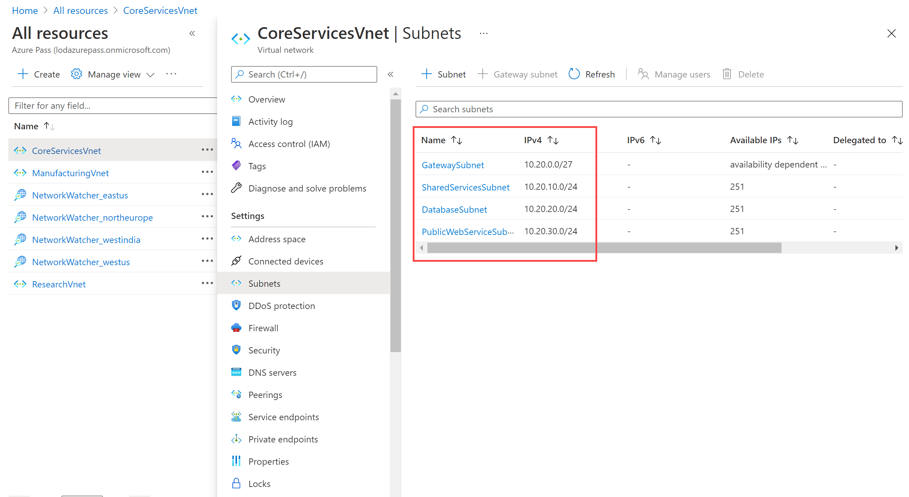

---
Exercise:
  title: M01 - Unidade 4 Projetar e implementar uma rede virtual no Azure
  module: Module 01 - Introduction to Azure Virtual Networks
---
# M01-Unidade 4 Projetar e implementar uma rede virtual no Azure

## Cenário do exercício 

Você já pode implantar redes virtuais no portal do Azure.

Considere a organização fictícia Contoso Ltd, que está em processo de migração da infraestrutura e de aplicativos para o Azure. Sua função de engenheiro de rede exige o planejamento e a implementação de três redes virtuais e sub-redes para dar suporte a recursos nessas redes virtuais.

**Observação:** há uma **[simulação interativa de laboratório](https://mslabs.cloudguides.com/guides/AZ-700%20Lab%20Simulation%20-%20Design%20and%20implement%20a%20virtual%20network%20in%20Azure)** disponível que permite que você clique neste laboratório no seu próprio ritmo. Você pode encontrar pequenas diferenças entre a simulação interativa e o laboratório hospedado, mas os principais conceitos e ideias que estão sendo demonstrados são os mesmos.

#### Tempo estimado: 20 minutos

A rede virtual **CoreServicesVnet** é implantada na região **Leste dos EUA**. A rede virtual terá o maior número de recursos. Ele terá conectividade com redes locais por meio de uma conexão VPN. Essa rede terá serviços Web, bancos de dados e outros sistemas que são fundamentais para as operações do negócio. Serviços compartilhados, como controladores de domínio e DNS, também estarão localizados aqui. Uma grande quantidade de crescimento está prevista, portanto, um espaço de endereços grande é necessário para essa rede virtual.

A rede virtual **ManufacturingVnet** é implantada na região **Oeste da Europa**, perto da localização das instalações de fabricação da sua organização. Essa rede virtual conterá sistemas para as operações das instalações de fabricação. A organização está prevendo um grande número de dispositivos conectados internamente dos quais seus sistemas poderão recuperar dados (tais como a temperatura) e precisarão de um espaço de endereços IP no qual eles possam expandir.

A rede virtual **ResearchVnet** é implantada na região **Sudeste da Ásia**, perto da localização da equipe de pesquisa e desenvolvimento da organização. A equipe de pesquisa e desenvolvimento usa essa rede virtual. A equipe tem um conjunto pequeno e estável de recursos, para o qual não há expectativa de crescimento. A equipe precisa de um pequeno número de endereços IP para algumas máquinas virtuais usadas no trabalho que fazem.

Você criará os seguintes recursos:
 

| **Rede Virtual** | **Região**   | **Espaço de endereço da rede virtual** | **Sub-rede**                | **Sub-rede**    |
| ------------------- | ------------ | --------------------------------- | ------------------------- | ------------- |
| CoreServicesVnet    | Leste dos EUA      | 10.20.0.0/16                      |                           |               |
|                     |              |                                   | GatewaySubnet             | 10.20.0.0/27  |
|                     |              |                                   | SharedServicesSubnet      | 10.20.10.0/24 |
|                     |              |                                   | DatabaseSubnet            | 10.20.20.0/24 |
|                     |              |                                   | PublicWebServiceSubnet    | 10.20.30.0/24 |
| ManufacturingVnet   | Europa Ocidental  | 10.30.0.0/16                      |                           |               |
|                     |              |                                   | ManufacturingSystemSubnet | 10.30.10.0/24 |
|                     |              |                                   | SensorSubnet1             | 10.30.20.0/24 |
|                     |              |                                   | SensorSubnet2             | 10.30.21.0/24 |
|                     |              |                                   | SensorSubnet3             | 10.30.22.0/24 |
| ResearchVnet        |Sudeste Asiático| 10.40.0.0/16                      |                           |               |
|                     |              |                                   | ResearchSystemSubnet      | 10.40.0.0/24  |

Essas redes virtuais e sub-redes são estruturadas de um modo que acomoda os recursos existentes, embora ainda permita o crescimento projetado. Vamos criar essas redes virtuais e sub-redes para estabelecer a base para nossa infraestrutura de rede.

Neste exercício, você vai:

+ Tarefa 1: criar o grupo de recursos da Contoso
+ Tarefa 2: criar a rede virtual CoreServicesVnet e as sub-redes
+ Tarefa 3: criar a rede virtual ManufacturingVnet e as sub-redes
+ Tarefa 4: criar a rede virtual ResearchVnet e as sub-redes
+ Tarefa 5: verificar a criação de VNets e sub-redes

## Tarefa 1: criar o grupo de recursos da Contoso

1. Vá para o [portal do Azure](https://portal.azure.com/).

2. Na home page, em **Serviços do Azure**, escolha **Grupos de recurso**.  

3. No grupo de recursos, selecione **+ Criar**.

4. Use as informações da tabela abaixo para criar o grupo de recursos.

| **Tab**         | **Opção**                                 | **Valor**            |
| --------------- | ------------------------------------------ | -------------------- |
| Noções básicas          | Grupo de recursos                             | ContosoResourceGroup |
|                 | Region                                     | (EUA) Leste dos EUA         |
| Marcações            | Nenhuma alteração necessária                        |                      |
| Examinar + criar | Examine suas configurações e escolha **Criar** |                      |

5. Em Grupos de recursos, verifique se **ContosoResourceGroup** aparece na lista.

 

## Tarefa 2: criar a rede virtual CoreServicesVnet e as sub-redes

1. Na home page portal do Azure, navegue até a barra de pesquisa global e pesquise **Redes Virtuais** e selecione redes virtuais em serviços.  
2. Na página Redes virtuais, selecione **Criar**.  
3. Use as informações da tabela abaixo para criar a rede virtual CoreServicesVnet.  
   ‎Remover ou substituir o espaço de endereço IP padrão

 

| **Tab**      | **Opção**         | **Valor**            |
| ------------ | ------------------ | -------------------- |
| Noções básicas       | Grupo de recursos     | ContosoResourceGroup |
|              | Nome               | CoreServicesVnet     |
|              | Region             | (EUA) Leste dos EUA         |
| Endereços IP | Espaço de endereço IPv4 | 10.20.0.0/16         |

 4. Use as informações da tabela abaixo para criar a sub-redes de CoreServicesVnet.

 5. Para começar a criar cada sub-rede, escolha **+ Adicionar sub-rede**. Para terminar a criação de cada sub-rede, escolha **Adicionar**.

| **Sub-rede**             | **Opção**           | **Valor**              |
| ---------------------- | -------------------- | ---------------------- |
| GatewaySubnet          | Nome da sub-rede          | GatewaySubnet          |
|                        | Intervalo de endereços da sub-rede | 10.20.0.0/27           |
| SharedServicesSubnet   | Nome da sub-rede          | SharedServicesSubnet   |
|                        | Intervalo de endereços da sub-rede | 10.20.10.0/24          |
| DatabaseSubnet         | Nome da sub-rede          | DatabaseSubnet         |
|                        | Intervalo de endereços da sub-rede | 10.20.20.0/24          |
| PublicWebServiceSubnet | Nome da sub-rede          | PublicWebServiceSubnet |
|                        | Intervalo de endereços da sub-rede | 10.20.30.0/24          |

 6. Para concluir a criação da CoreServicesVnet e das sub-redes associadas, escolha **Revisar + criar**.

 7. Verifique se a configuração foi aprovada na validação e, depois, escolha **Criar**.
 
 8. Repita as oito primeiras etapas para cada VNet com base nas tabelas abaixo  

## Tarefa 3: criar a rede virtual ManufacturingVnet e as sub-redes

| **Tab**      | **Opção**         | **Valor**             |
| ------------ | ------------------ | --------------------- |
| Noções básicas       | Grupo de recursos     | ContosoResourceGroup  |
|              | Nome               | ManufacturingVnet     |
|              | Region             | (Europa) Oeste da Europa  |
| Endereços IP | Espaço de endereço IPv4 | 10.30.0.0/16          |

| **Sub-rede**                | **Opção**           | **Valor**                 |
| ------------------------- | -------------------- | ------------------------- |
| ManufacturingSystemSubnet | Nome da sub-rede          | ManufacturingSystemSubnet |
|                           | Intervalo de endereços da sub-rede | 10.30.10.0/24             |
| SensorSubnet1             | Nome da sub-rede          | SensorSubnet1             |
|                           | Intervalo de endereços da sub-rede | 10.30.20.0/24             |
| SensorSubnet2             | Nome da sub-rede          | SensorSubnet2             |
|                           | Intervalo de endereços da sub-rede | 10.30.21.0/24             |
| SensorSubnet3             | Nome da sub-rede          | SensorSubnet3             |
|                           | Intervalo de endereços da sub-rede | 10.30.22.0/24             |
 

## Tarefa 4: criar a rede virtual ResearchVnet e as sub-redes

| **Tab**      | **Opção**         | **Valor**            |
| ------------ | ------------------ | -------------------- |
| Noções básicas       | Grupo de recursos     | ContosoResourceGroup |
|              | Nome               | ResearchVnet         |
|              | Region             | Sudeste Asiático       |
| Endereços IP | Espaço de endereço IPv4 | 10.40.0.0/16         |

| **Sub-rede**           | **Opção**           | **Valor**            |
| -------------------- | -------------------- | -------------------- |
| ResearchSystemSubnet | Nome da sub-rede          | ResearchSystemSubnet |
|                      | Intervalo de endereços da sub-rede | 10.40.0.0/24         |
 

## Tarefa 5: verificar a criação de VNets e sub-redes

1. Na home page do portal do Azure, selecione **Todos os recursos**.

2. Verifique se CoreServicesVnet, ManufacturingVnet e ResearchVnet estão listadas.

3 Selecione **CoreServicesVnet**. 

4. Em CoreServicesVnet, em **Configurações**, escolha **Sub-redes**.

5. Em CoreServicesVnet | Sub-redes, verifique se as sub-redes que você criou estão listadas e se os intervalos de endereços IP estão corretos.

   

6. Repita as etapas 3 a 5 para cada VNet.

Parabéns! Você criou um grupo de recursos, três VNets e sub-redes associadas. 
