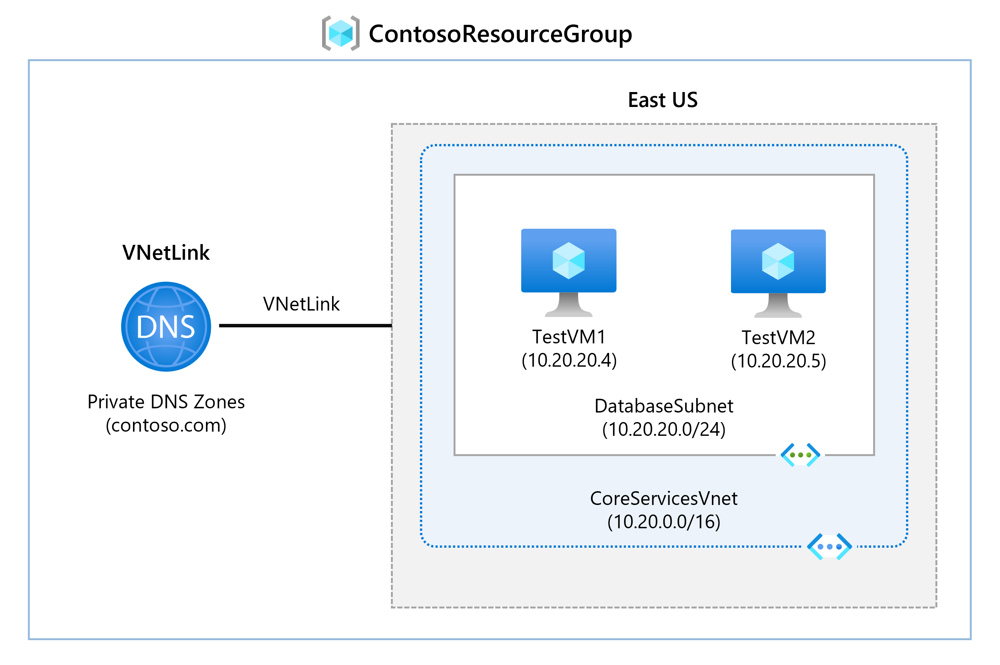

---
Exercise:
  title: M01 - Unidade 6 Definir configurações de DNS no Azure
  module: Module 01 - Introduction to Azure Virtual Networks
---

# M01 - Unidade 6 Definir configurações de DNS no Azure

## Cenário do exercício

Nesta unidade, você configurará a resolução de nomes DNS para Contoso Ltd. Você criará uma zona DNS privada chamada contoso.com, vinculará as VNets para registro e resolução e, depois, criará duas máquinas virtuais e testará a configuração.



### Habilidades de trabalho
Neste exercício, você vai:

+ Tarefa 1: criar uma zona DNS privada
+ Tarefa 2: vincular a sub-rede para registro automático
+ Tarefa 3: criar máquinas virtuais para testar a configuração
+ Tarefa 4: verificar se os registros estão presentes na zona DNS

### Simulações interativas de laboratório

>**Observação**: as simulações de laboratório fornecidas anteriormente foram desativadas.

### Tempo estimado: 25 minutos

**Importante:** este exercício requer uma rede virtual do laboratório anterior. Ela pode ser instalada usando um arquivo de [modelo](https://github.com/MicrosoftLearning/AZ-700-Designing-and-Implementing-Microsoft-Azure-Networking-Solutions/tree/master/Allfiles/Exercises/M01/template.json). Todas as redes virtuais serão instaladas, mas apenas a CoreServicesVNet é necessária. 

## Tarefa 1: criar uma zona DNS privada

1. Vá para [Portal do Azure](https://portal.azure.com/).

1. Na home page do Azure, na barra de pesquisa, insira o DNS e selecione **Zonas DNS privadas**.  
   

1. Nas zonas DNS privadas, escolha **+ Criar**.

1. Use as informações da tabela abaixo para criar a zona DNS privada.

    | **Tab**         | **Opção**                             | **Valor**            |
    | --------------- | -------------------------------------- | -------------------- |
    | Noções básicas          | Grupo de recursos (crie um novo se necessário) | `ContosoResourceGroup` |
    |                 | Nome                                   | `Contoso.com`          |
    | Examinar + criar | Examine suas configurações e escolha Criar |                      |

1. Aguarde a conclusão da implantação e, então, escolha **Ir para o recurso**.

1. Verifique se a zona foi criada.

## Tarefa 2: vincular a sub-rede para registro automático

1. Em Contoso.com, em **Gerenciamento de DNS**, escolha **Links de rede virtual**.

1. Em Contoso.com \| Links de rede virtual, selecione **+ Adicionar**.

    

1. Use as informações da tabela abaixo para adicionar o link de rede virtual.

    | **Opção**                          | **Valor**                               |
    | ----------------------------------- | --------------------------------------- |
    | Nome do link                           | `CoreServicesVnetLink`                   |
    | Assinatura                        | Nenhuma alteração necessária                     |
    | Rede Virtual                     | CoreServicesVnet (ContosoResourceGroup) |
    | Habilitar o registro automático            | Selecionadas                                |
    | Examine suas configurações e escolha OK. |                                         |

1. Selecione **Atualizar**.

1. Verifique se CoreServicesVnetLink foi criada e se o registro automático está habilitado.

## Tarefa 3: criar máquinas virtuais para testar a configuração

Nesta seção, você criará duas VMs de teste para testar a configuração da zona DNS privada.

1. No portal do Azure, clique no ícone do Cloud Shell (canto superior direito). Se necessário, configure o shell.  
    + Selecione **PowerShell**.
    + Selecione **Nenhuma Conta de Armazenamento necessária** e sua **Assinatura** e, em seguida, selecione **Aplicar**.
    + Aguarde até que o terminal seja criado e um prompt seja exibido. 

1. Na barra de ferramentas do painel do Cloud Shell, clique no ícone **Gerenciar arquivos**. No menu suspenso, clique em **Upload** e faça ulpload dos arquivos de modelo:**azuredeploy.json** e **azuredeploy.parameters.json**.

   >**Observação:** se você estiver trabalhando em sua própria assinatura, os [arquivos de modelo](https://github.com/MicrosoftLearning/AZ-700-Designing-and-Implementing-Microsoft-Azure-Networking-Solutions/tree/master/Allfiles/Exercises) estarão disponíveis no repositório do laboratório do GitHub.
   
1. Implante os seguintes modelos do ARM para criar as VMs necessárias para este exercício:

   >**Observação**: você será solicitado a fornecer uma senha de Administrador. Você precisará dessa senha em uma etapa posterior. 

   ```powershell
   $RGName = "ContosoResourceGroup"
   
   New-AzResourceGroupDeployment -ResourceGroupName $RGName -TemplateFile azuredeploy.json -TemplateParameterFile azuredeploy.parameters.json
   ```
  
1. Após a conclusão da implantação, acesse a home page do portal do Azure e, depois, escolha **Máquinas Virtuais**.

1. Verifique se as duas máquinas virtuais foram criadas.

## Tarefa 4: verificar se os registros estão presentes na zona DNS

1. Na página inicial do Portal do Azure, selecione **Zonas DNS privadas**.

1. Nas zonas DNS privadas, escolha **contoso.com**.

1. Verifique se os registros de host (A) estão listados para as duas VMs, conforme mostrado:

    

1. Anote os nomes e os endereços IP das VMs.

### Conectar-se a uma VM para testar a resolução de nomes

1. Na página inicial do Portal do Azure, selecione **Máquinas Virtuais**.

1. Escolha **TestVM1**.

1. Em TestVM1, selecione**Conectar &gt; Conectar** e baixe o arquivo RDP. Confirme o download do arquivo.

1. Localize o arquivo RDP e clique duas vezes para executá-lo.

1. Selecione **Conectar** e informe a senha **TestUser** fornecida durante a implantação do modelo.

1. Clique em **OK** e, em seguida, em **Sim** na página de aviso.

1. Em TestVM1, abra um prompt de comando e insira o comando `ipconfig /all`.

1. O endereço IP é o mesmo da zona DNS.

1. Digite o comando `ping TestVM2.contoso.com`. Esse comando atingirá o tempo limite por causa do Firewall do Windows habilitado nas VMs.

1. Em vez disso, use o comando `nslookup TestVM2.contoso.com` para verificar se você recebe um registro de resolução de nomes para VM2. Isso demonstra a resolução de nomes de zonas privadas. 

## Estender seu aprendizado com o Copilot

O Copilot pode ajudar você a aprender a usar as ferramentas de script do Azure. O Copilot também pode ajudar em áreas não cobertas no laboratório ou onde você precisar de mais informações. Abra um navegador do Edge e escolha Copilot (canto superior direito) ou navegue até *copilot.microsoft.com*. Reserve alguns minutos para experimentar essas solicitações.
+ Qual é a diferença entre o DNS do Azure e o DNS Privado do Azure? Forneça exemplos de quando usar o DNS privado do Azure.
+ Qual é a finalidade do registro automático ao criar uma zona DNS do Azure?

## Saiba mais com treinamento individual

+ [Introdução ao DNS do Azure](https://learn.microsoft.com/training/modules/intro-to-azure-dns/). Este módulo explica o que o DNS do Azure faz, como ele funciona e quando você deve optar por usar o DNS do Azure como uma solução para atender às necessidades da sua organização.
+ [Hospede seu domínio no DNS do Azure](https://learn.microsoft.com/training/modules/host-domain-azure-dns/). Neste módulo, você criará uma zona DNS e registros DNS para mapear o domínio em um endereço IP. Você também testará para garantir que o nome de domínio resolve para o seu servidor Web.

## Principais aspectos a serem lembrados

Parabéns por concluir o laboratório. Aqui estão as principais lições desse laboratório. 

+ O DNS do Azure é um serviço de nuvem que permite hospedar e gerenciar domínios DNS (sistema de nomes de domínio), também conhecidos como zonas DNS. 
+ As zonas públicas do DNS do Azure hospedam dados de zona de nome de domínio para registros que você pretende que sejam resolvidos por qualquer host na Internet.
+ As zonas DNS privadas do Azure permitem que você configure um namespace de zona DNS privada para recursos privados do Azure.
+ Uma zona DNS é uma coleção de registros DNS. Registros DNS fornecem informações sobre o domínio.
