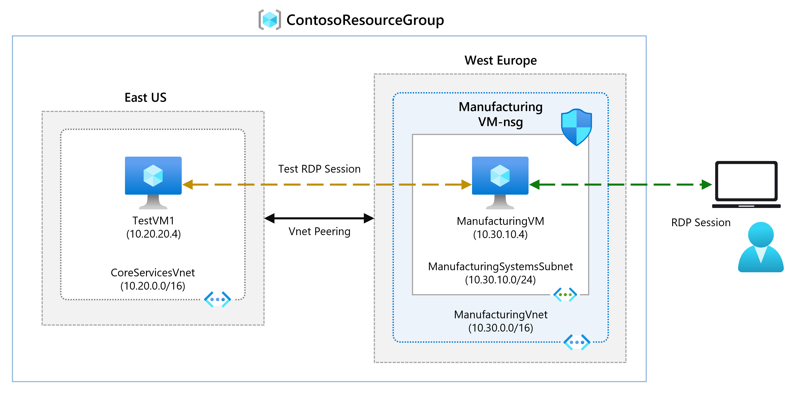

---
Exercise:
  title: M01 - Unidade 8 Cconectar duas redes virtuais do Azure usando o emparelhamento de rede virtual global
  module: Module 01 - Introduction to Azure Virtual Networks
---
# M01-Unidade 8 Conectar duas redes virtuais do Azure usando o emparelhamento de rede virtual global

## Cenário do exercício 
Nesta unidade, você configurará a conectividade entre a CoreServicesVnet e a ManufacturingVnet adicionando emparelhamentos a fim de permitir o fluxo de tráfego. 



Nesta unidade, você vai:

+ Tarefa 1: criar uma máquina virtual para testar a configuração
+ Tarefa 2: conectar-se às VMs de teste usando RDP
+ Tarefa 3: testar a conexão entre as VMs
+ Tarefa 4: criar emparelhamentos de VNet entre a CoreServicesVnet e a ManufacturingVnet
+ Tarefa 5: testar a conexão entre as VMs
+ Tarefa 6: limpar os recursos

**Observação:** há uma **[simulação interativa de laboratório](https://mslabs.cloudguides.com/guides/AZ-700%20Lab%20Simulation%20-%20Connect%20two%20Azure%20virtual%20networks%20using%20global%20virtual%20network%20peering)** disponível que permite que você clique neste laboratório no seu próprio ritmo. Você pode encontrar pequenas diferenças entre a simulação interativa e o laboratório hospedado, mas os principais conceitos e ideias que estão sendo demonstrados são os mesmos.

#### Tempo estimado: 20 minutos

## Tarefa 1: criar uma máquina virtual para testar a configuração

Nesta seção, você criará uma VM de teste na VNet de Fabricação para testar se pode acessar recursos dentro de outra rede virtual do Azure em sua ManufacturingVnet.

### Criar ManufacturingVM

1. No portal do Azure, abra a sessão **PowerShell** no painel do **Cloud Shell**.
  > **Observação:** se esta for a primeira vez que o Cloud Shell é aberto, você será solicitado a criar uma conta de armazenamento. Selecione **Criar armazenamento**.

1. Na barra de ferramentas do painel do Cloud Shell, selecione o ícone **Carregar/baixar arquivos**, no menu suspenso, selecione **Carregar** e carregue os seguintes arquivos **ManufacturingVMazuredeploy.json** e **ManufacturingVMazuredeploy.parameters.json**, um a um, da pasta de origem **F:\Allfiles\Exercises\M01** para o diretório base do Cloud Shell.

1. Implante os seguintes modelos do ARM para criar as VMs necessárias para este exercício:

   >**Observação**: você será solicitado a fornecer uma senha de Administrador.

   ```powershell
   $RGName = "ContosoResourceGroup"
   
   New-AzResourceGroupDeployment -ResourceGroupName $RGName -TemplateFile ManufacturingVMazuredeploy.json -TemplateParameterFile ManufacturingVMazuredeploy.parameters.json
   ```
  
1. Após a conclusão da implantação, acesse a home page do portal do Azure e, depois, escolha **Máquinas Virtuais**.

1. Verifique se a máquina virtual foi criada.

## Tarefa 2: conectar-se às VMs de teste usando RDP

1. Na página inicial do Portal do Azure, selecione **Máquinas Virtuais**.

1. Escolha **ManufacturingVM**.

1. Em ManufacturingVM, escolha **Conectar &gt; RDP**.

1. Em ManufacturingVM | Conectar, selecione **Baixar arquivo RDP**.

1. Salve o arquivo RDP em sua área de trabalho.

1. Conecte-se a ManufacturingVM usando o arquivo RDP e o nome de usuário **TestUser** e a senha fornecida durante a implantação.

1. Na página inicial do Portal do Azure, selecione **Máquinas Virtuais**.

1. Escolha **TestVM1**.

1. Em TestVM1, selecione **Conectar &gt; RDP**.

1. Em TestVM1 | Conectar, selecione **Baixar arquivo RDP**.

1. Salve o arquivo RDP em sua área de trabalho.

1. Conecte-se à TestVM1 usando o arquivo RDP e o nome de usuário **TestUser** e a senha fornecida durante a implantação.

1. Nas duas VMs, em **Escolher configurações de privacidade para seu dispositivo**, escolha **Aceitar**.

1. Em ambas as VMs, em **Redes**, selecione **Sim**.

1. Na TestVM1, abra um prompt do PowerShell e execute o comando a seguir: ipconfig

1. Endereço IPv4 inválido. 

 

## Tarefa 3: testar a conexão entre as VMs

1. Na ManufacturingVM, abra um prompt do PowerShell.

1. Use o comando a seguir para verificar se não há conexão com TestVM1 em CoreServicesVnet. Use o endereço IPv4 para TestVM1.

   ```powershell
    Test-NetConnection 10.20.20.4 -port 3389
    ```


1. A conexão de teste deve falhar, e você verá um resultado semelhante ao seguinte: 

 

## Tarefa 4: criar emparelhamentos de VNet entre a CoreServicesVnet e a ManufacturingVnet

1. No home page do Azure, escolha **Redes Virtuais** e, depois, escolha **CoreServicesVnet**.

1. Em CoreServicesVnet, em **Configurações**, escolha **Emparelhamentos**.
   

1. Em CoreServicesVnet | Emparelhamentos, escolha **+ Adicionar**.

1. Use as informações da tabela abaixo para criar o emparelhamento.

| **Seção**                          | **Opção**                                    | **Valor**                             |
| ------------------------------------ | --------------------------------------------- | ------------------------------------- |
| Esta rede virtual                 |                                               |                                       |
|                                      | Nome do link de emparelhamento                             | CoreServicesVnet-to-ManufacturingVnet |
|                                      | Tráfego para a rede virtual remota             | Permitir (padrão)                       |
|                                      | Tráfego encaminhado da rede virtual remota | Permitir (padrão)                       |
|                                      | Gateway de rede virtual ou Servidor de Rota       | Nenhum (padrão)                        |
| Rede virtual remota               |                                               |                                       |
|                                      | Nome do link de emparelhamento                             | ManufacturingVnet-to-CoreServicesVnet |
|                                      | Modelo de implantação de rede virtual              | Gerenciador de recursos                      |
|                                      | Conheço minha ID do recurso                         | Não selecionado                          |
|                                      | Assinatura                                  | Selecione a assinatura fornecida      |
|                                      | Rede virtual                               | ManufacturingVnet                     |
|                                      | Tráfego para a rede virtual remota             | Permitir (padrão)                       |
|                                      | Tráfego encaminhado da rede virtual remota | Permitir (padrão)                       |
|                                      | Gateway de rede virtual ou Servidor de Rota       | Nenhum (padrão)                        |
| Examine suas configurações e escolha Adicionar. |                                               |                                       |
|                                      |                                               |                                       |

 >**Observação**: se você não tiver uma "Assinatura MOC", use a assinatura que você usou anteriormente. É só um nome.

1. Em CoreServicesVnet | Emparelhamentos, verifique se o emparelhamento **CoreServicesVnet-to-ManufacturingVnet** está listado.

1. Em Redes virtuais, escolha **ManufacturingVnet** e verifique se o emparelhamento **ManufacturingVnet-to-CoreServicesVnet** está listado.

 

## Tarefa 5: testar a conexão entre as VMs

1. Na ManufacturingVM, abra um prompt do PowerShell.

1. Use o comando a seguir para verificar se já há conexão com TestVM1 em CoreServicesVnet. 

   ```powershell
    Test-NetConnection 10.20.20.4 -port 3389
    ```


1. A conexão de teste deve ter êxito, e você verá um resultado semelhante ao seguinte: 

 

Parabéns! Você configurou a conectividade entre VNets adicionando emparelhamentos. 

## Tarefa 6: limpar os recursos

   >**Observação**: lembre-se de remover todos os recursos do Azure recém-criados que você não usa mais. Remover recursos não utilizados garante que você não veja encargos inesperados.

1. No portal do Azure, abra a sessão **PowerShell** no painel do **Cloud Shell**. (Crie armazenamento do Cloud Shell, se necessário, usando as configurações padrão.)

1. Exclua todos os grupos de recursos criados em todos os laboratórios deste módulo executando o seguinte comando:

   ```powershell
   Remove-AzResourceGroup -Name 'ContosoResourceGroup' -Force -AsJob
   ```

    >**Observação**: o comando é executado de modo assíncrono (conforme determinado pelo parâmetro -AsJob), portanto, embora você possa executar outro comando do PowerShell imediatamente depois na mesma sessão do PowerShell, levará alguns minutos antes de os grupos de recursos serem de fato removidos.
