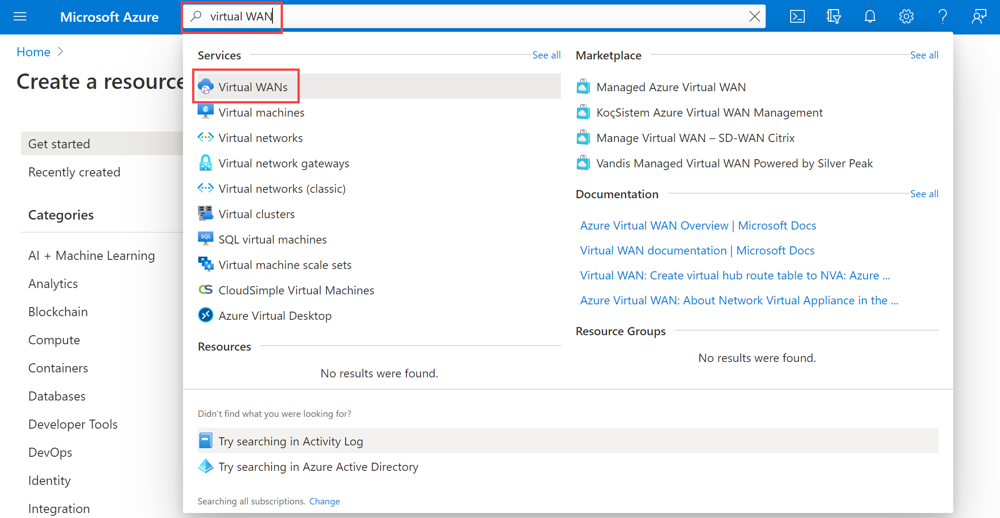

---
Exercise:
  title: M02 - Unidade 7 Criar uma WAN Virtual usando o Portal do Azure
  module: Module 02 - Design and implement hybrid networking
---

# M02-Unidade 7 Criar uma WAN Virtual usando o Portal do Azure

## Cenário do exercício

Neste exercício, você vai criar uma WAN Virtual para a Contoso.


Neste exercício, você vai:

+ Tarefa 1: Criar uma WAN Virtual
+ Tarefa 2: criar um hub usando o Portal do Azure
+ Tarefa 3: conectar uma VNet ao Hub Virtual
+ Tarefa 4: limpar recursos

**Observação:** há uma **[simulação interativa de laboratório](https://mslabs.cloudguides.com/guides/AZ-700%20Lab%20Simulation%20-%20Create%20a%20virtual%20WAN%20using%20the%20Azure%20portal)** disponível que permite que você clique neste laboratório no seu próprio ritmo. Você pode encontrar pequenas diferenças entre a simulação interativa e o laboratório hospedado, mas os principais conceitos e ideias que estão sendo demonstrados são os mesmos.

### Tempo estimado: 65 minutos (incluindo ~45 minutos de tempo de espera de implantação)

## Tarefa 1: Criar uma WAN Virtual

1. Em um navegador, acesse o portal do Azure e entre com sua conta do Azure.

1. No portal, digite WAN Virtual na caixa de pesquisa e selecione **WANs Virtuais** na lista de resultados.

   

1. Na página WAN Virtual, selecione + **Criar**.

1. Na página Criar WAN, na guia **Básico**, preencha os seguintes campos:

   + **Assinatura:** usar a assinatura existente

   + **Grupo de recursos:** ContosoResourceGroup

   + **Localização do grupo de recursos:** escolha uma localização de recurso na lista suspensa. Uma WAN é um recurso global e não pode residir em uma região específica. No entanto, você deve selecionar uma região para gerenciar e localizar o recurso de WAN criado.

   + **Nome:** ContosoVirtualWAN

   + **Tipo:** Standard

1. Ao terminar de preencher os campos, selecione **Examinar + Criar**.

1. Depois que a validação for aprovada, selecione **Criar** para criar a WAN Virtual.

## Tarefa 2: criar um hub usando o Portal do Azure

Um hub contém gateways para funcionalidade site a site, ExpressRoute ou ponto a site. Leva 30 minutos para criar o gateway de VPN site a site no hub virtual. Você deve criar uma WAN Virtual para criar um hub.

1. Localize o WAN Virtual que você criou.
1. Na página WAN Virtual, em **Conectividade**, selecione **Hubs**.
1. Na página Hubs, selecione **+Novo Hub** para abrir a página Criar hub virtual.
   
1. Na página Criar Hub Virtual, na guia **Básico**, preencha os seguintes campos:
   + **Região**: Oeste dos EUA
   + **Nome:** ContosoVirtualWANHub-WestUS
   + **Espaço de endereço privado do hub:** 10.60.0.0/24
   + **Capacidade do hub virtual:** duas unidades de infraestrutura de roteamento
   + **Preferência de roteamento do hub:** deixe o padrão
1. Selecione **Avançar: Site a site**.
1. Na guia **Site a site**, preencha os seguintes campos:
   + **Você deseja criar um site a site (gateway de VPN)?:** Sim
   + O campo de **Número do AS** não pode ser editado.
   + **Unidades de escala de gateway:** 1 unidade de escala = 500 Mbps x 2
   + **Preferência de roteamento:** deixe o padrão
1. Selecione **Examinar + Criar** para validar.
1. Selecione **Criar** para criar o hub.
1. Depois de 30 minutos, **Atualize** para exibir o hub na página Hubs.

## Tarefa 3: conectar uma VNet ao Hub Virtual

1. Localize o WAN Virtual que você criou.

1. Em ContosoVirtualWAN, em **Conectividade**, selecione **Conexões de rede virtual**.

   

1. Em ContosoVirtualWAN | Conexões de rede virtual, selecione **+ Adicionar conexão**.

1. Em Adicionar conexão, use as informações a seguir para criar a conexão.

   + **Nome da conexão:** ContosoVirtualWAN-to-ResearchVNet

   + **Hubs:** ContosoVirtualWANHub-WestUS

   + **Assinatura:** sem alterações

   + **Grupo de Recursos:** ContosoResourceGroup

   + **Rede virtual:** ResearchVNet

   + **Propagar para nenhum:** sim

   + **Associar tabela de rotas:** padrão

1. Selecione **Criar**.

Parabéns! Você criou uma WAN Virtual e um Hub de WAN Virtual e conectou a ResearchVNet ao hub.

## Tarefa 4: limpar recursos

   >**Observação**: lembre-se de remover todos os recursos do Azure recém-criados que você não usa mais. Remover recursos não utilizados garante que você não veja encargos inesperados.

1. No portal do Azure, abra a sessão **PowerShell** no painel do **Cloud Shell**.

1. Exclua todos os grupos de recursos criados em todos os laboratórios deste módulo executando o seguinte comando:

   ```powershell
   Remove-AzResourceGroup -Name 'ContosoResourceGroup' -Force -AsJob
   ```

    >**Observação**: o comando é executado de modo assíncrono (conforme determinado pelo parâmetro -AsJob), portanto, embora você possa executar outro comando do PowerShell imediatamente depois na mesma sessão do PowerShell, levará alguns minutos antes de os grupos de recursos serem de fato removidos.
