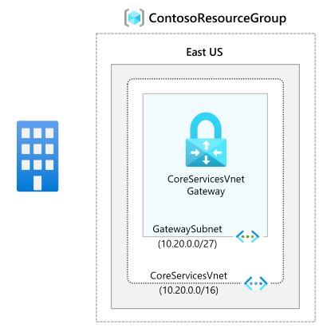

---
Exercise:
  title: "M03 - Unidade 4 Configurar um Gateway\_do ExpressRoute"
  module: Module 03 - Design and implement Azure ExpressRoute
---
# M03-Unidade 4 Configurar um Gateway do ExpressRoute

## Cenário do exercício

Para conectar sua rede virtual do Azure e sua rede local por ExpressRoute, você deve primeiro criar um gateway de rede virtual. Um gateway de rede virtual tem duas finalidades: trocar rotas de IP entre as redes e rotear o tráfego da rede.

### Simulações interativas de laboratório

>**Observação**: as simulações de laboratório fornecidas anteriormente foram desativadas.

### Tempo estimado: 60 minutos (inclui ~45 minutos de tempo de espera de implantação)

**Tipos de gateway**

Quando você cria um gateway de rede virtual, precisa especificar várias configurações. Uma das configurações necessárias, '-GatewayType', especifica se o gateway é usado para tráfego de VPN ou ExpressRoute. Os dois tipos de gateway são:

- **VPN** – para enviar tráfego criptografado pela Internet pública, use o tipo de gateway "VPN". Isso também é chamado de gateway de VPN. As conexões Site a Site, Ponto a Site e VNet a VNet usam um gateway VPN.
- **ExpressRoute** - Para enviar tráfego em uma conexão privada, use o tipo de gateway 'ExpressRoute'. Isso também é chamado de gateway ExpressRoute e é o tipo de gateway usado na configuração do ExpressRoute.

Cada rede virtual pode ter apenas um gateway de rede virtual por tipo de gateway. Por exemplo, você pode ter um gateway de rede virtual que usa -GatewayType VPN e outro que usa -GatewayType ExpressRoute.

### Habilidades de trabalho

Neste exercício, você vai:

- Tarefa 1: criar a VNet e a sub-rede de gateway
- Tarefa 2: criar o gateway de rede virtual

## Tarefa 1: criar a VNet e a sub-rede de gateway

1. Em qualquer página do Portal do Azure, em **Pesquisar recursos, serviços e documentos**, insira rede virtual e selecione **Redes virtuais** nos resultados.

1. Na página Redes virtuais, selecione **+Criar**.

1. No painel Criar redes virtuais, na guia **Noções básicas,** use as informações na seguinte tabela para criar a VNet:

   | **Configuração**          | **Valor**                        |
   | -------------------- | -------------------------------- |
   | Nome da VNET | CoreServicesVNet                 |
   | Grupo de Recursos       | ContosoResourceGroup             |
   | Localização             | Leste dos EUA                          |

1. Selecione **Avançar: endereços IP**.

1. Na guia **Endereços IP**, no **Espaço de endereço IPv4**, insira 10.20.0.0/16 e selecione **+ Adicionar sub-rede**.

1. No painel Adicionar sub-rede, use as informações na seguinte tabela para criar a sub-rede:

   | **Configuração**                  | **Valor**               |
   | ---------------------------- | ----------------------- |
   | Finalidade da sub-rede               | Gateway de Rede Virtual |
   | Espaço de endereço da sub-rede do gateway | 10.20.0.0/27            |

O nome da sub-rede será preenchido automaticamente.

1. Então selecione **Adicionar**.

1. Na página Criar rede virtual, selecione **Examinar + Criar**.

   

1. Confirme se a VNet é aprovada na validação e selecione **Criar**.

   >**Observação:** se você estiver usando uma rede virtual de pilha dupla e planeja usar o emparelhamento privado baseado em IPv6 por meio do ExpressRoute, clique em Adicionar espaço de endereço IPv6 e insira os valores de intervalo de endereços IPv6.

## Tarefa 2: criar o gateway de rede virtual

1. Em qualquer página do Portal do Azure, em **Pesquisar recursos, serviços e documentos (G+/)**, insira gateway de rede virtual e selecione **Gateways de rede virtual** nos resultados.

1. Na página Gateways de rede virtual, selecione **+Criar**.

1. Na página **Criar gateway de rede virtual**, use as informações na seguinte tabela para criar o gateway:

   | **Configuração**               | **Valor**                  |
   | ------------------------- | -------------------------- |
   | **Detalhes do projeto**       |                            |
   | Grupo de recursos            | ContosoResourceGroup       |
   | **Detalhes da instância**      |                            |
   | Nome                      | CoreServicesVnetGateway    |
   | Região                    | Leste dos EUA                    |
   | Tipo de gateway              | ExpressRoute               |
   | SKU                       | Standard                   |
   | Rede virtual           | CoreServicesVNet           |
   | Sub-rede                    | GatewaySubnet              |
   
1. Selecione **Examinar + criar**.

1. Confirme se a configuração do Gateway é aprovada na validação e selecione **Criar**.

1. Depois que a implantação estiver concluída, selecione **Ir para o recurso**.

   >**Observação:** pode levar até 45 minutos para implantar um Gateway.

## Estender seu aprendizado com o Copilot

O Copilot pode ajudar você a aprender a usar as ferramentas de script do Azure. O Copilot também pode ajudar em áreas não cobertas no laboratório ou onde você precisar de mais informações. Abra um navegador do Edge e escolha Copilot (canto superior direito) ou navegue até *copilot.microsoft.com*. Reserve alguns minutos para experimentar essas solicitações.
+ Qual é a diferença entre o Azure ExpressRoute e a WAN Virtual? Você poderia usar as tecnologias juntas? Forneça exemplos.
+ O que devo considerar ao escolher entre um modelo de provedor do ExpressRoute e o ExpressRoute Direct?
+ Crie uma tabela que resuma o SKU do Azure ExpressRoute e seus recursos.

## Saiba mais com treinamento individual

+ [Introdução ao Azure ExpressRoute](https://learn.microsoft.com/training/modules/intro-to-azure-expressroute/). Neste módulo, você aprenderá o que é o Azure ExpressRoute e a funcionalidade que fornece.
+ [Projetar e implementar o ExpressRoute](https://learn.microsoft.com/training/modules/design-implement-azure-expressroute/). Neste módulo, você aprenderá a projetar e a implementar o Azure ExpressRoute, o Alcance Global do ExpressRoute e o ExpressRoute FastPath.

## Principais aspectos a serem lembrados

Parabéns por concluir o laboratório. Aqui estão as principais lições desse laboratório. 
+ O Azure ExpressRoute permite que uma organização conecte suas redes locais diretamente às nuvens do Microsoft Azure e do Microsoft 365. O Azure ExpressRoute usa uma conexão de alta largura de banda dedicada fornecida por um parceiro da Microsoft.
+ A Microsoft garante um mínimo de 99,95% de disponibilidade para conexões dedicadas do ExpressRoute. A conexão é privada e trafega por uma linha dedicada, terceiros não podem interceptar o tráfego.
+ Você pode criar uma conexão entre sua rede local e a nuvem da Microsoft de quatro maneiras diferentes, Colocalização do CloudExchange, Conexão de Ethernet Ponto a Ponto, Conexão de Qualquer para Qualquer (IPVPN) e ExpressRoute Direct.
+ Os recursos do ExpressRoute são determinados pelo SKU: Local, Standard e Premium. 

