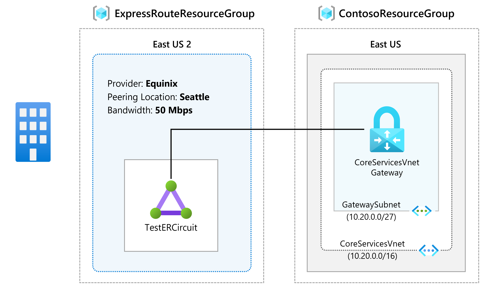
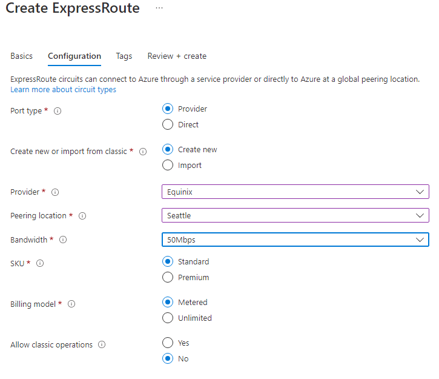
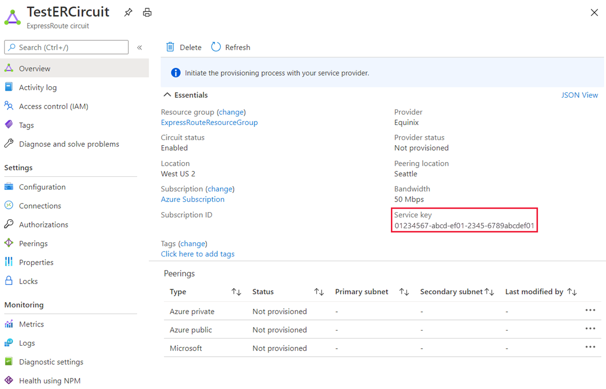

---
Exercise:
  title: M03 - Unidade 5 Provisionar um circuito do ExpressRoute
  module: Module 03 - Design and implement Azure ExpressRoute
---
# M03-Unidade 5 Provisionar um circuito do ExpressRoute

Neste exercício, você criará um circuito do ExpressRoute usando o portal do Azure e o modelo de implantação do Azure Resource Manager. 

**Observação:** há uma **[simulação interativa de laboratório](https://mslabs.cloudguides.com/guides/AZ-700%20Lab%20Simulation%20-%20Provision%20an%20ExpressRoute%20circuit)** disponível que permite que você clique neste laboratório no seu próprio ritmo. Você pode encontrar pequenas diferenças entre a simulação interativa e o laboratório hospedado, mas os principais conceitos e ideias que estão sendo demonstrados são os mesmos.

#### Tempo estimado: 15 minutos




Neste exercício, você vai:

+ Tarefa 1: criar e provisionar um circuito do ExpressRoute
+ Tarefa 2: recuperar sua chave de serviço
+ Tarefa 3: desprovisionar um circuito do ExpressRoute
+ Tarefa 4: limpar recursos


## Tarefa 1: criar e provisionar um circuito do ExpressRoute

 

1. Em um navegador, acesse o [Portal do Azure](https://portal.azure.com/) e entre com sua conta do Azure.

   > [!Important] 
   >
   > O circuito do ExpressRoute será cobrado a partir do momento em que uma chave de serviço for emitida. Execute esta operação quando o provedor de conectividade estiver pronto para provisionar o circuito.

1. No menu do portal do Azure, selecione **+ Criar um recurso**. Selecione **Rede** e **ExpressRoute**, conforme mostra a imagem a seguir. Se o ExpressRoute não aparecer na lista, use **Pesquisar no marketplace** para procurá-lo:

   

1. Na página **Criar ExpressRoute**, forneça o **Grupo de Recursos**, a **Região** e o **Nome** para o circuito com o seguinte: ExpressRouteResourceGroup, Leste dos EUA 2, TestERCircuit. Então selecione **Avançar: Configuração &gt;**.

1. Ao preencher os valores nesta página, neste exemplo, certifique-se de especificar a camada de SKU (**Padrão**) o modelo de cobrança de medição de dados, (**Limitado**) o Provedor (**Equinix**) o local de emparelhamento (**Seattle**) e a Largura de Banda (**50 Mbps**) com os valores corretos).

1. Selecione **Examinar + criar**.

1. Confirme se a configuração do ExpressRoute é aprovada na validação e selecione **Criar**.




 

- O Tipo de Porta determina se você está se conectando a um provedor de serviços ou diretamente à rede global da Microsoft em uma localização de emparelhamento.
- Criar ou importar do clássico determina se um circuito está sendo criado ou se você está migrando um circuito clássico para o Azure Resource Manager.
- Provedor é o provedor de serviços de Internet de quem você solicitará o serviço.
- Local de Emparelhamento é o local físico em que você está realizando o emparelhamento com a Microsoft.

> [!Important]
>
> O Local de Emparelhamento indica o [local físico](https://docs.microsoft.com/en-us/azure/expressroute/expressroute-locations) em que você está realizando o emparelhamento com a Microsoft. Isso não tem vínculo à propriedade "Local", que se refere à posição geográfica na qual o Provedor de Recursos de Rede do Azure está localizado. Embora eles não estejam relacionados, é uma boa prática escolher um provedor de recursos de rede geograficamente próximo do Local de Emparelhamento do circuito.

- **SKU** determina se um complemento Local, Standard ou Premium do ExpressRoute está habilitado. Você pode especificar **Local** para obter o SKU local, **Standard** para obter o SKU Standard ou **Premium** para obter o complemento premium. Você pode alterar o SKU para habilitar o complemento premium.

> [!Important]
>
> Não é possível alterar o SKU de Standard/Premium para Local.

- O **Modelo de cobrança** determina o tipo de cobrança. Você pode especificar **Limitado** para um plano de dados limitado e **Ilimitado** para um plano de dados ilimitado. Você pode alterar o tipo de cobrança de **Limitada** para **Ilimitada**.

> [!Important]
>
> Você não pode alterar o tipo de Ilimitada para Limitada.

- **Permitir operação clássica** permitirá que redes virtuais clássicas sejam vinculadas ao circuito.

## Tarefa 2: recuperar sua chave de serviço
 

1. Você pode ver todos os circuitos criados selecionando **Todos os serviços &gt; Rede &gt; Circuitos do ExpressRoute**.

   

1. Todos os circuitos do ExpressRoute criados na assinatura serão mostrados aqui. 

   

1. A página Circuito exibe as propriedades do circuito. A chave de serviço é exibida no campo Chave de serviço. O provedor de serviços precisará da chave de serviço para concluir o processo de provisionamento. A chave de serviço é específica para o circuito. **Você deve enviar a chave de serviço para seu provedor de conectividade para provisionamento.**

   

1. Nessa página, **Status do provedor** fornece o estado atual de provisionamento no lado do provedor de serviços. **Status de circuito** fornece o estado no lado da Microsoft. 

1. Quando você cria um novo circuito do ExpressRoute, ele está no seguinte estado:

   - Status do provedor: não provisionado
   - Status do circuito: habilitado


   - O circuito assumirá o seguinte estado quando o provedor de conectividade estiver habilitando-o para você:
     - Status do provedor: provisionando
     - Status do circuito: habilitado
   - Para usar o circuito do ExpressRoute, ele precisa estar no seguinte estado:
     - Status do provedor: provisionado
     - Status do circuito: habilitado
   - Verifique periodicamente o status do provisionamento e o estado do status do circuito.


 

Parabéns! Você criou um circuito do ExpressRoute e localizou a chave de serviço, da qual precisará para concluir o provisionamento do circuito.

## Tarefa 3: desprovisionar um circuito do ExpressRoute

Se o estado de provisionamento do provedor de serviço de circuito de ExpressRoute for **Provisionando** ou **Provisionado**, você deverá trabalhar com seu provedor de serviços para que ele desprovisione o circuito. A Microsoft pode continuar a reservar recursos e cobrar você até que o provedor de serviços conclua o desprovisionamento do circuito e nos notifique.

> [!Note]
>
> Você precisa desvincular todas as redes virtuais do circuito do ExpressRoute antes do desprovisionamento. Se essa operação falhar, verifique se há redes virtuais vinculadas ao circuito.
>
> Se o provedor de serviços tiver desprovisionado o circuito (o estado de provisionamento do provedor de serviços estiver definido como Não provisionado), exclua o circuito. Isso interrompe a cobrança pelo circuito.

## Tarefa 4: limpar recursos

Você pode excluir seu circuito do ExpressRoute selecionando o ícone **Excluir**. Verifique se o status do provedor está definido como Não provisionado antes de continuar.


   >**Observação**: lembre-se de remover todos os recursos do Azure recém-criados que você não usa mais. Remover recursos não utilizados garante que você não veja encargos inesperados.

1. No portal do Azure, abra a sessão **PowerShell** no painel do **Cloud Shell**.

1. Exclua todos os grupos de recursos criados em todos os laboratórios deste módulo executando o seguinte comando:

   ```powershell
   Remove-AzResourceGroup -Name 'ContosoResourceGroup' -Force -AsJob
   Remove-AzResourceGroup -Name 'ExpressRouteResourceGroup' -Force -AsJob
   ```
   >**Observação**: o comando é executado de modo assíncrono (conforme determinado pelo parâmetro -AsJob), portanto, embora você possa executar outro comando do PowerShell imediatamente depois na mesma sessão do PowerShell, levará alguns minutos antes de os grupos de recursos serem de fato removidos.


