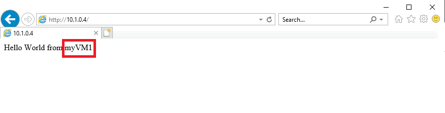

---
Exercise:
  title: M04 - Unidade 4 Criar e configurar um balanceador de carga do Azure
  module: Module 04 - Load balancing non-HTTP(S) traffic in Azure
---


# M04-Unidade 4 Criar e configurar um balanceador de carga do Azure

Neste exercício, você vai criar um balanceador de carga interno para a organização fictícia Contoso Ltd.

**Observação:** há uma **[simulação interativa de laboratório](https://mslabs.cloudguides.com/guides/AZ-700%20Lab%20Simulation%20-%20Create%20and%20configure%20an%20Azure%20load%20balancer)** disponível que permite que você clique neste laboratório no seu próprio ritmo. Você pode encontrar pequenas diferenças entre a simulação interativa e o laboratório hospedado, mas os principais conceitos e ideias que estão sendo demonstrados são os mesmos.

### Tempo estimado: 60 minutos (inclui ~45 minutos de tempo de espera de implantação)

As etapas para criar um balanceador de carga interno são muito semelhantes às que você já aprendeu neste módulo para criar um balanceador de carga público. A principal diferença é que, com um balanceador de carga público, o front-end é acessado por meio de um endereço IP público e você testa a conectividade a partir de um host que está localizado fora de sua rede virtual; ao passo que, com um balanceador de carga interno, o front-end é um endereço IP privado dentro de sua rede virtual e você testa a conectividade a partir de um host dentro da mesma rede.


Neste exercício, você vai:

+ Tarefa 1: criar a rede virtual
+ Tarefa 2: criar servidores de back-end
+ Tarefa 3: criar o balanceador de carga
+ Tarefa 4: criar recursos do balanceador de carga
+ Tarefa 5: testar o balanceador de carga

## Tarefa 1: criar a rede virtual

Nesta seção, você vai criar uma rede virtual e uma sub-rede.

1. Faça logon no Portal do Azure.

2. Na home page portal do Azure, navegue até a barra de pesquisa global e pesquise **Redes Virtuais** e selecione redes virtuais em serviços.  

3. Na página Redes virtuais, selecione **Criar**.  

4. Na guia **Noções Básicas**, use as informações na tabela abaixo para criar a rede virtual.

   | **Configuração**    | **Valor**                                  |
   | -------------- | ------------------------------------------ |
   | Subscription   | Selecionar sua assinatura                   |
   | Resource group | Selecione **Criar novo**  Nome: **IntLB-RG** |
   | Nome           | **IntLB-VNet**                             |
   | Região         | **(EUA) Leste dos EUA**                           |

5. Selecione **Próximo: Endereços IP**.

6. Na guia **Endereços IP**, na caixa **Espaço de endereço IPv4**, remova o padrão e digite **10.1.0.0/16**.

7. Na guia **Endereços IP**, selecione **+ Adicionar sub-rede**.

8. No painel **Adicionar sub-rede**, forneça o nome de sub-rede **myBackendSubnet** e o intervalo de endereços de sub-rede **10.1.0.0/24**.

9. Selecione **Adicionar**.

10. Clique em **Adicionar sub-rede**, forneça um nome de sub-rede de **myFrontEndSubnet** e um intervalo de endereços de sub-rede de **10.1.2.0/24**. Selecione **Adicionar**

11. Selecione **Avançar: Segurança**.

12. Em **BastionHost**, selecione **Habilitar** e insira as informações da tabela a seguir.

    | **Configuração**                       | **Valor**                                     |
    | --------------------------------- | --------------------------------------------- |
    | Nome do bastion                      | **myBastionHost**                             |
    | Espaço de endereço AzureBastionSubnet | **10.1.1.0/26**                               |
    | Endereço IP público                 | Selecione **Criar novo**  Nome: **myBastionIP** |

13. Selecione **Examinar + criar**.

14. Selecione **Criar**.

## Tarefa 2: criar servidores de back-end

Nesta seção, você criará três VMs, que estarão no mesmo conjunto de disponibilidade, para o pool de back-end do balanceador de carga, adicionará as VMs ao pool de back-end e instalará o IIS nas três VMs para testar o balanceador de carga.

1. No portal do Azure, abra a sessão **PowerShell** no painel do **Cloud Shell**.

 > **Observação:** se esta for a primeira vez que o Cloud Shell é aberto, você será solicitado a criar uma conta de armazenamento. Selecione **Criar armazenamento**.

2. Na barra de ferramentas do painel do Cloud Shell, selecione o ícone **Carregar/Baixar arquivos**. No menu suspenso, selecione **Carregar** e carregue os arquivos azuredeploy.json e azuredeploy.parameters.json no diretório inicial do Cloud Shell um a um.

3. Implante os seguintes modelos do ARM para criar as VMs necessárias para este exercício:

>**Observação**: você será solicitado a fornecer uma senha de Administrador.

   ```powershell
   $RGName = "IntLB-RG"
   
   New-AzResourceGroupDeployment -ResourceGroupName $RGName -TemplateFile azuredeploy.json -TemplateParameterFile azuredeploy.parameters.json
   ```

Pode levar de 5 a 10 minutos para criar essas três VMs. Você não precisa esperar até que o trabalho seja concluído, você já pode continuar com a próxima tarefa.

## Tarefa 3: criar o balanceador de carga

Nesta seção, você vai criar um balanceador de carga de SKU Standard interno. O motivo pelo qual estamos criando um balanceador de carga de SKU Standard aqui no exercício, em vez de um balanceamento de carga de SKU Básico, é que exercícios posteriores exigem uma versão de SKU Standard do balanceador de carga.

1. Na home page do portal do Azure, selecione **Criar um recurso**.

1. Na caixa de pesquisa na parte superior da página, digite **Balanceador de Carga** e pressione **Enter** (**Observação:** não selecione um na lista).

1. Na página de resultados, localize e selecione **Load Balancer** (aquele que indica "Microsoft" e "Serviço do Azure" abaixo do nome).

1. Selecione **Criar**.

1. Na guia **Noções básicas**, use as informações na tabela abaixo para criar o balanceador de carga.

   | **Configuração**           | **Valor**                |
   | --------------------- | ------------------------ |
   | Subscription          | Selecionar sua assinatura |
   | Resource group        | **IntLB-RG**             |
   | Nome                  | **myIntLoadBalancer**    |
   | Região                | **(EUA) Leste dos EUA**         |
   | SKU                   | **Standard**             |
   | Tipo                  | **Interna**             |
   | Camada                  | **Regional**             |

1. Selecione **Próximo: Configurações do IP de front-end**.
1. Selecione Adicionar um IP de front-end
1. Na folha **Adicionar endereço IP de front-end**, insira as informações da tabela abaixo e selecione **Adicionar**.

   | **Configuração**     | **Valor**                |
   | --------------- | ------------------------ |
   | Nome            | **LoadBalancerFrontEnd** |
   | Rede virtual | **IntLB-VNet**           |
   | Sub-rede          | **myFrontEndSubnet**     |
   | Atribuição      | **Dinâmico**              |

1. Selecione **Examinar + criar**.

1. Selecione **Criar**.

## Tarefa 4: criar recursos do balanceador de carga

Nesta seção, você definirá as configurações do balanceador de carga para um pool de endereços de back-end. Em seguida, criará uma investigação de integridade e uma regra do balanceador de carga.

### Criar um pool de back-end e adicionar VMs ao pool de back-end

O pool de endereços de back-end contém os endereços IP de NICs virtuais conectados ao balanceador de carga.

1. Na página inicial do portal do Azure, selecione **Todos os recursos** e selecione **myIntLoadBalancer** na lista de recursos.

1. Em **Configurações**, selecione **Pools de back-end** e, em seguida, **Adicionar**.

1. Na página **Adicionar pool de back-end**, insira as informações da tabela a seguir.

   | **Configuração**     | **Valor**            |
   | --------------- | -------------------- |
   | Nome            | **myBackendPool**    |
   | Rede virtual | **IntLB-VNet**       |

1. Em **Máquinas virtuais**, selecione **Adicionar**.

1. Marque as caixas de seleção para todas as três VMs (**myVM1**, **myVM2** e **myVM3**) e selecione **Adicionar**.

1. Selecione **Salvar**.
   

### Criar uma investigação de integridade

O balanceador de carga monitora o status do seu aplicativo com uma investigação de integridade. A investigação de integridade adiciona ou remove VMs do balanceador de carga com base na resposta às verificações de integridade. Aqui você vai criar uma investigação de integridade e monitorar a integridade das VMs.

1. Em **Configurações**, selecione **Investigações de integridade** e, em seguida, **Adicionar**.

1. Na página **Adicionar investigação de integridade**, insira as informações da tabela a seguir.

   | **Configuração**         | **Valor**         |
   | ------------------- | ----------------- |
   | Nome                | **myHealthProbe** |
   | Protocolo            | **HTTP**          |
   | Porta                | **80**            |
   | Caminho                | **/**             |
   | Intervalo            | **15**            |

1. Selecione **Adicionar**.
   

### Criar uma regra de balanceador de carga

Uma regra de balanceador de carga é usada para definir como o tráfego é distribuído para as VMs. Você define a configuração de IP de front-end para o tráfego de entrada e o pool de IPs de back-end para receber o tráfego. A porta de origem e de destino são definidas na regra. Aqui, você vai criar uma regra de balanceador de carga.

1. Em **Configurações**, selecione **Regras de balanceamento de carga** e, em seguida, **Adicionar**.

1. Na página **Adicionar regra de balanceamento de carga**, insira as informações da tabela a seguir.

   | **Configuração**            | **Valor**                |
   | ---------------------- | ------------------------ |
   | Nome                   | **myHTTPRule**           |
   | Versão IP             | **IPv4**                 |
   | Endereço IP de front-end    | **LoadBalancerFrontEnd** |
   | Pool de back-end           | **myBackendPool**        |
   | Protocolo               | **TCP**                  |
   | Porta                   | **80**                   |
   | Porta de back-end           | **80**                   |
   | Investigação de integridade           | **myHealthProbe**        |
   | Persistência de sessão    | **Nenhuma**                 |
   | Tempo limite de ociosidade (minutos) | **15**                   |
   | IP flutuante            | **Desabilitado**             |

1. Selecione **Salvar**.
   

## Tarefa 5: testar o balanceador de carga

Nesta seção, você criará uma VM de teste e testará o balanceador de carga.

### Criar VM de teste

1. Na página inicial do portal do Azure, selecione **Criar um recurso** e **virtual**; depois selecione **Máquina virtual** (se esse tipo de recurso não estiver listado na página, use a caixa Pesquisar na parte superior da página para pesquisá-lo e selecioná-lo).

1. Na página **Criar uma máquina virtual**, na guia **Noções básicas**, use as informações na tabela abaixo para criar a primeira VM.

   | **Configuração**          | **Valor**                                    |
   | -------------------- | -------------------------------------------- |
   | Subscription         | Selecionar sua assinatura                     |
   | Resource group       | **IntLB-RG**                                 |
   | Nome da máquina virtual | **myTestVM**                                 |
   | Região               | **(EUA) Leste dos EUA**                             |
   | Opções de disponibilidade | **Nenhuma redundância de infraestrutura necessária**    |
   | Imagem                | **Windows Server 2019 Datacenter – Gen 2**   |
   | Tamanho                 | **Standard_DS2_v3 – 2 vCPU, 8 GiB de memória**   |
   | Nome de Usuário             | **TestUser**                                 |
   | Senha             | **Forneça uma senha segura**                |
   | Confirmar senha     | **Forneça uma senha segura**                |

1. Selecione **Avançar: Discos** e **Avançar: Rede**.

1. Na guia **Rede**, use as informações na tabela abaixo para definir as configurações de rede.

   | **Configuração**                                                  | **Valor**                     |
   | ------------------------------------------------------------ | ----------------------------- |
   | Rede virtual                                              | **IntLB-VNet**                |
   | Sub-rede                                                       | **myBackendSubnet**           |
   | IP público                                                    | Alterar para **Nenhum**            |
   | Grupo de segurança de rede da NIC                                   | **Avançado**                  |
   | Configurar um grupo de segurança de rede                             | Selecione o **myNSG** existente |
   | Opções de balanceamento de carga                                       | **Nenhuma**                      |

1. Selecione **Examinar + criar**.

1. Selecione **Criar**.

1. Aguarde até que essa última VM seja implantada antes de prosseguir com a próxima tarefa.

### Conexão à VM de teste para testar o balanceador de carga

1. Na página inicial do portal do Azure, selecione **Todos os recursos** e selecione **myIntLoadBalancer** na lista de recursos.

1. Na página **Visão geral**, anote o **Endereço IP Privado** ou copie-o para a área de transferência. Observação: talvez seja necessário selecionar **Ver mais** para ver o campo ** Endereço IP privado**.

1. Clique em **Página Inicial** e, na página inicial do portal do Azure, selecione **Todos os recursos** e clique na máquina virtual **myTestVM** que você acabou de criar.

1. Na página **Visão Geral**, selecione **Conectar** e **Bastion**.

1. Selecione **Usar Bastion**.

1. Na caixa **Nome de usuário**, digite **TestUser** e, na caixa **Senha**, digite a senha criada e selecione **Conectar**. Se o bloqueador de pop-ups estiver impedindo a nova janela, habilite o bloqueador de pop-ups e **conecte-se** novamente.

1. A janela **myTestVM** será aberta em outra guia do navegador.

1. Se um painel **Redes** for exibido, selecione **Sim**.

1. Selecione o ícone **Internet Explorer** na barra de tarefas para abrir o navegador da Web.

1. Selecione **OK** na caixa de diálogo **Configurar o Internet Explorer 11**.

1. Insira (ou cole) o **Endereço IP privado** (por exemplo, 10.1.0.4) da etapa anterior na barra de endereços do navegador e pressione Enter.

1. A home page da Web padrão do servidor Web do IIS é exibida na janela do navegador. Uma das três máquinas virtuais no pool de back-end responderá.
    

1. Se você selecionar o botão Atualizar no navegador algumas vezes, verá que a resposta vem aleatoriamente das diferentes VMs no pool de back-end do balanceador de carga interno.
    

## Limpar os recursos

   >**Observação**: lembre-se de remover todos os recursos recém-criados do Azure que você não usa mais. Remover recursos não utilizados garante que você não veja encargos inesperados.

1. No portal do Azure, abra a sessão **PowerShell** no painel do **Cloud Shell**.

1. Exclua todos os grupos de recursos criados em todos os laboratórios deste módulo executando o seguinte comando:

   ```powershell
   Remove-AzResourceGroup -Name 'IntLB-RG' -Force -AsJob
   ```

    >**Observação**: o comando é executado de modo assíncrono (conforme determinado pelo parâmetro -AsJob), portanto, embora você possa executar outro comando do PowerShell imediatamente depois na mesma sessão do PowerShell, levará alguns minutos antes de os grupos de recursos serem de fato removidos.
