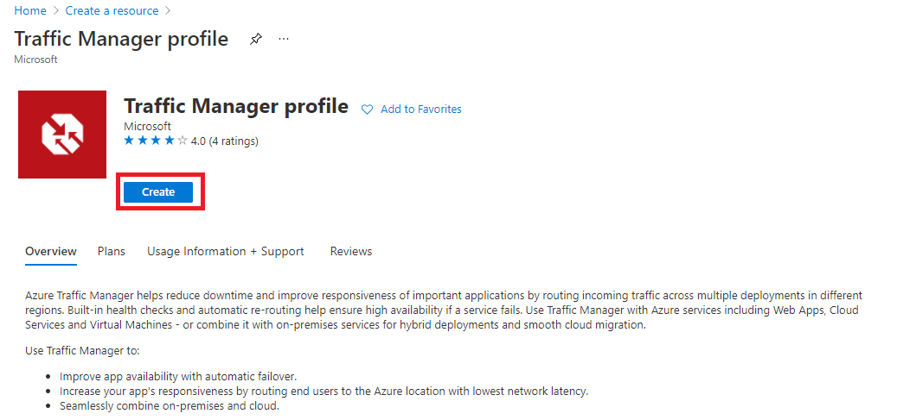

---
Exercise:
  title: M04 - Unidade 6 Criar um perfil do Gerenciador de Tráfego usando o portal do Azure
  module: Module 04 - Load balancing non-HTTP(S) traffic in Azure
---

# M04-Unidade 6 Criar um perfil do Gerenciador de Tráfego usando o portal do Azure

## Cenário do exercício

Neste exercício, você criará um perfil do Gerenciador de Tráfego para fornecer alta disponibilidade para o aplicativo Web da organização fictícia Contoso Ltd.

### Tempo estimado: 35 minutos

Você criará duas instâncias de um aplicativo Web implantado em duas regiões diferentes (Leste dos EUA e Oeste da Europa). A região Leste dos EUA atuará como um ponto de extremidade primário para o Gerenciador de Tráfego, e a região Oeste da Europa atuará como um ponto de extremidade de failover.

Em seguida, você criará um perfil do Gerenciador de Tráfego baseado na prioridade de ponto de extremidade. Esse perfil direcionará o tráfego de usuário para o site primário executando o aplicativo Web. O Gerenciador de Tráfego monitorará continuamente o aplicativo Web e, se o site primário no Leste dos EUA estiver indisponível, fornecerá failover automático para o site de backup no Oeste da Europa.

O diagrama a seguir faz uma ilustração aproximada do ambiente que você vai implantar neste exercício.

 

### Habilidades de trabalho

 Neste exercício, você vai:

+ Tarefa 1: criar os aplicativos Web
+ Tarefa 2: criar um perfil do Gerenciador de Tráfego
+ Tarefa 3: Adicionar pontos de extremidade do Gerenciador de Tráfego
+ Tarefa 4: testar o perfil do Gerenciador de Tráfego

## Tarefa 1: criar os aplicativos Web

Nesta seção, você criará duas instâncias de um aplicativo Web implantado nas duas regiões diferentes do Azure.

1. Na página inicial do portal do Azure, selecione **Criar um recurso** e selecione **Aplicativo Web** (se esse tipo de recurso não estiver listado na página, use a caixa de pesquisa na parte superior da página para pesquisá-lo e selecioná-lo).

1. Na página **Criar aplicativo Web**, na guia **Noções básicas**, use as informações na tabela abaixo para criar o primeiro aplicativo Web.

   | **Configuração**      | **Valor**                                                    |
   | ---------------- | ------------------------------------------------------------ |
   | Assinatura     | Selecionar sua assinatura                                     |
   | Resource group   | Selecione **Criar novo**  Nome: **Contoso-RG-TM1**             |
   | Nome             | **ContosoWebAppEastUSxx** (em que xx são suas iniciais para tornar o nome exclusivo) |
   | Publicação          | **Código**                                                     |
   | Pilha de runtime    | **ASP.NET V4.8**                                             |
   | Sistema operacional | **Windows**                                                  |
   | Região           | **Leste dos EUA**                                                  |
   | Plano do Windows     | Selecione **Criar novo** Nome: **ContosoAppServicePlanEastUS** |
   | Plano de preços     | **Premium V3 P1V3** (selecione outro plano se não estiver disponível)          |

1. Selecione a guia **Monitorar + proteger**.

1. Selecione a opção **Não** para **Habilitar o Application Insights**.

1. Selecione **Examinar + criar**.

   

1. Selecione **Criar**. Quando o aplicativo Web é implantado com êxito, ele cria um site da Web padrão.

1. Repita as etapas 1-6 acima para criar um segundo aplicativo Web. Use as mesmas configurações de antes, exceto as informações na tabela abaixo.

   | **Configuração**    | **Valor**                                                    |
   | -------------- | ------------------------------------------------------------ |
   | Resource group | Selecione **Criar novo**  Nome: **Contoso-RG-TM2**             |
   | Nome           | **ContosoWebAppWestEuropexx** (em que xx são suas iniciais para tornar o nome exclusivo)  |
   | Região         | **Oeste da Europa**                                              |
   | Plano do Windows   | Selecione **Criar novo** Nome: **ContosoAppServicePlanWestEurope** |

1. Na página inicial do Azure, selecione **Todos os serviços**, no menu de navegação à esquerda, selecione **Web** e selecione **Serviços de Aplicativos**.

1. Você deve ver os dois novos aplicativos Web listados.

   

## Tarefa 2: criar um perfil do Gerenciador de Tráfego

Agora, você criará um perfil do Gerenciador de Tráfego que direciona o tráfego de usuário com base na prioridade de ponto de extremidade.

1. Na home page do portal do Azure, selecione **Criar um recurso**.

1. Na caixa de pesquisa na parte superior da página, digite **Perfil do Gerenciador de Tráfego** e selecione-o na lista pop-up.

   

1. Selecione **Criar**.

1. Na página **Criar perfil do Gerenciador de Tráfego**, use as informações na tabela abaixo para criar o perfil do Gerenciador de Tráfego.

   | **Configuração**             | **Valor**                |
   | ----------------------- | ------------------------ |
   | Nome                    | **Contoso-TMProfilexx** (em que xx são suas iniciais para tornar o nome exclusivo) |
   | Método de roteamento          | **Prioridade**             |
   | Subscription            | Selecionar sua assinatura |
   | Resource group          | **Contoso-RG-TM1**       |
   | Localização do grupo de recursos | **Leste dos EUA**              |

1. Selecione **Examinar + criar** e depois **Criar**.

## Tarefa 3: adicionar pontos de extremidade de Gerenciador de Tráfego

Nesta seção, você adicionará o site no Leste dos EUA como o ponto de extremidade primário para rotear todo o tráfego do usuário. Em seguida, você adicionará o site no Oeste da Europa como um ponto de extremidade de failover. Se o ponto de extremidade primário ficar indisponível, o tráfego será automaticamente roteado para o ponto de extremidade de failover.

1. Na página inicial do portal do Azure, selecione **Todos os recursos** e selecione **Contoso-TMProfile** na lista de recursos.

1. Em **Configurações**, selecione **Pontos de extremidade** e selecione **Adicionar**.

   

1. Na página **Adicionar ponto de extremidade**, insira as informações da tabela a seguir.

   | **Configuração**          | **Valor**                         |
   | -------------------- | --------------------------------- |
   | Type                 | **Ponto de extremidade do Azure**                |
   | Nome                 | **myPrimaryEndpoint**             |
   | Tipo de recurso de destino | **Serviço de Aplicativo**                   |
   | Recurso de destino      | **ContosoWebAppEastUS (Leste dos EUA)** |
   | Prioridade             | **1**                             |

1. Selecione **Adicionar**.

1. Repita as etapas 2-4 acima para criar o ponto de extremidade de failover. Use as mesmas configurações de antes, exceto as informações na tabela abaixo.

   | **Configuração**     | **Valor**                                 |
   | --------------- | ----------------------------------------- |
   | Nome            | **myFailoverEndpoint**                    |
   | Recurso de destino | **ContosoWebAppWestEurope (Oeste da Europa)** |
   | Prioridade        | **2**                                     |

1. Definir uma prioridade 2 significa que o tráfego será roteado para esse ponto de extremidade de failover se o ponto de extremidade primário configurado se tornar não íntegro.

1. Em **Configurações**, selecione **Configuração** e, em seguida, atualize as configurações do monitor do ponto de extremidade em **Protocolo** para HTTPS e **Porta** para 443 e selecione **Salvar**.

1. Os dois novos pontos de extremidade são exibidos no perfil do Gerenciador de Tráfego. Observe que, após alguns minutos, o **Status de monitoramento** deverá mudar para **Online**.

   

## Tarefa 4: testar o perfil do Gerenciador de Tráfego

Nesta seção, você verificará o nome DNS do seu perfil do Gerenciador de Tráfego e configurará o ponto de extremidade primário para que ele não esteja disponível. Em seguida, você verificará se o aplicativo Web ainda está disponível para testar se o perfil de Gerenciador de Tráfego está enviando o tráfego com êxito para o ponto de extremidade de failover.

1. Na página **Contoso-TMProfile**, selecione **Visão geral**.

1. Na tela **Visão geral**, copie a entrada **Nome DNS** para a área de transferência (ou anote-a em algum lugar).

   

1. Abra uma guia do navegador da Web e cole (ou insira) a entrada do **Nome DNS** (contoso-tmprofile.trafficmanager.net) na barra de endereços e pressione Enter.

1. O site da Web padrão do aplicativo Web aparecerá. Se você receber a mensagem **404 Site não encontrado**, **Desabilite o perfil** da página de visão geral do perfil do Gerenciador de Tráfego **Contoso-TMProfilexx** e **Habilite o perfil**. Em seguida, atualize a página da Web.

   

1. No momento, todo o tráfego está sendo enviado para o ponto de extremidade primário à medida que você define sua **Prioridade** como **1**.

1. Para testar se o ponto de extremidade de failover está funcionando corretamente, você precisa desabilitar o site primário.

1. Na página **Contoso-TMProfile**, na tela de visão geral, selecione o número **2** à direita de **Pontos de extremidade:**.

1. Selecione o botão Editar (ícone de lápis) para **myPrimaryEndpoint**.

1. Na folha **myPrimaryEndpoint**, em **Status**, desmarque a caixa de seleção para **Habilitar Ponto de Extremidade** e selecione **Salvar**.

1. Se necessário, feche a folha **myPrimaryEndpoint** (selecione o **X** no canto superior direito da página).

1. Na página **Contoso-TMProfile**, o **Status do monitor** para **myPrimaryEndpoint** agora deve ser **Desabilitado**.

1. Abra uma nova sessão do navegador da Web e cole (ou insira) a entrada do **Nome DNS** (contoso-tmprofile.trafficmanager.net) na barra de endereços e pressione Enter.

1. Verifique se o aplicativo Web ainda está respondendo. Como o ponto de extremidade primário não estava disponível, o tráfego foi roteado para o ponto de extremidade de failover para permitir a continuidade do funcionamento do site da Web.

## Limpar os recursos

   >**Observação**: lembre-se de remover todos os recursos recém-criados do Azure que você não usa mais. Remover recursos não utilizados garante que você não veja encargos inesperados.

1. No portal do Azure, abra a sessão **PowerShell** no painel do **Cloud Shell**.

1. Exclua todos os grupos de recursos criados em todos os laboratórios deste módulo executando o seguinte comando:

   ```powershell

   Remove-AzResourceGroup -Name 'Contoso-RG-TM1' -Force -AsJob
   Remove-AzResourceGroup -Name 'Contoso-RG-TM2' -Force -AsJob

   ```

   >**Observação**: o comando é executado de maneira assíncrona (conforme determinado pelo parâmetro -AsJob), portanto, embora você possa executar outro comando do PowerShell imediatamente após na mesma sessão do PowerShell, levará alguns minutos antes dos grupos de recursos serem de fato removidos.

## Estender seu aprendizado com o Copilot

O Copilot pode ajudar você a aprender a usar as ferramentas de script do Azure. O Copilot também pode ajudar em áreas não cobertas no laboratório ou onde você precisar de mais informações. Abra um navegador do Edge e escolha Copilot (canto superior direito) ou navegue até *copilot.microsoft.com*. Reserve alguns minutos para experimentar essas solicitações.
+ Quais são as etapas de alto nível para configurar o Gerenciador de Tráfego do Azure?
+ Compare e contraste quando usar o Azure Load Balancer e o Gerenciador de Tráfego do Azure.
+ Explique os perfis de roteamento do Gerenciador de Tráfego e quando devem ser usados.

## Saiba mais com treinamento individual

+ [Aprimore sua localidade de dados e disponibilidade do serviço usando o Gerenciador de Tráfego do Azure](https://learn.microsoft.com/training/modules/distribute-load-with-traffic-manager/). Nesse módulo, você aprenderá a usar o Gerenciador de Tráfego para distribuir dinamicamente o tráfego de rede.
+ [Balanceamento de carga de tráfego não HTTP(S) no Azure](https://learn.microsoft.com/training/modules/load-balancing-non-https-traffic-azure/). Neste módulo, você aprenderá sobre o Gerenciador de Tráfego do Azure e a implementação de métodos de roteamento. 

## Principais aspectos a serem lembrados

Parabéns por concluir o laboratório. Aqui estão as principais lições desse laboratório. 
+ O Gerenciador de Tráfego do Azure é um balanceador de carga de tráfego baseado em DNS. Esse serviço permite distribuir o tráfego para seus aplicativos voltados ao público nas regiões globais do Azure.
+ O Gerenciador de Tráfego inclui seis métodos de roteamento de tráfego que permitem controlar como o Gerenciador escolhe qual ponto de extremidade deve receber o tráfego de cada usuário final. Quantos você pode nomear?
+ Aninhe perfis do Gerenciador de Tráfego para combinar os benefícios de mais de um método de roteamento de tráfego. Os perfis aninhados permitem que você substitua o comportamento padrão do Gerenciador de Tráfego para dar suporte a implantações de aplicativo maiores e mais complexas.
