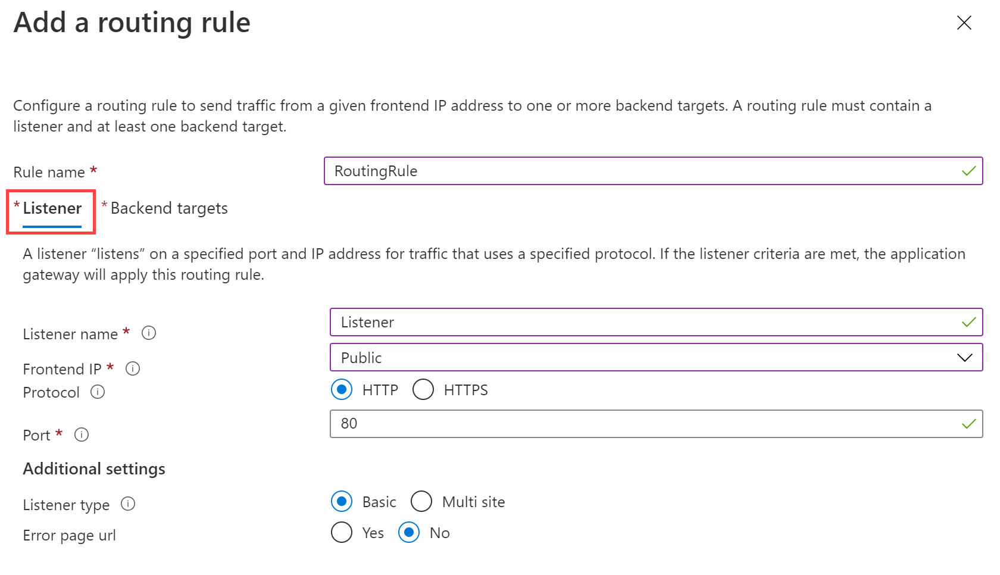
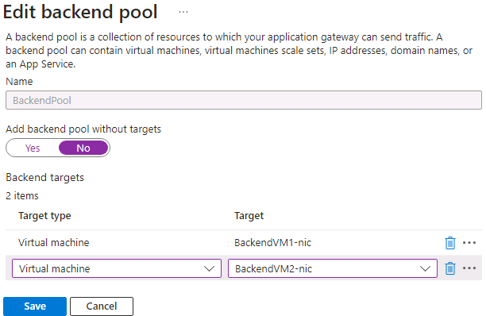

---
Exercise:
  title: M05 - Unidade 4 Implantar um Gateway de Aplicativo do Azure
  module: Module 05 - Load balancing HTTP(S) traffic in Azure
---

# M05-Unidade 4 Implantar um Gateway de Aplicativo do Azure

## Cenário do exercício

Neste exercício, você usará o portal do Azure para criar um gateway de aplicativo. Em seguida, você o testará para verificar se ele funciona corretamente.


### Tempo estimado: 25 minutos

O gateway de aplicativo direciona o tráfego da Web do aplicativo para recursos específicos em um pool de back-end. Você atribuirá ouvintes a portas, criará regras e adicionará recursos a um pool de back-end. Para simplificar, este artigo usa uma configuração simples com um IP de front-end público, um ouvinte básico para hospedar um só site no gateway de aplicativo, uma regra de roteamento de solicitação básica e duas máquinas virtuais usadas no pool de back-end.

Para que o Azure se comunique entre os recursos que você cria, ele precisa de uma rede virtual. Você pode criar uma nova rede virtual ou usar uma existente. Neste exemplo, você criará uma nova rede virtual enquanto cria o gateway de aplicativo. As instâncias do Gateway de Aplicativo são criadas em sub-redes separadas. Crie duas sub-redes neste exemplo: uma para o gateway de aplicativo e outra para os servidores de back-end.

### Habilidades de trabalho

Neste exercício, você vai:

+ Tarefa 1: criar um gateway de aplicativo
+ Tarefa 2: criar máquinas virtuais
+ Tarefa 3: adicionar servidores de back-end ao pool de back-end
+ Tarefa 4: testar o gateway de aplicativo

## Tarefa 1: criar um gateway de aplicativo

1. Entre no [portal do Azure](https://portal.azure.com/) com sua conta do Azure.

1. Em qualquer página do Portal do Azure, em **Pesquisar recursos, serviços e documentos (G+/)**, insira o gateway de aplicativo e selecione **Gateways de aplicativo** nos resultados.
    

1. Na página Gateways de aplicativo, selecione **+ Criar**.

1. Na guia **Noções básicas** para criar um gateway de aplicativo, insira ou selecione as seguintes informações:

   | **Configuração**         | **Valor**                                    |
   | ------------------- | -------------------------------------------- |
   | Subscription        | Selecione sua assinatura.                    |
   | Resource group      | Selecione Criar ContosoResourceGroup       |
   | Gateway de Aplicativo | ContosoAppGateway                            |
   | Região              | Selecione **Leste dos EUA**                           |
   | Rede Virtual     | Selecione **Criar**                        |

1. Em Criar rede virtual, insira ou selecione as seguintes informações:

   | **Configuração**       | **Valor**                          |
   | ----------------- | ---------------------------------- |
   | Nome              | ContosoVNet                        |
   | **ESPAÇO DE ENDEREÇO** |                                    |
   | Intervalo de endereços     | 10.0.0.0/16                        |
   | **SUB-REDES**       |                                    |
   | Nome da sub-rede       | Altere o **padrão** para **AGSubnet** |
   | Intervalo de endereços     | 10.0.0.0/24                        |


1. Selecione **OK** para retornar à guia Noções básicas para criar um gateway de aplicativo.

1. Aceite os valores padrão para as outras configurações e selecione **Avançar: Front-ends**.

1. Na guia **Front-ends**, verifique se **Tipo de endereço IP do front-end** está definido como **Público**.

1. Selecione **Adicionar novo** para o **Endereço IP público**, insira AGPublicIPAddress no nome do endereço IP público, depois selecione **OK**.

1. Selecione **Avançar: Back-ends**.

1. Na guia **Back-ends**, selecione **Adicionar um pool de back-end**.

1. Na janela **Adicionar um pool de back-end** que é aberta, insira os seguintes valores para criar um pool de back-end vazio:

    | **Configuração**                      | **Valor**   |
    | -------------------------------- | ----------- |
    | Nome                             | BackendPool |
    | Adicionar pool de back-end sem destinos | Sim         |

1. Na janela **Adicionar um pool de back-end**, selecione **Adicionar** para salvar a configuração do pool de back-end e retornar à guia **Back-ends**.

1. Na guia **Back-ends**, selecione **Avançar: Configuração**.

1. Na guia **Configuração**, você conectará o front-end e o pool de back-end que você criou usando uma regra de roteamento.

1. Na coluna **Regras de roteamento**, selecione **Adicionar uma regra de roteamento**.

1. Na caixa **Nome da regra**, digite **RoutingRule**.

1. Em **Prioridade**, insira **100**. 

1. Na guia **Ouvinte**, insira ou selecione as informações a seguir:

    | **Configuração**   | **Valor**         |
    | ------------- | ----------------- |
    | Nome do ouvinte | Ouvinte          |
    | IP de front-end   | Selecione **IPv4 Público** |

1. Aceite os valores padrão para as outras configurações na guia **Ouvinte**.

    

1. Selecione a guia **Destinos de back-end** para configurar o restante da regra de roteamento.

1. Na guia **Destinos de back-end**, insira ou selecione as informações a seguir:

    | **Configuração**      | **Valor**      |
    | -------------    | -------------- |
    | Tipo de destino      | Pool de back-end   |
    | Configurações de back-end | **Adicionar nova** |

1. Em **Adicionar uma configuração de back-end**, insira ou selecione as informações a seguir:

    | **Configuração**          | **Valor**   |
    | ------------------   | ----------- |
    | Nome da configuração de back-end | HTTPSetting |
    | Porta de back-end         | 80          |

1. Aceite os valores padrão para as outras configurações na janela **Adicionar uma configuração de back-end**, depois selecione **Adicionar** para retornar para **Adicionar uma regra de roteamento**.

1. Selecione **Adicionar** para salvar a regra de roteamento e voltar para a guia **Configuração**.

1. Selecione **Avançar: Marcas** e, em seguida, **Avançar: Revisar + criar**.

1. Analise as configurações na guia **Revisar + criar**

1. Selecione **Criar** para criar a rede virtual, o endereço IP público e o gateway de aplicativo.

1. Pode levar vários minutos para que o Azure crie o gateway de aplicativo. Espere a conclusão da implantação.

### Adicionar uma sub-rede para servidores de back-end

1. Procure e selecione **ContosoVNet**. Verifique se o **AGSubnet** foi criado. 

1. Para criar **BackendSubnet**, selecione **Configurações** e, em seguida, **Subredes**. Certifique-se de **Adicionar** a sub-rede quando terminar.
   
   | **Configuração**       | **Valor**                          |
   | ----------------- | ---------------------------------- |
   | Nome da sub-rede       | BackendSubnet                      |
   | Intervalo de endereços     | 10.0.1.0/24                        |

## Tarefa 2: criar máquinas virtuais

1. No portal do Azure, clique no ícone do Cloud Shell (canto superior direito). Se necessário, configure o shell.  
    + Selecione **PowerShell**.
    + Selecione **Nenhuma Conta de Armazenamento necessária** e sua **Assinatura** e, em seguida, selecione **Aplicar**.
    + Aguarde até que o terminal seja criado e um prompt seja exibido.
      
1. Na barra de ferramentas do painel do Cloud Shell, selecione **Gerenciar arquivos** e, em seguida, **Carregar**. Carregue os seguintes arquivos: **backend.json**, **backend.parameters.json** e **install-iis.ps1**.

    >**Observação:** se você estiver trabalhando em sua própria assinatura, os [arquivos de modelo](https://github.com/MicrosoftLearning/AZ-700-Designing-and-Implementing-Microsoft-Azure-Networking-Solutions/tree/master/Allfiles/Exercises) estarão disponíveis no repositório do GitHub Lab.

1. Implante os seguintes modelos do ARM para criar as VMs necessárias para este exercício:

   >**Observação**: você será solicitado a fornecer uma senha de Administrador. 

   ```powershell
   $RGName = "ContosoResourceGroup"
   
   New-AzResourceGroupDeployment -ResourceGroupName $RGName -TemplateFile backend.json -TemplateParameterFile backend.parameters.json
   ```
   >**Observação**: reserve um tempo para revisar o arquivo **backend.json**. Há duas máquinas virtuais sendo implantadas. Isto pode levar alguns minutos. 

1. O comando será concluído e listará **BackendVM1** e **BackendVM2**.

### Instalar o IIS em cada máquina virtual

1. Cada servidor back-end precisa ter o IIS instalado.

1. Continue no prompt do PowerShell e use o script fornecido para instalar o IIS em **BackendVM1**.

   ```powershell
   Invoke-AzVMRunCommand -ResourceGroupName 'ContosoResourceGroup' -Name 'BackendVM1' -CommandId 'RunPowerShellScript' -ScriptPath 'install-iis.ps1'
   ```

   >**Observação**: enquanto aguarda, examine o script do PowerShell. Observe que a home page do IIS está sendo personalizada para fornecer o nome da máquina virtual.

1. Execute o comando novamente, desta vez para **BackendVM2**.

   ```powershell
   Invoke-AzVMRunCommand -ResourceGroupName 'ContosoResourceGroup' -Name 'BackendVM2' -CommandId 'RunPowerShellScript' -ScriptPath 'install-iis.ps1'
   ```
   >**Observação:** cada comando levará alguns minutos para ser concluído.

## Tarefa 3: adicionar servidores de back-end ao pool de back-end

1. No menu portal do Azure, selecione **Todos os recursos** ou pesquise e selecione Todos os recursos. Depois, selecione **ContosoAppGateway**.

1. Em **Configurações**, selecione **Pools de back-end**.

1. Selecione **BackendPool**.

1. Na página Editar pool de back-end, em **Destinos de back-end**, em **Tipo de destino**, selecione **Máquina virtual**.

1. Em **Destino**, escolha **BackendVM1-nic**.

1. Em **Tipo de destino**, selecione **Máquina virtual**.

1. Em **Destino**, escolha **BackendVM2-nic**.

   

1. Clique em **Salvar** e aguarde até que os destinos sejam adicionados. 

1. Verifique se os servidores back-end estão íntegros. Clique em **Monitoramento** e depois em **Integridade do back-end**. Ambos os destinos estarão íntegros. 

   

## Tarefa 4: testar o gateway de aplicativo

Embora o IIS não seja exigido para criar o gateway de aplicativo, você o instalou neste exercício para verificar se o Azure criou o gateway de aplicativo com êxito.

### Usar o IIS para testar o gateway de aplicativo

1. Localize o endereço IP público para o gateway de aplicativo na página **Visão geral**.

   

1. Copie o endereço IP público e cole-o na barra de endereços do seu navegador para procurar esse endereço IP.

1. Verifique a resposta. Uma resposta válida verifica se o gateway de aplicativo foi criado com êxito e é capaz de conectar-se com êxito ao back-end.

   

1. Ao atualizar o navegador várias vezes, você deverá ver conexões a ambos BackendVM1 e BackendVM2.

## Limpar os recursos

   >**Observação**: lembre-se de remover todos os recursos recém-criados do Azure que você não usa mais. Remover recursos não utilizados garante que você não veja encargos inesperados.

1. No portal do Azure, abra a sessão **PowerShell** no painel do **Cloud Shell**.

1. Exclua todos os grupos de recursos criados em todos os laboratórios deste módulo executando o seguinte comando:

   ```powershell
   Remove-AzResourceGroup -Name 'IntLB-RG' -Force -AsJob
   ```

>**Observação**: o comando é executado de maneira assíncrona (conforme determinado pelo parâmetro -AsJob), portanto, embora você possa executar outro comando do PowerShell imediatamente após na mesma sessão do PowerShell, levará alguns minutos antes dos grupos de recursos serem de fato removidos.

## Estender seu aprendizado com o Copilot

O Copilot pode ajudar você a aprender a usar as ferramentas de script do Azure. O Copilot também pode ajudar em áreas não cobertas no laboratório ou onde você precisar de mais informações. Abra um navegador do Edge e escolha Copilot (canto superior direito) ou navegue até *copilot.microsoft.com*. Reserve alguns minutos para experimentar essas solicitações.
+ Como o Gateway de Aplicativo do Azure roteia solicitações?
+ Quais recursos de segurança o Gateway de Aplicativo do Azure inclui?
+ Compare o Gateway de Aplicativo do Azure com o Azure Load Balancer. Dê exemplos de quando usar cada produto.


## Saiba mais com treinamento individual

+ [Introdução ao Gateway de Aplicativo do Azure](https://learn.microsoft.com/training/modules/intro-to-azure-application-gateway/). Este módulo explica o que o Gateway de Aplicativo do Azure faz, como funciona e quando você deve optar por utilizá-lo como uma solução para atender às necessidades de sua organização.
+ [Balancear a carga do tráfego de seu serviço Web com o Gateway de Aplicativo](https://learn.microsoft.com/training/modules/load-balancing-https-traffic-azure/). Neste módulo, você aprenderá a criar e configurar um Gateway de Aplicativo com roteamento baseado em caminho de URL.
+ [Balancear carga de tráfego HTTP(S) no Azure](https://learn.microsoft.com/training/modules/load-balancing-https-traffic-azure/). Neste módulo, você aprenderá a projetar e implementar o Gateway de Aplicativo do Azure.

## Principais aspectos a serem lembrados

Parabéns por concluir o laboratório. Aqui estão as principais lições desse laboratório. 
+ O Gateway de Aplicativo do Azure é um balanceador de carga de tráfego da Web (camada 7 OSI) que permite que você gerencie o tráfego para seus aplicativos Web.
+ O Gateway de Aplicativo pode tomar decisões de roteiros com base em outros atributos de uma solicitação HTTP, por exemplo, o caminho de URI ou os cabeçalhos de host.
+ Use o Gateway de Aplicativo para aplicativos hospedados em uma única região e quando precisar de roteamento baseado em URL. 
