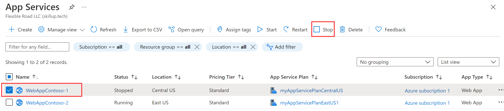

---
Exercise:
  title: M05 - Unidade 6 Criar um Front Door para um aplicativo Web altamente disponível usando o portal do Azure
  module: Module 05 - Load balancing HTTP(S) traffic in Azure
---


# M05-Unidade 6 Criar um Front Door para um aplicativo Web altamente disponível usando o portal do Azure

 

Neste exercício, você definirá uma configuração do Azure Front Door que agrupa duas instâncias de um aplicativo Web que é executado em diferentes regiões do Azure. Essa configuração direciona o tráfego para o site mais próximo que executa o aplicativo. O Azure Front Door monitora o aplicativo Web continuamente. Você demonstrará o failover automático para o próximo site disponível quando o site mais próximo estiver não disponível. A configuração de rede é mostrada no seguinte diagrama:


Neste exercício, você vai:

+ Tarefa 1: criar duas instâncias de um aplicativo Web
+ Tarefa 2: criar um Front Door para seu aplicativo
+ Tarefa 3: ver o Azure Front Door em ação
+ Tarefa 4: limpar recursos

**Observação:** há uma **[simulação interativa de laboratório](https://mslabs.cloudguides.com/guides/AZ-700%20Lab%20Simulation%20-%20Create%20a%20Front%20Door%20profile%20for%20a%20highly%20available%20web%20application)** disponível que permite que você clique neste laboratório no seu próprio ritmo. Você pode encontrar pequenas diferenças entre a simulação interativa e o laboratório hospedado, mas os principais conceitos e ideias que estão sendo demonstrados são os mesmos.


#### Tempo estimado: 30 minutos

## Tarefa 1: criar duas instâncias de um aplicativo Web

Este exercício requer duas instâncias de um aplicativo Web em execução em diferentes regiões do Azure. Ambas as instâncias do aplicativo Web são executadas no modo ativo/ativo, portanto, qualquer uma pode aceitar tráfego. Essa configuração difere da configuração Ativo/Em Espera, em que uma atua como failover.

1. Entre no Portal do Azure em [https://portal.azure.com](https://portal.azure.com/).

1. Na página inicial do Azure, usando a pesquisa global, insira **WebApp** e selecione **Serviços de Aplicativos** em Serviços.

1. Selecione **+ Criar** para criar um aplicativo Web.

1. Na página Criar aplicativo Web, na guia **Noções básicas**, insira ou selecione as informações a seguir.

   | **Configuração**      | **Valor**                                                    |
   | ---------------- | ------------------------------------------------------------ |
   | Subscription     | Selecione sua assinatura.                                    |
   | Resource group   | Selecione o grupo de recursos ContosoResourceGroup               |
   | Nome             | Insira um Nome exclusivo para o aplicativo Web. Este exemplo usa WebAppContoso-1. |
   | Publicar          | Selecione **Código**.                                             |
   | Pilha de runtime    | Selecione **.NET 6 (LTS)**.                                     |
   | Sistema operacional | Selecione **Windows**.                                          |
   | Região           | Selecione **EUA Central**.                                       |
   | Plano do Windows     | Selecione **Criar** e insira myAppServicePlanCentralUS na caixa de texto. |
   | Plano de preços    | Selecione **S1 Standard 100 ACU no total, 1,75 GB de memória**.        |

1. Selecione **Revisar + criar**, analise o Resumo, depois selecione **Criar**.   
   Pode levar vários minutos para que a implantação seja concluída.

1. Crie um segundo aplicativo Web. Na página inicial do Portal do Azure, pesquise **WebApp**.

1. Selecione **+ Criar** para criar um aplicativo Web.

1. Na página Criar aplicativo Web, na guia **Noções básicas**, insira ou selecione as informações a seguir.

   | **Configuração**      | **Valor**                                                    |
   | ---------------- | ------------------------------------------------------------ |
   | Subscription     | Selecione sua assinatura.                                    |
   | Resource group   | Selecione o grupo de recursos ContosoResourceGroup               |
   | Nome             | Insira um Nome exclusivo para o aplicativo Web. Este exemplo usa WebAppContoso-2. |
   | Publicar          | Selecione **Código**.                                             |
   | Pilha de runtime    | Selecione **.NET 6 (LTS)**.                                     |
   | Sistema operacional | Selecione **Windows**.                                          |
   | Região           | Selecione **Leste dos EUA**.                                          |
   | Plano do Windows     | Selecione **Criar** e insira myAppServicePlanEastUS na caixa de texto. |
   | Plano de preços     | Selecione **S1 Standard 100 ACU no total, 1,75 GB de memória**.        |

1. Selecione **Revisar + criar**, analise o Resumo, depois selecione **Criar**.   
   Pode levar vários minutos para que a implantação seja concluída.

## Tarefa 2: criar um Front Door para seu aplicativo

Configure o Azure Front Door para direcionar o tráfego do usuário com base na latência mais baixa entre dois servidores dos aplicativos Web. Para começar, adicione um host de front-end para o Azure Front Door.

1. Em qualquer página do Portal do Azure, em **Pesquisar recursos, serviços e documentos (G+/)**, procure perfis de Front Door e CDN e selecione **Perfis de Front Door e CDN**.

1. Selecione **Perfis de Front Door e CDN**. Na página Comparar ofertas, selecione **Criação rápida**. Selecione **Continuar para criar um Front Door**.

1. Na guia Básico, insira ou selecione as informações a seguir.


   | **Configuração**             | **Valor**                                    |
   | ----------------------- | -------------------------------------------- |
   | Subscription            | Selecione sua assinatura.                    |
   | Resource group          | Escolha ContosoResourceGroup                  |
   | Localização do grupo de recursos | Aceitar a configuração padrão                       |
   | Nome                    | Insira um nome exclusivo nesta assinatura, como FrontDoor(yourinitials)   |
   | Camada                    | Standard   |
   | Nome do Ponto de Extremidade           | FDendpoint   |
   | Tipo de origem             | Serviço de Aplicativo| 
   | Nome do host de origem        | O nome do aplicativo Web implantado anteriormente |
   

1. Selecione **Revisar e criar** e, em seguida, selecione **Criar**.

1. Aguarde até que o recurso seja implantando e selecione **Acessar o recurso**.
1. No recurso Front Door, na folha Visão geral, localize **Grupos de origem** e selecione o grupo de origem criado
1. Para atualizar o grupo de origem, selecione o nome **default-origin-group** na lista. Selecione **Adicionar uma origem** e adicione o segundo aplicativo Web. Selecione Adicionar e, em seguida, selecione Atualizar. 

## Tarefa 3: ver o Azure Front Door em ação

Depois de você criar um Front Door, a configuração leva alguns minutos para ser implantada globalmente. Depois de concluído, acesse o host de front-end que você criou. 

1. No recurso Front Door, na folha Visão geral, localize o nome do host do ponto de extremidade criado para o seu ponto de extremidade. Isso deve ser fdendpoint seguido por um hífen e uma cadeia de caracteres aleatória. Por exemplo, **fdendpoint-fxa8c8hddhhgcrb9.z01.azurefd.net**. **Copie** esse FQDN.

1. Em uma nova guia do navegador, navegue até o FQDN do ponto de extremidade Front Door. A página padrão do Serviço de Aplicativo será exibida.
   

1. Para testar o failover global instantâneo em ação, tente as seguintes etapas:

1. Mude para o portal do Azure, procure e selecione **Serviços de aplicativos**. 

1. Selecione um dos seus aplicativos Web, selecione **Parar**, depois selecione **Sim** para verificar.

   

1. Mude de volta para o navegador e selecione Atualizar. Você deverá ver a mesma página de informações.

**Pode haver um atraso enquanto o aplicativo Web para. Se você vir uma página de erro em seu navegador, atualize a página**.

1. Volte para o Portal do Azure, localize o outro aplicativo Web e pare-o.

1. Mude de volta para o navegador e selecione Atualizar. Desta vez, você deverá ver uma mensagem de erro.

   

   Parabéns! Você configurou e testou um Azure Front Door.
   

## Tarefa 4: limpar recursos
   
   >**Observação**: lembre-se de remover todos os recursos do Azure recém-criados que você não usa mais. Remover recursos não utilizados garante que você não veja encargos inesperados.

1. No portal do Azure, abra a sessão **PowerShell** no painel do **Cloud Shell**.

1. Exclua todos os grupos de recursos criados em todos os laboratórios deste módulo executando o seguinte comando:

   ```powershell

   Remove-AzResourceGroup -Name 'ContosoResourceGroup' -Force -AsJob

   ```

    >**Observação**: o comando é executado de modo assíncrono (conforme determinado pelo parâmetro -AsJob), portanto, embora você possa executar outro comando do PowerShell imediatamente depois na mesma sessão do PowerShell, levará alguns minutos antes de os grupos de recursos serem de fato removidos.
