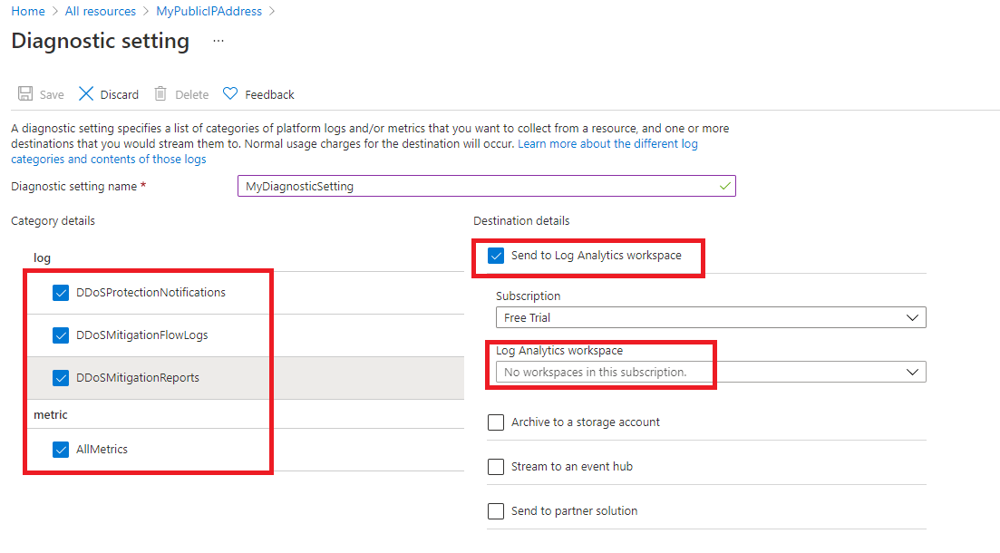
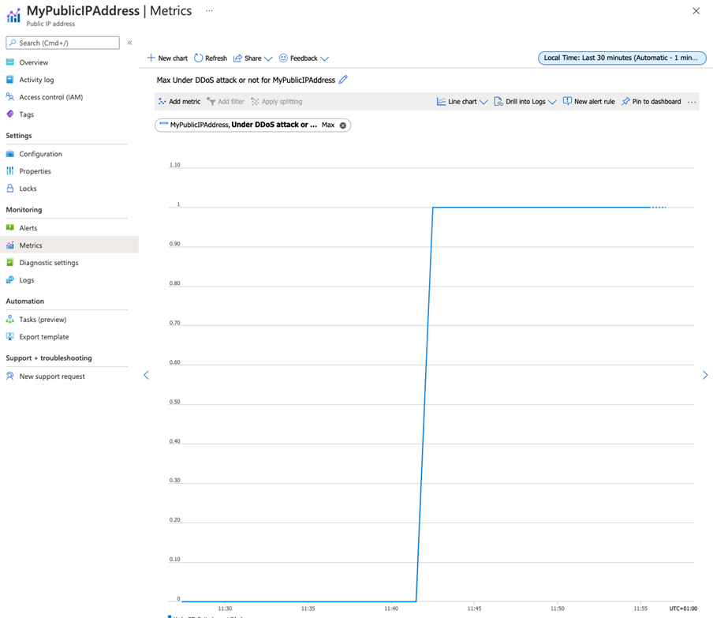

---
Exercise:
  title: M06 - Unidade 4 Configurar a Proteção contra DDoS em uma rede virtual usando o portal do Azure
  module: Module 06 - Design and implement network security
---

# M06-Unidade 4 Configurar a Proteção contra DDoS em uma rede virtual usando o portal do Azure

## Cenário do exercício

Sendo responsável pela equipe de Segurança de Rede da Contoso, você executará um DDoS simulado na rede virtual. As etapas a seguir explicam como criar uma rede virtual, configurar a Proteção contra DDoS e criar um ataque que você pode observar e monitorar com a ajuda de telemetria e métricas.


Neste exercício, você vai:

+ Tarefa 1: criar um grupo de recursos
+ Tarefa 2: Criar um plano de Proteção contra DDoS
+ Tarefa 3: Habilitar a Proteção contra DDoS em uma nova rede virtual
+ Tarefa 4: Configurar a telemetria de DDoS
+ Tarefa 5: Configurar logs de diagnóstico de DDoS
+ Tarefa 6: Configurar alertas de DDoS
+ Tarefa 7: testar com parceiros de simulação
+ Tarefa 8: Limpar os recursos

**Observação:** há uma **[simulação interativa de laboratório](https://mslabs.cloudguides.com/guides/AZ-700%20Lab%20Simulation%20-%20Configure%20Azure%20DDoS%20Protection%20on%20a%20virtual%20network)** disponível que permite que você clique neste laboratório no seu próprio ritmo. Você pode encontrar pequenas diferenças entre a simulação interativa e o laboratório hospedado, mas os principais conceitos e ideias que estão sendo demonstrados são os mesmos.

### Tempo estimado: 40 minutos

## Tarefa 1: criar um grupo de recursos

1. Faça logon na sua conta do Azure.

1. Na página inicial do portal do Azure, selecione **Grupos de recursos**.

1. Selecione **Criar**.

1. Na guia **Noções básicas**, em **Grupo de recursos**, insira **MyResourceGroup**.

1. Em **Região**, selecione Leste dos EUA.

1. Selecione **Examinar + criar**.

1. Selecione **Criar**.

## Tarefa 2: Criar um plano de Proteção contra DDoS

1. Na página inicial do portal do Azure, na caixa de pesquisa, insira **DDoS** e selecione **Plano de proteção contra DDoS** quando ela aparecer.

1. Selecione **+ Criar**.

1. Na guia **Noções básicas,** na lista **Grupo de recursos**, selecione o grupo de recursos que você acabou de criar.

1. Na caixa **Nome da instância**, digite **MyDdoSProtectionPlan** e selecione **Revisar + criar**.

1. Selecione **Criar**.

## Tarefa 3: Habilitar a Proteção contra DDoS em uma nova rede virtual

Aqui, você habilita o DDoS em uma nova rede virtual em vez de uma existente. Portanto, primeiro você precisa criar a nova rede virtual para habilitar a proteção contra DDoS usando o plano criado anteriormente.

1. Na página inicial do portal do Azure, selecione **Criar um recurso**, digite **Rede Virtual** na caixa de pesquisa e selecione **Rede Virtual** quando aparecer.

1. Na página **Rede Virtual**, selecione **Criar**.

1. Na guia **Noções básicas**, selecione o grupo de recursos criado anteriormente.

1. Na caixa **Nome**, insira **MyVirtualNetwork** e selecione a guia **Segurança**.

1. Na guia **Segurança** ao lado de **Proteção de rede contra DDoS**, selecione **Habilitar**.

1. Na lista suspensa **Plano de proteção contra DDoS**, selecione **MyDdosProtectionPlan**.

   

1. Selecione **Examinar + criar**.

1. Selecione **Criar**.

## Tarefa 4: Configurar a telemetria de DDoS

Você cria um endereço IP público e configura a telemetria nas próximas etapas.

1. Na página inicial do portal do Azure, selecione **Criar um recurso**, insira **IP público** na caixa de pesquisa e selecione **Endereço IP público** quando for exibido.

1. Na página **Endereço IP público**, selecione **Criar**.

1. Na página **Criar endereço IP público**, em **SKU**, selecione **Standard**.

1. Na caixa **Nome**, insira **MyPublicIPAddress**.

1. Em **Atribuição de endereço IP**, selecione **Estático**.

1. Em **Rótulo do nome DNS**, insira **mypublicdnsxx** (em que xx são suas iniciais para torná-lo único).

1. Selecione **Criar**.

1. Para configurar a telemetria, navegue até a página inicial do Azure e selecione **Todos os recursos**.

1. Na lista dos seus recursos, selecione **MyDdosProtectionPlan**.

1. Em **Monitoramento**, selecione **Métricas**.

1. Marque a caixa **Escopo** e marque a caixa de seleção ao lado de **MyPublicIPAddress**.

    

1. Escolha **Aplicar**.

1. Na caixa **Métricas**, selecione **DDoS descartados dos pacotes de entrada**.

1. Na caixa **Agregação**, selecione **Máximo**.

    

## Tarefa 5: Configurar logs de diagnóstico de DDoS

1. Na home page do Azure, selecione **Todos os recursos**.

1. Na lista de seus recursos, selecione **MyPublicIPAddress**.

1. Em **Monitoramento**, selecione **Configurações de diagnóstico**.

1. Selecione **Adicionar configuração de diagnóstico**.

1. Na página **Configuração de diagnóstico**, na caixa **Nome da configuração de diagnóstico**, insira **MyDiagnosticSetting**.

1. Em **Detalhes da categoria**, marque todas as três caixas de seleção de **log** e a caixa de seleção **AllMetrics**.

1. Em **Detalhes de destino**, marque a caixa de seleção **Enviar para o workspace do Log Analytics**. Aqui você pode selecionar um workspace do Log Analytics pré-existente. Mas como você ainda não definiu um destino para os logs de diagnóstico, precisará apenas inserir as configurações para descartá-las na próxima etapa deste exercício.

   

1. Normalmente, agora você selecionaria **Salvar** para salvar as configurações de diagnóstico. Observe que essa opção ainda está acinzentada, pois ainda não é possível concluir a configuração.

1. Selecione **Descartar** e, em seguida, **Sim**.

## Tarefa 6: Configurar alertas de DDoS

Nesta etapa, você criará uma máquina virtual, atribuirá um endereço IP público a ela e configurará alertas de DDoS.

### Criar a VM

1. Na página inicial do portal do Azure, selecione **Criar um recurso**, digite **máquina virtual** na caixa de pesquisa e selecione **Máquina virtual** quando aparecer.

1. Na página **Máquina virtual**, selecione **Criar**.

1. Na guia **Noções básicas**, crie uma nova VM usando as informações na tabela a seguir.

   | **Configuração**           | **Valor**                                                    |
   | --------------------- | ------------------------------------------------------------ |
   | Subscription          | Selecionar sua assinatura                                     |
   | Grupo de recursos        | **MyResourceGroup**                                          |
   | Nome da máquina virtual  | **MyVirtualMachine**                                         |
   | Region                | Sua região                                                  |
   | Opções de disponibilidade  | **Nenhuma redundância de infraestrutura necessária**                   |
   | Imagem                 | **Ubuntu Server 20.04 LTS – Gen 2** (selecione o link Configurar Geração de VM, se necessário) |
   | Tamanho                  | Selecione **Ver todos os tamanhos**, escolha **B1ls** na lista e escolha **Selecionar****(Standard_B1ls-1 vcpu, 0,5 GiB de memória)** |
   | Tipo de autenticação   | **Chave pública SSH**                                           |
   | Nome de Usuário              | **azureuser**                                                |
   | Origem de chave pública SSH | **Gerar novo par de chaves**                                    |
   | Nome do par de chaves         | **myvirtualmachine-ssh-key**                                 |
   | Porta de entrada públicas  | Selecione Nenhum                                                  |

1. Selecione **Examinar + criar**.

1. Selecione **Criar**.

1. Na caixa de diálogo **Gerar novo par de chaves**, selecione **Baixar chave privada e criar recurso**.

1. Salve a chave privada.

1. Após a conclusão da implantação, selecione **Ir para o recurso**.

### Atribuir o endereço IP público

1. Na página **Visão geral** da nova máquina virtual, em **Configurações**, selecione **Rede**.

1. Ao lado de **Interface de rede**, selecione **myvirtualmachine-nic**. O nome do nic pode ser diferente.

1. Em **Configurações**, selecione **Configurações de IP**.

1. Selecione **ipconfig1**.

1. Na lista **Endereço IP público**, selecione **MyPublicIPAddress**.

1. Selecione **Salvar**.

   

### Configurar alertas de DDoS

1. Na home page do Azure, selecione **Todos os recursos**.

1. Na lista de seus recursos, selecione **MyPublicIPAddress**.

1. Em **Monitoramento**, selecione **Alertas**.

1. Selecione **Criar regra de alerta**.

1. Na página **Criar regra de alerta**, em **Escopo**, selecione **Editar recurso**.

1. Para o nome do sinal, selecione **Sob ataque de DDoS ou não**.

1. Em Lógica de alerta, localize a configuração **Operador** e selecione **Maior que ou igual a**.

1. Em **Valor de limite**, digite **1** (significa sob ataque).

1. Navegue até a guia de detalhes, selecione **Nome da regra de alerta** e digite **MyDdosAlert**.

    

1. Selecione **Criar regra de alerta**.

## Tarefa 7: testar com parceiros de simulação

1. Examinar [Política de teste de simulação de DDoS do Azure](https://learn.microsoft.com/azure/ddos-protection/test-through-simulations#azure-ddos-simulation-testing-policy)

1. Configure um ataque de teste DDoS usando um parceiro de teste aprovado. Se estiver usando o BreakingPoint Cloud para testar, use as configurações na captura de tela abaixo (pode ser necessário selecionar o tamanho de teste de 100k pps com a conta de teste), mas especificando o endereço IP do seu próprio recurso **MyPublicIPAddress** na caixa **Endereço IP de destino** (por exemplo, **51.140.137.219**) 

1. Na home page do portal do Azure, selecione **Todos os recursos**.

1. Na lista de recursos, selecione o recurso **MyPublicIPAddress** e, em **Monitoramento**, selecione **Métricas**.

1. Na caixa **Métrica**, selecione **Sob DDoS ou não** na lista.

1. Agora você pode ver o ataque de DDoS acontecendo. Observe que pode levar os 10 minutos completos antes de ver os resultados.

   

## Tarefa 8: Limpar os recursos

>**Observação**: lembre-se de remover todos os recursos do Azure recém-criados que você não usa mais. Remover recursos não utilizados garante que você não veja encargos inesperados.

1. No portal do Azure, abra a sessão **PowerShell** no painel do **Cloud Shell**.

1. Exclua todos os grupos de recursos criados em todos os laboratórios deste módulo executando o seguinte comando:

   ```powershell
   Remove-AzResourceGroup -Name 'MyResourceGroup' -Force -AsJob
   ```

    >**Observação**: o comando é executado de modo assíncrono (conforme determinado pelo parâmetro -AsJob), portanto, embora você possa executar outro comando do PowerShell imediatamente depois na mesma sessão do PowerShell, levará alguns minutos antes de os grupos de recursos serem de fato removidos.
