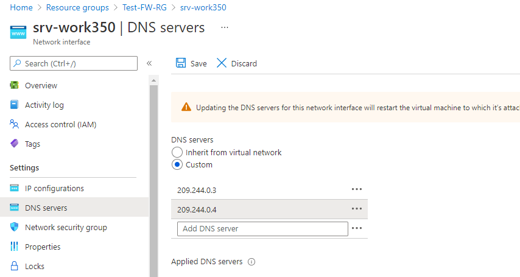
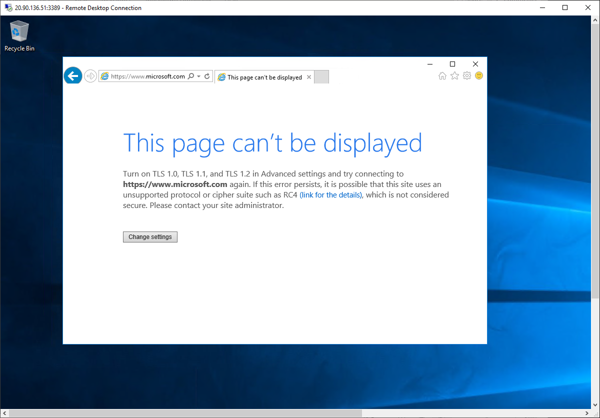

---
Exercise:
  title: M06 - Unidade 7 Implantar e configurar o Firewall do Azure usando o portal do Azure
  module: 'Module 06 - Design and implement network security '
---

# M06-Unidade 7 Implantar e configurar o Firewall do Azure usando o portal do Azure

## Cenário do exercício

Sendo parte da equipe de Segurança de Rede na Contoso, sua próxima tarefa é criar regras de firewall para permitir/negar o acesso a determinados sites. As etapas a seguir explicam como criar um grupo de recursos, uma rede virtual, sub-redes e uma máquina virtual como tarefas de preparação do ambiente e implantar o firewall e a política de firewall, configurar rotas padrão e de aplicativo, regras de rede e DNAT e, por fim, testar o firewall.


Neste exercício, você vai:

+ Tarefa 1: criar um grupo de recursos
+ Tarefa 2: Criar uma rede virtual e sub-redes
+ Tarefa 3: Criar uma máquina virtual
+ Tarefa 4: Implantar o firewall e a política de firewall
+ Tarefa 5: Criar uma rota padrão
+ Tarefa 6: Configurar uma regra de aplicativo
+ Tarefa 7: Configurar uma regra de rede
+ Tarefa 8: Configurar uma regra DNAT (NAT de destino)
+ Tarefa 9: Alterar os endereços DNS primário e secundário para a interface de rede do servidor
+ Tarefa 10: Testar o firewall


   >**Observação:** há uma **[simulação interativa de laboratório](https://mslabs.cloudguides.com/guides/AZ-700%20Lab%20Simulation%20-%20Deploy%20and%20configure%20Azure%20Firewall%20using%20the%20Azure%20portal)** disponível que permite que você clique neste laboratório no seu próprio ritmo. Você pode encontrar pequenas diferenças entre a simulação interativa e o laboratório hospedado, mas os principais conceitos e ideias que estão sendo demonstrados são os mesmos.

### Tempo estimado: 60 minutos

## Tarefa 1: criar um grupo de recursos

Nesta tarefa, você criará um novo grupo de recursos.

1. Faça logon na sua conta do Azure.

1. Na página inicial do portal do Azure, selecione **Grupos de recursos**.

1. Selecione **Criar**.

1. Na guia **Noções básicas**, em **Grupo de recursos**, insira **Test-FW-RG**.

1. Em **Região**, selecione sua região na lista.

   

1. Selecione **Examinar + criar**.

1. Selecione **Criar**.

## Tarefa 2: Criar uma rede virtual e sub-redes

Nesta tarefa, você criará uma única rede virtual com duas sub-redes.

1. Na página inicial do portal do Azure, na caixa de pesquisa, insira **rede virtual** e selecione **Rede Virtual** quando ela aparecer.

1. Selecione **Criar**.

1. Selecione o grupo de recursos **Test-FW-RG** criado anteriormente.

1. Na caixa **Nome**, insira **Test-FW-VN**.

   

1. Selecione **Avançar: Endereços IP**. Digite o espaço de endereço IPv4 10.0.0.0/16 se ainda não estiver lá por padrão.

1. Em **Nome da sub-rede**, selecione a palavra **padrão**.

1. Na caixa de diálogo **Editar sub-rede**, altere o nome para **AzureFirewallSubnet**.

1. Altere o **Intervalo de endereços de sub-rede** para **10.0.1.0/26**.

1. Selecione **Salvar**.

1. Selecione **Adicionar sub-rede** para criar outra sub-rede que hospedará o servidor de carga de trabalho que será criado em breve.

    

1. Na caixa de diálogo **Editar sub-rede**, altere o nome para **Workload-SN**.

1. Altere o **Intervalo de endereços de sub-rede** para **10.0.2.0/24**.

1. Selecione **Adicionar**.

1. Selecione **Examinar + criar**.

1. Selecione **Criar**.

## Tarefa 3: Criar uma máquina virtual

Nesta tarefa, você criará a máquina virtual de carga de trabalho e a posicionará na sub-rede Workload-SN criada anteriormente.

1. No portal do Azure, clique no ícone do Cloud Shell (canto superior direito). Se necessário, configure o shell.  
    + Selecione **PowerShell**.
    + Selecione **Nenhuma Conta de Armazenamento necessária** e sua **Assinatura** e, em seguida, selecione **Aplicar**.
    + Aguarde até que o terminal seja criado e um prompt seja exibido. 

1. Na barra de ferramentas do painel do painel do Cloud Shell, selecione o ícone **Gerenciar arquivos**. No menu suspenso, selecione **Upload** e faça upload dos seguintes arquivos **firewall.json** e **firewall.parameters.json** no diretório base do Cloud Shell.

    > **Observação:** se você estiver trabalhando em sua própria assinatura, os [arquivos de modelo](https://github.com/MicrosoftLearning/AZ-700-Designing-and-Implementing-Microsoft-Azure-Networking-Solutions/tree/master/Allfiles/Exercises) estarão disponíveis no repositório do GitHub Lab.

1. Implante os seguintes modelos do ARM para criar a VM necessária para este exercício:

   >**Observação**: você será solicitado a fornecer uma senha de Administrador.

   ```powershell
   $RGName = "Test-FW-RG"
   
   New-AzResourceGroupDeployment -ResourceGroupName $RGName -TemplateFile firewall.json -TemplateParameterFile firewall.parameters.json
   ```
  
1. Após a conclusão da implantação, acesse a home page do portal do Azure e, depois, escolha **Máquinas Virtuais**.

1. Verifique se a máquina virtual foi criada.

1. Na página **Visão geral** de **Srv-Work**, à direita da página em **Rede**, anote o **Endereço IP privado** para essa VM (por exemplo, **10.0.2.4**).

## Tarefa 4: Implantar o firewall e a política de firewall

Nesta tarefa, você implantará o firewall na rede virtual com uma política de firewall configurada.

1. Na página inicial do portal do Azure, selecione **Criar um recurso**, insira **Firewall** na caixa de pesquisa e selecione **Firewall** quando for exibido.

1. Na página **Firewall** , selecione **Criar**.

1. Na guia **Noções básicas**, crie um novo firewall usando as informações na tabela a seguir.

   | **Configuração**          | **Valor**                                                    |
   | -------------------- | ------------------------------------------------------------ |
   | Subscription         | Selecione sua assinatura                                     |
   | Grupo de recursos       | **Test-FW-RG**                                               |
   | Nome do firewall        | **Test-FW01**                                                |
   | Region               | Sua região                                                  |
   | SKU do Firewall        | **Standard**                                                 |
   | Gerenciamento do firewall  | **Usar uma política de firewall para gerenciar este firewall**            |
   | Política de firewall      | Selecione **Adicionar nova**<br />Nome: **fw-test-pol**<br />Região: **sua região** |

   

   | Escolher uma rede virtual | **Usar existente**                         |
   | ------------------------ | ---------------------------------------- |
   | Rede virtual          | **Test-FW-VN**                           |
   | Endereço IP público        | Selecione **Adicionar nova**<br />Nome: **fw-pip** |

   

1. Não usaremos o Gerenciador de Firewall, portanto, desmarque a caixa **Ativar NIC de Gerenciamento de Firewall**. 

1. Examine suas configurações. 

   

1. Continue para **Revisar + criar** e depois **Criar**.

1. Aguarde até que a implantação do firewall seja concluída.

1. Quando a implantação do firewall for concluída, selecione **Ir para o recurso**.

1. Na página **Visão geral** do **Test-FW01**, à direita da página, anote o **IP privado do firewall** para esse firewall (por exemplo, **10.0.1.4**).

1. No menu à esquerda, em **Configurações**, selecione **Configuração de IP público**.

1. Anote o endereço em **Endereço IP** para a configuração de IP público **fw-pip** (por exemplo, **20.90.136.51**).

## Tarefa 5: Criar uma rota padrão

Para esta tarefa, na sub-rede Workload-SN, configure a rota de saída padrão para atravessar o firewall.

1. Na página inicial do portal do Azure, selecione **Criar um recurso**, insira **rota** na caixa de pesquisa e selecione **Tabela de rotas** quando for exibido.

1. Na página **Tabela de rotas**, selecione **Criar**.

1. Na guia **Noções básicas**, crie uma nova tabela de rotas usando as informações na tabela a seguir.

   | **Configuração**              | **Valor**                |
   | ------------------------ | ------------------------ |
   | Subscription             | Selecione sua assinatura |
   | Grupo de recursos           | **Test-FW-RG**           |
   | Region                   | Sua região              |
   | Nome                     | **Firewall-route**       |
   | Propagar rotas de gateway | **Sim**                  |

1. Selecione **Examinar + criar**.

1. Selecione **Criar**.

   

1. Após a implantação ser concluída, selecione **Ir para o recurso**.

1. Na página **Firewall-route**, em **Configurações**, selecione **Sub-redes** e **Associar**.

1. Em **Rede virtual**, selecione **Test-FW-VN**.

1. Em **Sub-rede**, selecione **Carga de trabalho-SN**. Não deixe de selecionar apenas a sub-rede Workload-SN para essa rota, caso contrário, o firewall não funcionará corretamente.

1. Selecione **OK**.

1. Em **Configurações**, selecione **Rotas** e **Adicionar**.

1. Em **Nome da rota**, insira **fw-dg**.

1. Em **Prefixo do endereço de destino**, digite **0.0.0.0/0**.

1. Em **Tipo do próximo salto**, selecione **Solução de virtualização**.

1. Em **Endereço do próximo salto**, insira o endereço IP privado do firewall que você anotou anteriormente (por exemplo, **10.0.1.4**)

1. Selecione **Adicionar**.

    

## Tarefa 6: Configurar uma regra de aplicativo

Nesta tarefa, você adicionará uma regra de aplicativo que permite o acesso de saída a <www.google.com>.

1. Na home page do portal do Azure, selecione **Todos os recursos**.

1. Na lista de recursos, selecione sua política de firewall, **fw-test-pol**.

1. Em **Regras**, selecione **Regras de aplicativo**.

1. Selecione **Adicionar uma coleção de regras**.

1. Na página **Adicionar uma coleção de regras**, crie uma nova regra de aplicativo usando as informações na tabela abaixo.

   | **Configuração**            | **Valor**                                 |
   | ---------------------- | ----------------------------------------- |
   | Nome                   | **App-Coll01**                            |
   | Tipo de coleção de regras   | **Aplicativo**                           |
   | Prioridade               | **200**                                   |
   | Ação da coleção de regras | **Permitir**                                 |
   | Grupo de coleções de regras  | **DefaultApplicationRuleCollectionGroup** |
   | **Seção de Regras**      |                                           |
   | Nome                   | **Allow-Google**                          |
   | Tipo de origem            | **Endereço IP**                            |
   | Origem                 | **10.0.2.0/24**                           |
   | Protocolo               | **http,https**                            |
   | Tipo de destino       | **FQDN**                                  |
   | Destino            | **<www.google.com>**                        |

   

1. Selecione **Adicionar**.

## Tarefa 7: Configurar uma regra de rede

Nesta tarefa, você adicionará uma regra de rede que permite o acesso de saída a dois endereços IP na porta 53 (DNS).

1. Na página **fw-test-pol**, em **Regras**, selecione **Regras de Rede**.

1. Selecione **Adicionar uma coleção de regras**.

1. Na página **Adicionar uma coleção de regras**, crie uma nova regra de rede usando as informações na tabela abaixo.

   | **Configuração**            | **Valor**                                                    |
   | ---------------------- | ------------------------------------------------------------ |
   | Nome                   | **Net-Coll01**                                               |
   | Tipo de coleção de regras   | **Rede**                                                  |
   | Prioridade               | **200**                                                      |
   | Ação da coleção de regras | **Permitir**                                                    |
   | Grupo de coleções de regras  | **DefaultNetworkRuleCollectionGroup**                        |
   | **Seção de Regras**      |                                                              |
   | Nome                   | **Allow-DNS**                                                |
   | Tipo de origem            | **Endereço IP**                                               |
   | Origem                 | **10.0.2.0/24**                                              |
   | Protocolo               | **UDP**                                                      |
   | Portas de Destino      | **53**                                                       |
   | Tipo de destino       | **Endereço IP**                                               |
   | Destino            | **209.244.0.3, 209.244.0.4**<br />São servidores DNS públicos operados pelo Century Link |

    

1. Selecione **Adicionar**.

## Tarefa 8: Configurar uma regra DNAT (NAT de destino)

Nesta tarefa, você adicionará uma regra DNAT que permite que você conecte uma área de trabalho remota à máquina virtual Srv-Work por meio do firewall.

1. Na página **fw-test-pol**, em **Regras**, selecione **Regras DNAT**.

1. Selecione **Adicionar uma coleção de regras**.

1. Na página **Adicionar uma coleção de regras**, crie uma nova regra DNAT usando as informações na tabela abaixo.

   | **Configuração**           | **Valor**                                                    |
   | --------------------- | ------------------------------------------------------------ |
   | Nome                  | **rdp**                                                      |
   | Tipo de coleção de regras  | **DNAT**                                                     |
   | Prioridade              | **200**                                                      |
   | Grupo de coleções de regras | **DefaultDnatRuleCollectionGroup**                           |
   | **Seção de Regras**     |                                                              |
   | Nome                  | **rdp-nat**                                                  |
   | Tipo de origem           | **Endereço IP**                                               |
   | Origem                | *                                                            |
   | Protocolo              | **TCP**                                                      |
   | Portas de Destino     | **3389**                                                     |
   | Tipo de destino      | **Endereço IP**                                               |
   | Destino           | Insira o endereço IP público do firewall do **fw-pip** que você anotou anteriormente.<br />**por exemplo – 20.90.136.51** |
   | Endereço traduzido    | Insira o endereço IP privado de **Srv-Work** que você anotou anteriormente.<br />**por exemplo – 10.0.2.4** |
   | Porta traduzida       | **3389**                                                     |

  

1. Selecione **Adicionar**.

## Tarefa 9: Alterar os endereços DNS primário e secundário para a interface de rede do servidor

Para fins de teste, nesta tarefa, você configurará os endereços DNS primários e secundários do servidor Srv-Work. No entanto, não é um requisito geral do Firewall do Azure.

1. Na página inicial do portal do Azure, selecione **Grupos de recursos**.

1. Na lista de grupos de recursos, selecione seu grupo de recursos, **Test-FW-RG**.

1. Na lista de recursos nesse grupo de recursos, selecione a interface de rede para a máquina virtual **Srv-Work** (por exemplo, **srv-work350**).

   

1. Em **Configurações**, selecione **Servidores DNS**.

1. Em **Servidores DNS**, selecione **Personalizado**.

1. insira **209.244.0.3** na caixa de texto **Adicionar servidor DNS** e **209.244.0.4** na próxima caixa de texto.

1. Selecione **Salvar**.

   

1. Reinicie a máquina virtual **Srv-Work**.

## Tarefa 10: Testar o firewall

Nesta tarefa final, você testará o firewall para verificar se as regras estão configuradas corretamente e funcionando conforme o esperado. Essa configuração permitirá que você conecte uma conexão de área de trabalho remota à máquina virtual Srv-Work por meio do firewall, via endereço IP público do firewall.

1. Abra **Conexão de Área de Trabalho Remota** em seu computador.

1. Na caixa **Computador**, insira o endereço IP público do firewall (por exemplo, **20.90.136.51**) seguido por **:3389** (por exemplo, **20.90.136.51:3389**).

1. Na caixa **Nome de usuário**, digite **TestUser**.

1. Selecione **Conectar**.

   

1. Na caixa de diálogo **Inserir suas credenciais**, entre na máquina virtual do servidor **Srv-Work** usando a senha fornecida durante a implantação.

1. Selecione **OK**.

1. Selecione **Sim** na mensagem do certificado.

1. Abra o Internet Explorer e navegue até **<https://www.google.com>**.

1. Na caixa de diálogo **Alerta de Segurança**, selecione **OK**.

1. Selecione **Fechar** nos alertas de segurança do Internet Explorer que podem aparecer.

1. Você deve ver a página inicial do Google.

    

1. Navegue até **<https://www.microsoft.com>**.

1. Você deve ser bloqueado pelo firewall.

    

## Limpar os recursos

   >**Observação**: lembre-se de remover todos os recursos recém-criados do Azure que você não usa mais. Remover recursos não utilizados garante que você não veja encargos inesperados.

1. No portal do Azure, abra a sessão **PowerShell** no painel do **Cloud Shell**.

1. Exclua todos os grupos de recursos criados em todos os laboratórios deste módulo executando o seguinte comando:

   ```powershell
   Remove-AzResourceGroup -Name 'Test-FW-RG' -Force -AsJob
   ```

   >**Observação**: o comando é executado de maneira assíncrona (conforme determinado pelo parâmetro -AsJob), portanto, embora você possa executar outro comando do PowerShell imediatamente após na mesma sessão do PowerShell, levará alguns minutos antes dos grupos de recursos serem de fato removidos.

## Estender seu aprendizado com o Copilot

O Copilot pode ajudar você a aprender a usar as ferramentas de script do Azure. O Copilot também pode ajudar em áreas não cobertas no laboratório ou onde você precisar de mais informações. Abra um navegador do Edge e escolha Copilot (canto superior direito) ou navegue até *copilot.microsoft.com*. Reserve alguns minutos para experimentar essas solicitações.
+ Forneça três cenários de uso comuns para firewalls. 
+ Forneça uma tabela comparando os recursos dos SKUs do Firewall do Azure.
+ Descreva os três tipos de regras que você pode criar para um Firewall do Azure.

## Saiba mais com treinamento individual

+ [Introdução ao Firewall do Azure](https://learn.microsoft.com/training/modules/introduction-azure-firewall/). Neste módulo, você aprenderá como o Firewall do Azure protege os recursos de rede virtual do Azure, incluindo recursos, regras e opções de implantação.
+ [Introdução ao Gerenciador de Firewall do Azure](https://learn.microsoft.com/training/modules/intro-to-azure-firewall-manager/). Neste módulo, você aprenderá como o Gerenciador de Firewall do Azure fornece política de segurança central e gerenciamento de rotas para parâmetros de segurança baseados em nuvem.

## Principais aspectos a serem lembrados

Parabéns por concluir o laboratório. Aqui estão as principais lições desse laboratório. 
+ Um firewall é um recurso de segurança de rede que fica entre uma rede confiável e uma rede não confiável, como a Internet. O trabalho do firewall é analisar e permitir ou negar o tráfego de rede.
+ O Firewall do Azure é um serviço de firewall baseado em nuvem. Na maioria das configurações, ele é provisionado dentro de uma rede virtual hub. O tráfego das redes virtuais spoke e para elas, bem como a rede local, atravessa o firewall.
+ As regras de firewall avaliam o tráfego da rede. O Firewall do Azure tem três tipos de regras: aplicativo, rede e NAT. 
+ O Firewall do Azure é oferecido em três SKUs: Standard, Premium e Basic.
