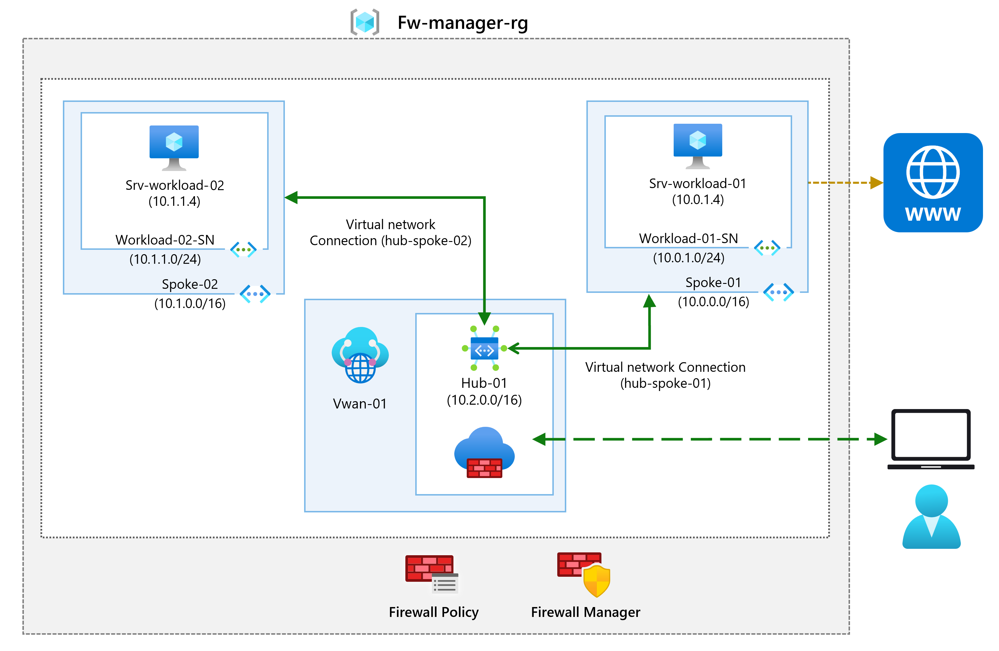
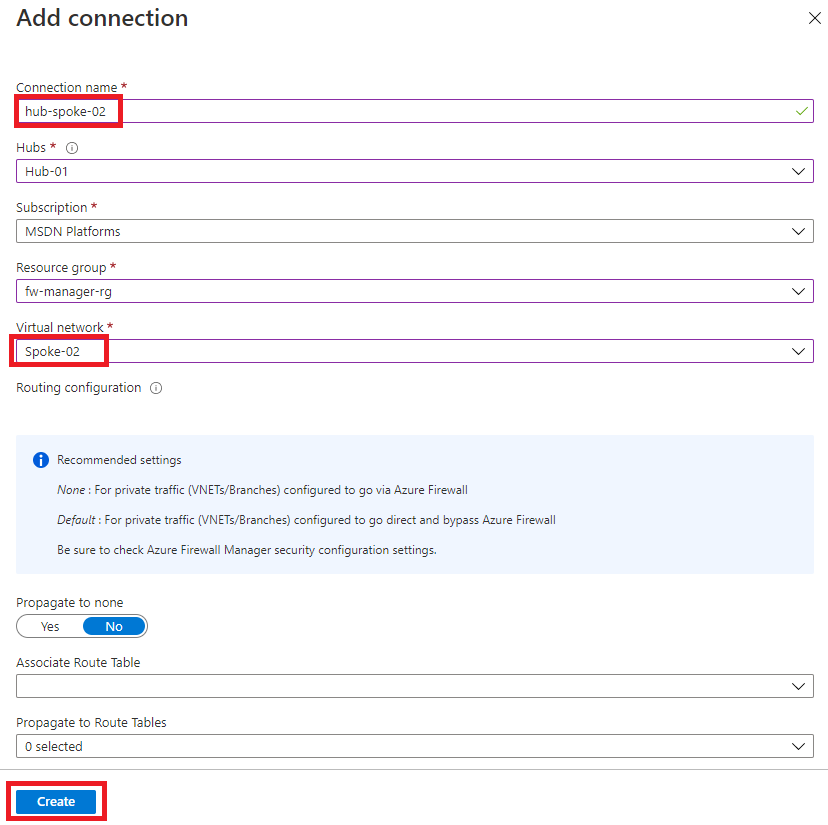
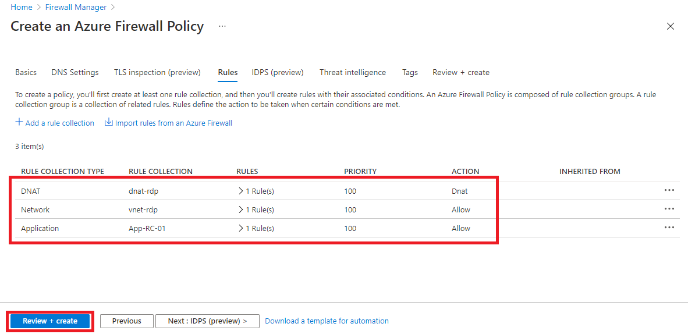
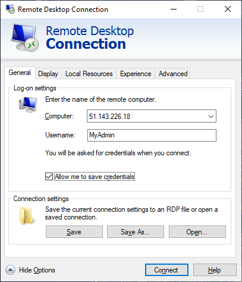
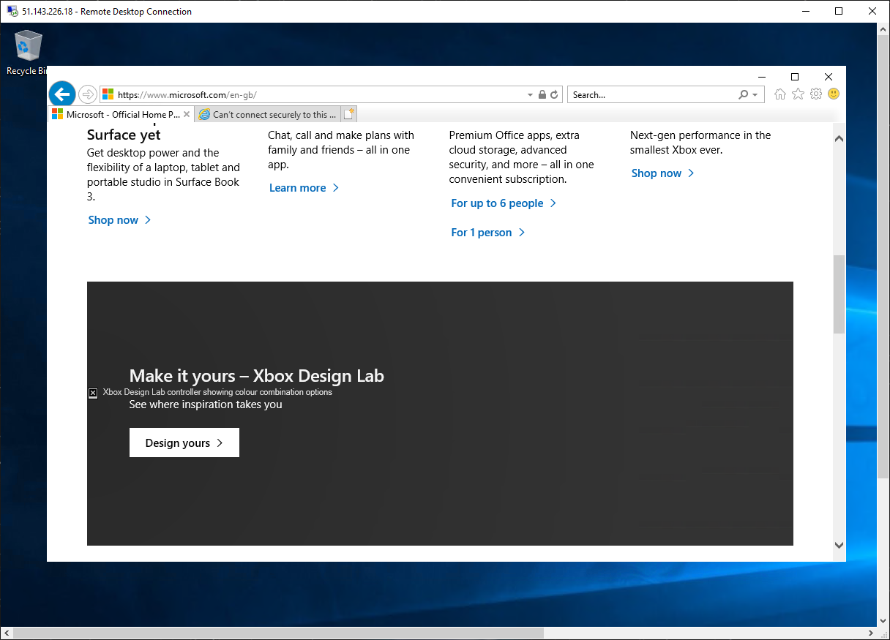

---
Exercise:
  title: M06 - Unidade 9 Proteger seu hub virtual usando o Gerenciador de Firewall do Azure
  module: Module 06 - Design and implement network security
---


# M06-Unidade 9 Proteger seu hub virtual usando o Gerenciador de Firewall do Azure

## Cenário do exercício

Neste exercício, você criará a rede virtual spoke, criará um hub virtual seguro, conectará as redes virtuais hub e spoke e roteará o tráfego para seu hub. Agora, você implantará os servidores de carga de trabalho, criará uma política de firewall, protegerá seu hub e, por fim, testará o firewall.




**Observação:** uma **[simulação de laboratório interativa](https://mslabs.cloudguides.com/guides/AZ-700%20Lab%20Simulation%20-%20Secure%20your%20virtual%20hub%20using%20Azure%20Firewall%20Manager)** está disponível e permite que você clique neste laboratório no seu próprio ritmo. Você pode encontrar pequenas diferenças entre a simulação interativa e o laboratório hospedado, mas os principais conceitos e ideias que estão sendo demonstrados são os mesmos.

## Criar uma arquitetura de hub e spoke

Nesta parte do exercício, você criará as redes virtuais spoke e sub-redes em que colocará os servidores da carga de trabalho. Você criará o hub virtual seguro e conectará as redes virtuais hub e spoke.

Neste exercício, você vai:

+ Tarefa 1: Criar duas redes virtuais spoke e sub-redes
+ Tarefa 2: Criar o hub virtual seguro
+ Tarefa 3: Conectar as redes virtuais hub e spoke
+ Tarefa 4: Implantar os servidores
+ Tarefa 5: Criar uma política de firewall e proteger seu hub
+ Tarefa 6: Associar a política de firewall
+ Tarefa 7: Rotear o tráfego para o hub
+ Tarefa 8: Testar a regra do aplicativo
+ Tarefa 9: Testar a regra de rede
+ Tarefa 10: Limpar os recursos

### Tempo estimado: 35 minutos

## Tarefa 1: Criar duas redes virtuais spoke e sub-redes

Nesta tarefa, você criará as duas redes virtuais spoke, cada uma contendo uma sub-rede que hospedará seus servidores de carga de trabalho.

1. Na página inicial do portal do Azure, na caixa de pesquisa, insira **rede virtual** e selecione **Rede Virtual** quando ela aparecer.
2. Selecione **Criar**.
3. Em **Grupo de recursos,** selecione **Criar novo** e insira **fw-manager-rg** como o nome e selecione **OK**.
4. Em **Nome**, insira **Spoke-01**.
5. Em **Região**, selecione sua região.
6. Selecione **Avançar: Endereços IP**.
7. Em **Espaço de endereço IPv4**, insira **10.0.0.0/16**.
8. **Exclua** quaisquer outros espaços de endereço listados aqui, como **10.1.0.0/16**.
9. Em **Nome da sub-rede**, selecione a palavra **padrão**.
10. Na caixa de diálogo **Editar sub-rede**, altere o nome para **Workload-01-SN**.
11. Altere o **Intervalo de endereços de sub-rede** para **10.0.1.0/24**.
12. Selecione **Salvar**.
13. Selecione **Examinar + criar**.
14. Selecione **Criar**.

Repita as etapas de 1 a 14 acima para criar outra rede virtual e sub-rede semelhantes, mas usando as seguintes informações:

+ Grupo de Recursos: **fw-manager-rg** (selecionar existente)
+ Nome: **Spoke-02**
+ Espaço de endereço: **10.1.0.0/16** – (excluir quaisquer outros espaços de endereço listados)
+ Nome da sub-rede: **Workload-02-SN**
+ Intervalo de endereços da sub-rede: **10.1.1.0/24**

## Tarefa 2: Criar o hub virtual seguro

Nesta tarefa, você criará seu hub virtual seguro usando o Gerenciador de Firewall.

1. Na página inicial do portal do Azure, selecione **Todos os serviços**.

2. Na caixa de pesquisa, insira **gerenciador de firewall** e selecione **Gerenciador de Firewall** quando for exibido.

3. Na página **Gerenciador de Firewall**, a partir da página Visão geral, selecione **Exibir hubs virtuais protegidos**.

4. Na página **Hubs virtuais**, selecione **Criar novo hub virtual seguro**.

5. Em **Grupo de recursos**, selecione **fw-manager-rg**.

6. Em **Região**, selecione sua região.

7. Para o **nome do hub virtual seguro**, insira **Hub-01**.

8. Em **Espaço de endereço do hub**, insira **10.2.0.0/16**.

9. Escolha **Nova vWAN**.

10. Em **Nome da WAN Virtual**, insira **Vwan-01**.

11. Selecione **Avançar: Firewall do Azure**.
    

12. Selecione **Avançar: Provedor de Parceiro de Segurança**.

13. Selecione **Avançar: Revisar + criar**.

14. Selecione **Criar**.

    > **[!NOTE]**
    >
    > Pode levar até 30 minutos para implantar.

    

    

15. Quando a implantação for concluída, na página inicial do portal do Azure, selecione **Todos os serviços**.

16. Na caixa de pesquisa, insira **gerenciador de firewall** e selecione **Gerenciador de Firewall** quando for exibido.

17. Na página **Gerenciador de Firewall**, selecione **Hubs virtuais**.

18. Selecione **Hub-01**.

19. Selecione **Configuração de IP público**.

20. Anote o endereço IP público (por exemplo, **51.143.226.18**), que será usado posteriormente.

## Tarefa 3: Conectar as redes virtuais hub e spoke

Nesta tarefa, você conectará as redes virtuais hub e spoke. Isso é normalmente conhecido como emparelhamento.

1. Na página inicial do portal do Azure, selecione **Grupos de recursos**.
2. Escolha o grupo de recursos **fw-manager-rg** e selecione a WAN Virtual **Vwan-01**.
3. Em **Conectividade**, selecione **Conexões de rede virtual**.
4. Selecione **Adicionar conexão**.
5. Em **Nome da conexão**, insira **hub-spoke-01**.
6. Para **Hubs**, selecione **Hub-01**.
7. Em **Grupo de recursos**, selecione **fw-manager-rg**.
8. Para **Rede virtual**, selecione **Spoke-01**.
9. Selecione **Criar**.
   
10. Repita as etapas de 4 a 9 acima para criar outra conexão semelhante, mas usando o nome da conexão **hub-spoke-02** para conectar à rede virtual **Spoke-02**.



## Tarefa 4: Implantar os servidores

1. No portal do Azure, abra a sessão **PowerShell** no painel do **Cloud Shell**.

1. Na barra de ferramentas do painel do Cloud Shell, selecione o ícone **Carregar/baixar arquivos**, no menu suspenso, selecione **Carregar** e carregue os seguintes arquivos **FirewallManager.json** e **FirewallManager.parameters.json**, um a um, da pasta de origem **F:\Allfiles\Exercises\M06** para o diretório base do Cloud Shell.

1. Implante os seguintes modelos do ARM para criar a VM necessária para este exercício:

   >**Observação**: você será solicitado a fornecer uma senha de Administrador.

   ```powershell
   $RGName = "fw-manager-rg"
   
   New-AzResourceGroupDeployment -ResourceGroupName $RGName -TemplateFile FirewallManager.json -TemplateParameterFile FirewallManager.parameters.json
   ```
  
1. Após a conclusão da implantação, acesse a home page do portal do Azure e, depois, escolha **Máquinas Virtuais**.

1. Na página **Visão geral** do **Srv-workload-01**, no painel à direita, na seção **Rede**, anote o **Endereço IP privado** (por exemplo, **10.0.1.4**).

1. Na página **Visão geral** do **Srv-workload-02**, no painel à direita, na seção **Rede**, anote o **Endereço IP privado** (por exemplo, **10.1.1.4**).

## Tarefa 5: Criar uma política de firewall e proteger seu hub

Nesta tarefa, você criará a política de firewall para proteger seu hub. Uma política de firewall define coleções de regras para direcionar o tráfego em um ou mais Hubs virtuais seguros.

1. Na página inicial do portal do Azure, selecione **Gerenciador de Firewall**.
   + Se o ícone do Gerenciador de Firewall não aparecer na página inicial, selecione**Todos os serviços**. Em seguida, na caixa de pesquisa, insira **gerenciador de firewall** e selecione **Gerenciador de Firewall** quando for exibido.

1. No **Gerenciador de Firewall**, a partir da página Visão Geral, selecione **Exibir políticas de Firewall do Azure**.

1. Selecione **Criar uma Política de Firewall do Azure**.

1. Em **Grupo de recursos**, selecione **fw-manager-rg**.

5. Em **Detalhes da política**, para o **Nome**, insira **Policy-01**.

1. Em **Região**, selecione sua região.

1. Em **Camada da política**, selecione **Standard**.

1. Selecione **Próximo: Configurações de DNS**.

1. Selecione **Próximo: Inspeção de TLS (versão prévia)**.

1. Selecione **Avançar: Regras**.

1. Na guia **Regras**, selecione **Adicionar a coleção de regras**.

1. Na página **Adicionar uma coleção de regras**, em **Nome**, insira **App-RC-01**.

1. Para **Tipo de coleção de regras**, selecione **Aplicativo**.

1. Para **Prioridade**, insira **100**.

1. Verifique se a **Ação de coleção de regras** é **Permitir**.

1. Em **Regras**, em **Nome**, insira **Allow-msft**.

1. Para o **Tipo de origem**, selecione **Endereço IP**.

1. Em **Origem**, insira *.

1. Para **Protocolo**, insira **http,https**.

1. Verifique se o **Tipo de destino** é **FQDN**.

1. Para **Destino**, insira ***.microsoft.com**.

1. Selecione **Adicionar**.

    

1. Para adicionar uma regra DNAT para que você possa conectar uma área de trabalho remota à VM Srv-workload-01, selecione **Adicionar uma coleção de regras**.

1. Para **Nome**, insira **dnat-rdp**.

1. Em **Tipo de coleção de regras**, selecione **DNAT**.

1. Para **Prioridade**, insira **100**.

1. Em **Regras**, em **Nome**, insira **Allow-rdp**.

1. Para o **Tipo de origem**, selecione **Endereço IP**.

1. Em **Origem**, insira *.

1. Em **Protocolo**, selecione **TCP**.

1. Para **Portas de Destino**, insira **3389**.

1. Para **Tipo de Destino**, selecione **Endereço IP**.

1. Para **Destino**, insira o endereço IP público do hub virtual do firewall que você anotou anteriormente (por exemplo, **51.143.226.18**).

1. Para **Endereço traduzido**, insira o endereço IP privado para **Srv-workload-01** que você anotou anteriormente (por exemplo, **10.0.1.4**).

1. Para **Porta traduzida**, insira **3389**.

1. Selecione **Adicionar**.

1. Para adicionar uma Regra de rede para que você possa conectar uma área de trabalho remota de Srv-workload-01 à VM Srv-workload-02, selecione **Adicionar uma coleção de regras**.

1. Para **Nome**, insira **vnet-rdp**.

1. Para **Tipo de coleção de regras**, selecione **Rede**.

1. Para **Prioridade**, insira **100**.

1. Em **Ação de coleção de regras**, selecione **Permitir**.

1. Em **Regras**, em **Nome**, insira **Allow-vnet**.

1. Para o **Tipo de origem**, selecione **Endereço IP**.

1. Em **Origem**, insira *.

1. Em **Protocolo**, selecione **TCP**.

1. Para **Portas de Destino**, insira **3389**.

1. Para **Tipo de Destino**, selecione **Endereço IP**.

1. Para **Destino**, insira o endereço IP privado para **Srv-workload-02** que você anotou anteriormente (por exemplo, **10.1.1.4**).

1. Selecione **Adicionar**.

    

1. Agora você deve ter três coleções de regras listadas.

1. Selecione **Examinar + criar**.

1. Selecione **Criar**.

## Tarefa 6: Associar a política de firewall

Nesta tarefa, você associará a política de firewall ao hub virtual.

1. Na página inicial do portal do Azure, selecione **Gerenciador de Firewall**.
   + Se o ícone do Gerenciador de Firewall não aparecer na página inicial, selecione**Todos os serviços**. Em seguida, na caixa de pesquisa, insira **gerenciador de firewall** e selecione **Gerenciador de Firewall** quando for exibido.
1. No **Gerenciador de Firewall**, em **Segurança**, selecione **Políticas de Firewall do Azure**.
1. Marque a caixa de seleção para **Política-01**.
1. Selecione **Gerenciar associações&gt;Associar hubs**.
1. Marque a caixa de seleção para **Hub-01**.
1. Selecione **Adicionar**.
1. Quando a política tiver sido anexada, selecione **Atualizar**. A associação deve ser exibida.


## Tarefa 7: Rotear o tráfego para o hub

Nesta tarefa, você deverá garantir que o tráfego de rede seja roteado por meio do firewall.

1. No **Gerenciador de Firewall**, selecione **Hubs virtuais**.
1. Selecione **Hub-01**.
1. Em **Configurações**, escolha **Configuração de segurança**.
1. Em **Tráfego da Internet**, selecione **Firewall do Azure**.
1. Em **Tráfego privado**, selecione **Enviar por meio do Firewall do Azure**.
1. Selecione **Salvar**.
1. Essa ação levará alguns minutos para ser concluída.
1. Após a conclusão da configuração, garanta que **TRÁFEGO DE INTERNET** e **TRÁFEGO PRIVADO** indica **Protegido pelo Firewall do Azure** para conexões hub-spoke.

## Tarefa 8: Testar a regra do aplicativo

Nesta parte do exercício, você conectará uma área de trabalho remota ao endereço IP público do firewall, que é NATed para SRV-Workload-01. Você usará um navegador da Web para testar a regra de aplicativo e conectar uma área de trabalho remota a Srv-Workload-02 para testar a regra de rede.

Nesta tarefa, você testará a regra de aplicativo para confirmar que ela funciona conforme o esperado.

1. Abra **Conexão de Área de Trabalho Remota** em seu computador.

1. Na caixa **Computador**, insira o **endereço IP público do firewall** (por exemplo, **51.143.226.18**).

1. Selecione **Mostrar Opções**.

1. Na caixa **Nome de usuário**, digite **TestUser**.

1. Selecione **Conectar**.

   

1. Na caixa de diálogo **Inserir suas credenciais**, entre na máquina virtual do servidor **Srv-workload-01** usando a senha fornecida durante a implantação.

1. Selecione **OK**.

1. Selecione **Sim** na mensagem do certificado.

1. Abra o Internet Explorer e selecione **OK** na caixa de diálogo **Configurar Internet Explorer 11**.

1. Navegue para **https://** **<www.microsoft.com>**.

1. Na caixa de diálogo **Alerta de Segurança**, selecione **OK**.

1. Selecione **Fechar** nos alertas de segurança do Internet Explorer que podem aparecer.

1. Você deve ver a página inicial da Microsoft.

    

1. Navegue para **https://** **<www.google.com>**.

1. Você deve ser bloqueado pelo firewall.

    

1. Portanto, você verificou que pode se conectar a um FQDN permitido, mas que está bloqueado em todos os outros.

## Tarefa 9: Testar a regra de rede

Nesta tarefa, você testará a regra de rede para confirmar que ela funciona conforme o esperado.

1. Embora ainda esteja conectado à sessão RDP **Srv-workload-01**, nesse computador remoto, abra **Conexão de Área de Trabalho Remota**.

1. Na caixa **Computador**, insira o **endereço IP privado** de **Srv-workload-02** (por exemplo, **10.1.1.4**).

1. Na caixa de diálogo **Digite suas credenciais**, entre no servidor **Srv-workload-02** usando o nome de usuário **TestUser** e a senha fornecida durante a implantação.

1. Selecione **OK**.

1. Selecione **Sim** na mensagem do certificado.

   

1. Agora você verificou que a regra de rede do firewall está funcionando, pois conectou uma área de trabalho remota de um servidor a outro servidor localizado em outra rede virtual.

1. Feche as duas sessões RDP para desconectá-las.

## Tarefa 10: Limpar os recursos

>**Observação**: lembre-se de remover todos os recursos do Azure recém-criados que você não usa mais. Remover recursos não utilizados garante que você não veja encargos inesperados.

1. No portal do Azure, abra a sessão **PowerShell** no painel do **Cloud Shell**.

1. Exclua todos os grupos de recursos criados em todos os laboratórios deste módulo executando o seguinte comando:

   ```powershell
   Remove-AzResourceGroup -Name 'fw-manager-rg' -Force -AsJob
   ```

    >**Observação**: o comando é executado de modo assíncrono (conforme determinado pelo parâmetro -AsJob), portanto, embora você possa executar outro comando do PowerShell imediatamente depois na mesma sessão do PowerShell, levará alguns minutos antes de os grupos de recursos serem de fato removidos.
