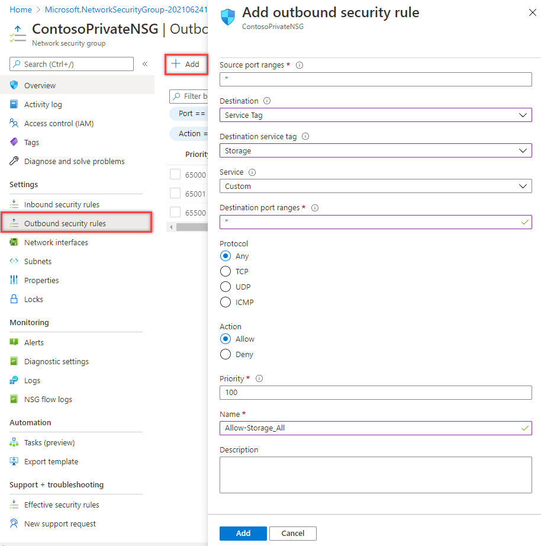

---
Exercise:
  title: M07 - Unidade 5 Restrinja o acesso à rede a recursos de PaaS com pontos de extremidade de serviço de rede virtual
  module: Module 07 - Design and implement private access to Azure Services
---

# M07-Unidade 5 Restrinja o acesso à rede a recursos de PaaS com pontos de extremidade de serviço de rede virtual


Os pontos de extremidade de serviço de rede virtual permitem limitar o acesso à rede a alguns recursos de serviço do Azure para uma sub-rede da rede virtual. Você também pode remover o acesso à Internet para os recursos. Os pontos de extremidade de serviço fornecerão conexão direta de sua rede virtual a um serviço do Azure, permitindo que você use o espaço de endereço privado da sua rede virtual para acessar os serviços do Azure compatíveis. O tráfego destinado aos recursos do Azure por meio de pontos de extremidade de serviço sempre fica na rede de backbone do Microsoft Azure.


Neste exercício, você vai:

+ Tarefa 1: criar uma rede virtual
+ Tarefa 2: habilitar um ponto de extremidade de serviço
+ Tarefa 3: restringir o acesso à rede para uma sub-rede
+ Tarefa 4: adicionar outras regras de saída 
+ Tarefa 5: permitir o acesso para conexões de RDP
+ Tarefa 6: restringir o acesso à rede para um recurso
+ Tarefa 7: criar um compartilhamento de arquivo na conta de armazenamento
+ Tarefa 8: restringir o acesso à rede para uma sub-rede
+ Tarefa 9: criar máquinas virtuais
+ Tarefa 10: confirmar o acesso à conta de armazenamento
+ Tarefa 11: limpar os recursos

**Observação:** há uma **[simulação interativa de laboratório](https://mslabs.cloudguides.com/guides/AZ-700%20Lab%20Simulation%20-%20Restrict%20network%20access%20to%20PaaS%20resources%20with%20virtual%20network%20service%20endpoints)** disponível que permite que você clique neste laboratório no seu próprio ritmo. Você pode encontrar pequenas diferenças entre a simulação interativa e o laboratório hospedado, mas os principais conceitos e ideias que estão sendo demonstrados são os mesmos.

#### Tempo estimado: 35 minutos

## Tarefa 1: criar uma rede virtual

1. Faça logon no portal do Azure.

1. Na página inicial do portal do Azure, procure a rede virtual e selecione **Redes virtuais** nos resultados da pesquisa.

1. Selecione **+** **Criar**.

1. Insira ou selecione as seguintes informações: 

   | **Configuração**    | **Valor**                                     |
   | -------------- | --------------------------------------------- |
   | Subscription   | Selecionar sua assinatura                      |
   | Grupo de recursos | (Novo) myResourceGroup                         |
   | Nome           | CoreServicesVNet                              |
   | Localização       | Selecione **Leste dos EUA**                            |

1. Selecione a guia **Endereços IP** e insira os seguintes valores (selecione **padrão** para alterar o nome da sub-rede): 

   | **Configuração**          | **Valor**   |
   | -------------------- | ----------- |
   | Espaço de endereço        | 10.0.0.0/16 |
   | Nome da sub-rede          | Público      |
   | Intervalo de endereços da sub-rede | 10.0.0.0/24 |

1. Selecione a guia **Segurança** e insira os seguintes valores: 

   | **Configuração**             | **Valor** |
   | ----------------------- | --------- |
   | BastionHost             | Desabilitado  |
   | Proteção de Rede DDoS | Desabilitado  |
   | Firewall                | Desabilitado  |

1. Selecione **Examinar + criar**. Após a validação do recurso, selecione **Criar**. 

## Tarefa 2: habilitar um ponto de extremidade de serviço

Pontos de extremidade de serviço são habilitados por serviço, por sub-rede. Criar uma sub-rede e habilitar um ponto de extremidade de serviço para a sub-rede.

1. Na caixa **Pesquisar recursos, serviços e documentos** na parte superior do portal, insira CoreServicesVNet. Quando CoreServicesVNet aparecer nos resultados da pesquisa, selecione-a.

1. Adicione uma sub-rede à rede virtual. Em **Configurações**, selecione **Sub-redes** e, em seguida, selecione **+ Sub-rede**, conforme mostrado na imagem a seguir: 

1. Em **Adicionar sub-rede**, selecione ou insira as seguintes informações:

   | **Configuração**                 | **Valor**                    |
   | --------------------------- | ---------------------------- |
   | Nome                        | Privado                      |
   | Intervalo de endereços               | 10.0.1.0/24                  |
   | Pontos de extremidade de serviço: serviços | Selecione **Microsoft.Storage** |

1. Selecione **Salvar**.

Agora, você deve ter duas sub-redes configuradas:


 

## Tarefa 3: restringir o acesso à rede para uma sub-rede

Por padrão, todas as VMs em uma sub-rede podem se comunicar com todos os recursos. É possível limitar a comunicação com todos os recursos em uma sub-rede, criando um grupo de segurança de rede e o associando à sub-rede.

1. Na caixa **Pesquisar recursos, serviços e documentos** na parte superior do portal, insira **security group**. Quando a opção **Grupos de segurança de rede** aparecer nos resultados da pesquisa, selecione-a.

1. Em Grupos de segurança de rede, selecione **+ Criar**. 

1. Insira ou selecione as seguintes informações: 


   | **Configuração**    | **Valor**                                                    |
   | -------------- | ------------------------------------------------------------ |
   | Subscription   | Selecionar sua assinatura                                     |
   | Grupo de recursos | myResourceGroup                                              |
   | Nome           | ContosoPrivateNSG                                            |
   | Localização       | Selecione **Leste dos EUA**                                           |

1. selecione **Examinar + criar** e **Criar**:

1. Após a criação do grupo de segurança de rede ContosoPrivateNSG, escolha **Ir para o recurso**.

1. Em **Configurações**, escolha **Regras de segurança de saída**.

1. Selecione **+ Adicionar**.

1. Crie uma regra que permita a comunicação de saída para o serviço de Armazenamento do Azure. Insira ou selecione as seguintes informações: 

   | **Configuração**             | **Valor**                 |
   | ----------------------- | ------------------------- |
   | Fonte                  | Selecione **Marca de Serviço**    |
   | Marca de serviço de origem      | Selecione **VirtualNetwork** |
   | Intervalos de portas de origem      | *                         |
   | Destino             | Selecione **Marca de Serviço**    |
   | Marca de serviço de destino | Selecione **Armazenamento**        |
   | Serviço                 | Personalizado                    |
   | Intervalos de portas de destino | *                         |
   | Protocolo                | Qualquer                       |
   | Ação                  | Permitir                     |
   | Prioridade                | 100                       |
   | Nome                    | Allow-Storage-All         |

1. Escolha **Adicionar**:


## Tarefa 4: adicionar outras regras de saída 

Crie outra regra de segurança de saída que nega a comunicação com a Internet. Essa regra substitui uma regra padrão em todos os grupos de segurança de rede que permite a comunicação de saída à Internet. 

1. Escolha **+ Adicionar** em **Regras de segurança de saída**.

1. Insira ou selecione as seguintes informações: 

   | **Configuração**             | **Valor**                 |
   | ----------------------- | ------------------------- |
   | Fonte                  | Selecione **Marca de Serviço**    |
   | Marca de serviço de origem      | Selecione **VirtualNetwork** |
   | Intervalos de portas de origem      | *                         |
   | Destino             | Selecione **Marca de Serviço**    |
   | Marca de serviço de destino | Selecione **Internet**       |
   | Serviço                 | Personalizado                    |
   | Intervalos de portas de destino | *                         |
   | Protocolo                | Qualquer                       |
   | Ação                  | Negar                      |
   | Prioridade                | 110                       |
   | Nome                    | Deny-Internet-All         |

1. Selecione **Adicionar**.

## Tarefa 5: permitir o acesso para conexões de RDP

Crie uma regra de segurança de entrada que permita o tráfego do protocolo RDP à sub-rede de qualquer lugar. A regra substitui uma regra de segurança padrão que nega todo o tráfego da Internet. Conexões de área de trabalho remota são permitidas para a sub-rede para que a conectividade possa ser testada em uma etapa posterior.

1. Em ContosoPrivateNSG | Regras de segurança de saída, em **Configurações**, escolha **Regras de segurança de entrada**.

1. Selecione **+ Adicionar**.

1. Em Adicionar regra de segurança de entrada, insira os seguintes valores: 

   | **Configuração**             | **Valor**                 |
   | ----------------------- | ------------------------- |
   | Fonte                  | Qualquer                       |
   | Intervalos de portas de origem      | *                         |
   | Destino             | Selecione **VirtualNetwork** |
   | Serviço                 | Personalizado                    |
   | Intervalos de portas de destino | 3389                      |
   | Protocolo                | Qualquer                       |
   | Ação                  | Permitir                     |
   | Prioridade                | 120                       |
   | Nome                    | Allow-RDP-All             |

1. Então selecione **Adicionar**.

> **Aviso**: a porta 3389 RDP é exposta à Internet. Isso só é recomendado para testes. Para ambientes de produção, recomendamos usar uma VPN ou uma conexão privada.

1. Em **Configurações**, selecione **Sub-redes**.

1. Selecione **+ Associar**.

1. Em **Associar sub-rede**, escolha **Rede virtual** e, depois, escolha **CoreServicesVNet** em **Escolher uma rede virtual**.

1. Em **Escolher sub-rede**, selecione **Privada**e selecione **OK**.

## Tarefa 6: restringir o acesso à rede para um recurso

As etapas necessárias para restringir o acesso de rede a recursos criados por meio de serviços do Azure habilitados para pontos de extremidade do serviço variam de acordo com os serviços. Confira a documentação de serviços individuais para obter as etapas específicas para cada serviço. O restante deste exercício inclui etapas para restringir o acesso de rede para uma conta de Armazenamento do Microsoft Azure, como exemplo.

1. No portal do Azure, selecione Contas de armazenamento.

1. Escolha +Criar.

1. Insira ou selecione as informações a seguir e aceite os padrões restantes:


   | **Configuração**    | **Valor**                                                    |
   | -------------- | ------------------------------------------------------------ |
   | Subscription   | Selecionar sua assinatura                                     |
   | Grupo de recursos | myResourceGroup                                              |
   | Nome           | Insira contosostoragexx (em que xx são suas iniciais para torná-la exclusiva) |
   | Desempenho    | Standard StorageV2 (uso geral v2)                      |
   | Localização       | Selecione Leste dos EUA                                               |
   | Replicação    | Armazenamento com redundância local (LRS)                              |

1. selecione **Revisar** e, em seguida, selecione **Criar**.

## Tarefa 7: criar um compartilhamento de arquivos na conta de armazenamento

1. Depois que a conta de armazenamento for criada, insira o nome dela na caixa **Pesquisar recursos, serviços e documentos**, na parte superior do portal. Quando o nome da conta de armazenamento for exibido nos resultados da pesquisa, selecione-o.
1. Selecione **Compartilhamentos de arquivos**, conforme mostrado na imagem a seguir: 
1. Selecione **+Compartilhamento de arquivos**.
1. Insira marketing em **Nome** e, depois, selecione **Avançar: Backup**.
   
1. Desmarque **Ativar backup**, conforme mostrado na imagem a seguir: 
1. Selecione **Examinar + criar**. Após a validação do recurso, selecione **Criar**.

## Tarefa 8: restringir o acesso à rede para uma sub-rede

Por padrão, as contas de armazenamento aceitam conexões de clientes em qualquer rede, incluindo a Internet. Negar acesso à rede da Internet, e a todas as outras sub-redes em todas as redes virtuais, exceto à sub-rede Privada na rede virtual CoreServicesVNet.

1. Em **Segurança + rede** da conta de armazenamento, escolha **Rede**.

1. Selecione **Habilitado a partir das redes virtuais e endereços IP selecionados**.

1. Selecione **+Adicionar rede virtual existente**.

1. Em **Adicionar redes**, selecione os seguintes valores: 

   | **Configuração**      | **Valor**                    |
   | ---------------- | ---------------------------- |
   | Subscription     | Selecione sua assinatura.    |
   | Redes virtuais | Selecione CoreServicesVNet **.** |
   | Sub-redes          | Selecionar **Privada**.          |

1. Selecione **Adicionar**.

1. Clique em **Salvar**.

1. Em **Segurança e Rede** da conta de armazenamento, escolha **Chaves de acesso**.

1. Selecione **Mostrar chaves**. Anote o valor de **Chave**, pois você precisará inseri-lo manualmente em uma etapa posterior ao mapear o compartilhamento de arquivos para uma letra de unidade em uma VM.

## Tarefa 9: criar máquinas virtuais

Para testar o acesso à rede para uma conta de armazenamento, implante uma VM para cada sub-rede.

1. No portal do Azure, abra a sessão **PowerShell** no painel do **Cloud Shell**.

1. Na barra de ferramentas do painel do Cloud Shell, selecione o ícone **Carregar/baixar arquivos**, no menu suspenso, selecione **Carregar** e carregue os seguintes arquivos **VMs.json** e **VMs.parameters.json**, um a um, da pasta de origem **F:\Allfiles\Exercises\M07** para o diretório base do Cloud Shell.

1. Implante os seguintes modelos do ARM para criar as VMs necessárias para este exercício:

   >**Observação**: você será solicitado a fornecer uma senha de Administrador.

   ```powershell
   $RGName = "myResourceGroup"
   
   New-AzResourceGroupDeployment -ResourceGroupName $RGName -TemplateFile VMs.json -TemplateParameterFile VMs.parameters.json
   ```
  
1. Após a conclusão da implantação, acesse a home page do portal do Azure e, depois, escolha **Máquinas Virtuais**.


## Tarefa 10: confirmar o acesso à conta de armazenamento

1. Após a criação da VM ContosoPrivate, abra o painel da VM selecionando Ir para o recurso. Selecione o botão Conectar e, depois, escolha RDP.
   
1. Depois de selecionar o botão Conectar e o RDP, selecione o botão Baixar arquivo RDP. Um arquivo .rdp (Remote Desktop Protocol) é criado e baixado para o computador.
1. Abra o arquivo rdp baixado. Se solicitado, selecione Conectar. Insira o nome de usuário e senha que você especificou ao criar a VM. Talvez seja necessário selecionar Mais escolhas e, em seguida, Usar uma conta diferente para especificar as credenciais inseridas durante a criação da VM.
1. Selecione **OK**.
1. Você pode receber um aviso do certificado durante o processo de logon. Se você receber o aviso, selecione Sim ou Continuar para prosseguir com a conexão.
1. Na VM ContosoPrivate, mapeie o compartilhamento de arquivos do Azure para a unidade Z usando o PowerShell. Antes de executar os comandos a seguir, substitua <storage-account-key> , <storage-account-name> (ou seja, contosostoragexx) e my-file-share (ou seja, Marketing) com os valores fornecidos e recuperados na tarefa criar uma conta de armazenamento.


```azurecli
$acctKey = ConvertTo-SecureString -String "<storage-account-key>" -AsPlainText -Force

$credential = New-Object System.Management.Automation.PSCredential -ArgumentList "Azure\<storage-account-name>", $acctKey

New-PSDrive -Name Z -PSProvider FileSystem -Root "\\<storage-account-name>.file.core.windows.net\marketing" -Credential $credential

```

O compartilhamento de arquivos do Azure foi mapeado com êxito para a unidade Z.

1. Confirme que a VM não tem conectividade de saída com a Internet em um prompt de comando:

 ping bing.com


Você não recebe nenhuma resposta, pois o grupo de segurança de rede associado à sub-rede Privada não permite acesso de saída para a Internet.

1. Feche a sessão de área de trabalho remota da VM ContosoPrivate.

### Confirmar que o acesso é negado para a conta de armazenamento

1. Insira ContosoPublic na caixa **Pesquisar recursos, serviços e documentos** na parte superior do portal.

1. Quando **ContosoPublic** aparecer nos resultados da pesquisa, selecione-a.

1. Conclua as etapas de 1 a 6 na tarefa Confirmar acesso à conta de armazenamento da VM ContosoPublic.  
     
   ‎Após uma breve espera, você receberá um erro de New-PSDrive: acesso negado. O acesso é negado porque a VM ContosoPublic está implantada na sub-rede Pública. A sub-rede Pública não tem um ponto de extremidade de serviço habilitado para Armazenamento do Azure. A conta de armazenamento só permite o acesso à rede a partir da sub-rede Privada, não da sub-rede Pública.

1. Confirme que a VM pública tem conectividade de saída com a Internet em um prompt de comando:

 ping bing.com    

1. Feche a sessão de área de trabalho remota da VM ContosoPublic.

1. No computador, vá para o portal do Azure.

1. Insira o nome da conta de armazenamento que você criou na caixa **Pesquisar recursos, serviços e documentos**. Quando o nome da conta de armazenamento for exibido nos resultados da pesquisa, selecione-o.

1. Selecione **Compartilhamentos de arquivo** e, em seguida, selecione o compartilhamento de arquivo **marketing**.

1. Você recebe o erro mostrado na captura de tela a seguir:

    

 Acesso negado porque o computador não está na sub-rede Privada da rede virtual CoreServicesVNet.

> **Aviso**: antes de continuar, remova todos os recursos usados para este laboratório. Para fazer isso, no portal do Azure, selecione Grupos de recursos. Selecione os grupos de recursos que você criou. No painel do grupo de recursos, clique em Excluir Grupo de Recursos, insira o nome do grupo de recursos e clique em Excluir. Repita o processo para todos os grupos de recursos adicionais que você possa ter criado. Se não fizer isso, poderá causar problemas com outros laboratórios.

Resultados: você concluiu este laboratório.

## Tarefa 11: limpar os recursos

   >**Observação**: lembre-se de remover todos os recursos do Azure recém-criados que você não usa mais. Remover recursos não utilizados garante que você não veja encargos inesperados.

1. No portal do Azure, abra a sessão **PowerShell** no painel do **Cloud Shell**.

1. Exclua todos os grupos de recursos criados em todos os laboratórios deste módulo executando o seguinte comando:

   ```powershell
   Remove-AzResourceGroup -Name 'myResourceGroup' -Force -AsJob
   ```

    >**Observação**: o comando é executado de modo assíncrono (conforme determinado pelo parâmetro -AsJob), portanto, embora você possa executar outro comando do PowerShell imediatamente depois na mesma sessão do PowerShell, levará alguns minutos antes de os grupos de recursos serem de fato removidos.
