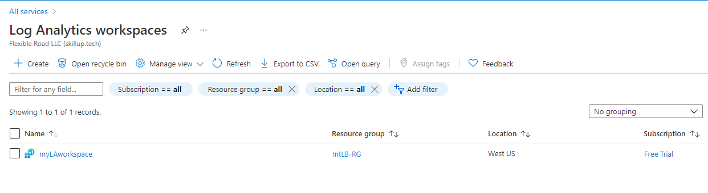

---
Exercise:
  title: M08 - Unidade 3 Monitorar um recurso do balanceador de carga usando o Azure Monitor
  module: Module 08 - Design and implement network monitoring
---

# M08-Unidade 3 Monitorar um recurso do balanceador de carga usando o Azure Monitor

## Cenário do exercício

Neste exercício, você vai criar um balanceador de carga interno para a organização fictícia Contoso Ltd. Em seguida, vai criar um workspace do Log Analytics e usar Insights do Azure Monitor para exibir informações sobre o balanceador de carga interno. Você verá a exibição de Dependência Funcional, métricas detalhadas para o recurso de balanceador de carga e informações de integridade de recursos para o balanceador de carga. Por fim, você vai definir as configurações de diagnóstico do balanceador de carga para enviar métricas para o workspace do Log Analytics que você criou.

O diagrama a seguir ilustra o ambiente que você vai implantar neste exercício.


 Neste exercício, você vai:

+ Tarefa 1: criar a rede virtual
+ Tarefa 2: Criar o balanceador de carga
+ Tarefa 3: Criar um pool de back-end
+ Tarefa 4: Criar uma investigação de integridade
+ Tarefa 5: Criar uma regra de balanceador de carga
+ Tarefa 6: criar servidores de back-end
+ Tarefa 7: adicionar VMs ao pool de endereços de back-end
+ Tarefa 8: testar o balanceador de carga
+ Tarefa 9: criar um workspace do Log Analytics
+ Tarefa 10: usar a exibição de dependência funcional
+ Tarefa 11: exibir métricas detalhadas
+ Tarefa 12: exibir a integridade do recurso
+ Tarefa 13: definir configurações de diagnóstico
+ Tarefa 14: limpar recursos

**Observação:** há uma **[simulação interativa de laboratório](https://mslabs.cloudguides.com/guides/AZ-700%20Lab%20Simulation%20-%20Monitor%20a%20load%20balancer%20resource%20using%20Azure%20Monitor)** disponível que permite que você clique neste laboratório no seu próprio ritmo. Você pode encontrar pequenas diferenças entre a simulação interativa e o laboratório hospedado, mas os principais conceitos e ideias que estão sendo demonstrados são os mesmos.

> [!Note]  
> Você pode encontrar pequenas diferenças entre as instruções e a interface do portal do Azure, mas o conceito principal é o mesmo.

### Tempo estimado: 55 minutos

## Tarefa 1: criar a rede virtual

Nesta seção, você vai criar uma rede virtual e uma sub-rede.

1. Faça logon no Portal do Azure.

1. Na página inicial do portal do Azure, pesquise **Rede Virtual** e selecione as redes virtuais em Serviços.

1. Selecione **+ Criar**.

   

1. Na guia **Noções Básicas**, use as informações na tabela abaixo para criar a rede virtual.

   | **Configuração**    | **Valor**                                           |
   | -------------- | --------------------------------------------------- |
   | Subscription   | Selecionar sua assinatura                            |
   | Resource group | Selecione **Criar**<br /><br />Nome: **IntLB-RG** |
   | Nome           | **IntLB-VNet**                                      |
   | Região         | **(EUA) Oeste dos EUA**                                    |

1. Selecione **Próximo: Endereços IP**.

1. Na guia **Endereços IP**, na caixa **Espaço de endereço IPv4**, digite **10.1.0.0/16**.

1. Em **Nome da sub-rede**, selecione **+ Adicionar sub-rede**.

1. No painel **Adicionar sub-rede**, forneça o nome de sub-rede **myBackendSubnet** e o intervalo de endereços de sub-rede de **10.1.0.0/24**.

1. Selecione **Adicionar**.

1. Selecione **Avançar: Segurança**.

1. Em **BastionHost**, selecione **Habilitar** e insira as informações da tabela a seguir.

    | **Configuração**                       | **Valor**                                              |
    | --------------------------------- | ------------------------------------------------------ |
    | Nome do bastion                      | **myBastionHost**                                      |
    | Espaço de endereço da AzureBastionSubnet  | **10.1.1.0/24**                                        |
    | Endereço IP público                 | Selecione **Criar**<br /><br />Nome: **myBastionIP** |

1. Selecione **Examinar + criar**.

1. Selecione **Criar**.

## Tarefa 2: criar o balanceador de carga

Nesta seção, você vai criar um balanceador de carga de SKU Standard interno. O motivo pelo qual estamos criando um balanceador de carga de SKU Standard aqui no exercício, em vez de um balanceamento de carga de SKU Básico, é que exercícios posteriores exigem uma versão de SKU Standard do balanceador de carga.

1. Na home page do Azure, na barra de pesquisa, insira **Balanceador de Carga**
1. Selecione **Criar Balanceador de Carga**.
1. Na guia **Noções básicas**, use as informações na tabela abaixo para criar o balanceador de carga.

   | **Configuração**           | **Valor**                |
   | --------------------- | ------------------------ |
   | Guia Básico            |                          |
   | Assinatura          | Selecionar sua assinatura |
   | Resource group        | **IntLB-RG**             |
   | Nome                  | **myIntLoadBalancer**    |
   | Região                | **(EUA) Oeste dos EUA**         |
   | SKU                   | **Standard**             |
   | Tipo                  | **Interna**             |
   | Guia Configuração do IP de front-end | + Adicionar uma configuração de IP de front-end |
   | Nome                  | **LoadBalancerFrontEnd** |
   | Rede virtual       | **IntLB-VNet**           |
   | Sub-rede                | **myBackendSubnet**      |
   | Atribuição de endereço IP | **Dinâmico**              |

1. Selecione **Examinar + criar**.

1. Selecione **Criar**.

## Tarefa 3: criar um pool de back-end

O pool de endereços de back-end contém os endereços IP de NICs virtuais conectados ao balanceador de carga.

1. Na página inicial do portal do Azure, selecione **Todos os recursos** e selecione **myIntLoadBalancer** na lista de recursos.

1. Em **Configurações**, selecione **Pools de back-end** e, em seguida, **Adicionar**.

1. Na página **Adicionar pool de back-end**, insira as informações da tabela a seguir.

   | **Configuração**     | **Valor**            |
   | --------------- | -------------------- |
   | Nome            | **myBackendPool**    |
   | Rede virtual | **IntLB-VNet**       |
   | Configuração do pool de back-end   | **NIC** |

1. Selecione **Adicionar**.

   

## Tarefa 4: criar uma investigação de integridade

O balanceador de carga monitora o status do seu aplicativo com uma investigação de integridade. A investigação de integridade adiciona ou remove VMs do balanceador de carga com base na resposta às verificações de integridade. Aqui você vai criar uma investigação de integridade e monitorar a integridade das VMs.

1. Na página **Pools de back-end** do balanceador de carga, em **Configurações**, selecione **Investigações de integridade** e **Adicionar**.

1. Na página **Adicionar investigação de integridade**, insira as informações da tabela a seguir.

   | **Configuração**         | **Valor**         |
   | ------------------- | ----------------- |
   | Nome                | **myHealthProbe** |
   | Protocolo            | **HTTP**          |
   | Porta                | **80**            |
   | Caminho                | **/**             |
   | Intervalo            | **15**            |

1. Selecione **Adicionar**.

   

## Tarefa 5: Criar uma regra de balanceador de carga

Uma regra de balanceador de carga é usada para definir como o tráfego é distribuído para as VMs. Você define a configuração de IP de front-end para o tráfego de entrada e o pool de IPs de back-end para receber o tráfego. A porta de origem e de destino são definidas na regra. Aqui, você vai criar uma regra de balanceador de carga.

1. Na página **Pools de back-end** do balanceador de carga, em **Configurações**, selecione **Regras de balanceamento de carga** e selecione **Adicionar**.

1. Na página **Adicionar regra de balanceamento de carga**, insira as informações da tabela a seguir.

   | **Configuração**            | **Valor**                |
   | ---------------------- | ------------------------ |
   | Nome                   | **myHTTPRule**           |
   | Versão IP             | **IPv4**                 |
   | Endereço IP de front-end    | **LoadBalancerFrontEnd** |
   | Protocolo               | **TCP**                  |
   | Porta                   | **80**                   |
   | Porta de back-end           | **80**                   |
   | Pool de back-end           | **myBackendPool**        |
   | Investigação de integridade           | **myHealthProbe**        |
   | Persistência de sessão    | **Nenhuma**                 |
   | Tempo limite de ociosidade (minutos) | **15**                   |
   | IP flutuante            | **Desabilitado**             |

1. Selecione **Adicionar**.

   

## Tarefa 6: criar servidores de back-end

Nesta seção, você criará três VMs para o pool de back-end do balanceador de carga, adicionará as VMs ao pool de back-end e instalará o IIS nas três VMs para testar o balanceador de carga.

1. No portal do Azure, abra a sessão **PowerShell** no painel do **Cloud Shell**.

 > **Observação:** se esta for a primeira vez que o Cloud Shell é aberto, você será solicitado a criar uma conta de armazenamento. Selecione **Criar armazenamento**.

1. Na barra de ferramentas do painel do Cloud Shell, selecione o ícone **Carregar/baixar arquivos**, no menu suspenso, selecione **Carregar** e carregue os seguintes arquivos **azuredeploy.json** e **azuredeploy.parameters.json**, um a um, da pasta de origem **F:\Allfiles\Exercises\M08** para o diretório base do Cloud Shell.

1. Implante os seguintes modelos do ARM para criar a rede virtual, as sub-redes e as VMs necessárias para este exercício:

   >**Observação**: você será solicitado a fornecer uma senha de Administrador.

   ```powershell
   $RGName = "IntLB-RG"

   New-AzResourceGroupDeployment -ResourceGroupName $RGName -TemplateFile azuredeploy.json -TemplateParameterFile azuredeploy.parameters.json
   ```
  
    > **Observação:** isso levará alguns minutos para implantar.

## Tarefa 7: Adicionar VMs ao pool de back-end

1. Na página inicial do portal do Azure, selecione **Todos os recursos** e selecione **myIntLoadBalancer** na lista de recursos.

1. Em **Configurações**, selecione **Pools de back-end** e selecione **myBackendPool**.

1. Na caixa **Associado a**, selecione **Máquinas virtuais**.

1. Em **Máquinas virtuais**, selecione **Adicionar**.

1. Marque as caixas de seleção para todas as três VMs (**myVM1**, **myVM2** e **myVM3**) e selecione **Adicionar**.

1. Na página **myBackendPool**, selecione **Salvar**.

   

## Tarefa 8: testar o balanceador de carga

Nesta seção, você criará uma VM de teste e testará o balanceador de carga.

### Criar VM de teste

> [!Note]  
> Você pode encontrar pequenas diferenças entre as instruções e a interface do portal do Azure, mas o conceito principal é o mesmo.

1. Na página inicial do Azure, usando a pesquisa global, digite **Máquinas Virtuais** e selecione máquinas virtuais em Serviços.

1. Selecione **+ Criar, + Máquina virtual**, na guia **Noções básicas**, use as informações na tabela abaixo para criar a primeira VM.

   | **Configuração**          | **Valor**                                    |
   | -------------------- | -------------------------------------------- |
   | Subscription         | Selecionar sua assinatura                     |
   | Resource group       | **IntLB-RG**                                 |
   | Nome da máquina virtual | **myTestVM**                                 |
   | Região               | **(EUA) Oeste dos EUA**                             |
   | Opções de disponibilidade | **Nenhuma redundância de infraestrutura necessária**    |
   | Imagem                | **Windows Server 2019 Datacenter – Gen 1**   |
   | Tamanho                 | **Standard_DS2_v3 – 2 vCPU, 8 GiB de memória** |
   | Nome de Usuário             | **TestUser**                                 |
   | Senha             | **Forneça uma senha segura**                |
   | Confirmar senha     | **Forneça uma senha segura**                |

1. Selecione **Avançar: Discos** e **Avançar: Rede**.

1. Na guia **Rede**, use as informações na tabela abaixo para definir as configurações de rede.

   | **Configuração**                                                  | **Valor**                     |
   | ------------------------------------------------------------ | ----------------------------- |
   | Rede virtual                                              | **IntLB-VNet**                |
   | Sub-rede                                                       | **myBackendSubnet**           |
   | IP público                                                    | Alterar para **Nenhum**            |
   | Grupo de segurança de rede da NIC                                   | **Avançado**                  |
   | Configurar um grupo de segurança de rede                             | Selecione o **myNSG** existente |
   | Balanceamento de carga                                               | **Nenhum** (ou desmarcado)       |

1. Selecione **Examinar + criar**.

1. Selecione **Criar**.

1. Aguarde até que essa última VM seja implantada antes de prosseguir com a próxima tarefa.

### Conexão à VM de teste para testar o balanceador de carga

1. Na página inicial do portal do Azure, selecione **Todos os recursos** e selecione **myIntLoadBalancer** na lista de recursos.

1. Na página **Visão geral**, anote o **Endereço IP Privado** ou copie-o para a área de transferência. Observação: talvez seja necessário selecionar **Ver mais** para ver o **Endereço IP privado**.

1. Clique em **Página Inicial** e, na página inicial do portal do Azure, selecione **Todos os recursos** e clique na máquina virtual **myTestVM** que você acabou de criar.

1. Na página **Visão Geral**, selecione **Conectar** e **Bastion**.

1. Selecione **Usar Bastion**.

1. Na caixa **Nome de usuário**, digite **TestUser** e, na caixa **Senha**, digite a senha fornecida durante a implantação e selecione **Conectar**.

1. A janela **myTestVM** será aberta em outra guia do navegador.

1. Se um painel **Redes** for exibido, selecione **Sim**.

1. Selecione o ícone **Internet Explorer** na barra de tarefas para abrir o navegador da Web.

1. Selecione **OK** na caixa de diálogo **Configurar o Internet Explorer 11**.

1. Insira (ou cole) o **Endereço IP privado** (por exemplo, 10.1.0.4) da etapa anterior na barra de endereços do navegador e pressione Enter.

1. A home page da Web padrão do servidor Web do IIS é exibida na janela do navegador. Uma das três máquinas virtuais no pool de back-end responderá.
    

1. Se você selecionar o botão Atualizar no navegador algumas vezes, verá que a resposta vem aleatoriamente das diferentes VMs no pool de back-end do balanceador de carga interno.

    

## Tarefa 9: criar um workspace do Log Analytics

1. Na página inicial do portal do Azure, selecione **Todos os serviços**, depois, na caixa de pesquisa na parte superior da página, insira **Log Analytics** e selecione **Workspaces do Log Analytics** na lista filtrada.

   

1. Selecione **Criar**.

1. Na página **Criar workspace do Log Analytics**, na guia **Noções básicas**, use as informações na tabela abaixo para criar o workspace.

   | **Configuração**    | **Valor**                |
   | -------------- | ------------------------ |
   | Subscription   | Selecionar sua assinatura |
   | Resource group | **IntLB-RG**             |
   | Nome           | **myLAworkspace**        |
   | Região         | **Oeste dos EUA**              |

1. Selecione **Examinar + Criar** e **Criar**.

   

## Tarefa 10: usar a exibição de dependência funcional

1. Na página inicial do portal do Azure, selecione **Todos os recursos** e, na lista recursos, selecione **myIntLoadBalancer**.

   

1. Em **Monitoramento**, selecione **Insights**.

1. No canto superior direito da página, selecione **X** para fechar o painel de **Métricas** por enquanto. Você vai abri-lo novamente em breve.

1. Essa exibição de página é conhecida como exibição de dependência funcional e, nela, você obtém um diagrama interativo útil que ilustra a topologia do recurso de rede selecionado, neste caso, um balanceador de carga. Para Standard Load Balancers, os recursos do conjunto de back-end são codificados por cores com o status de investigação de integridade, indicando a disponibilidade atual do conjunto de back-end para atender ao tráfego.

1. Use os botões **Ampliar (+)** e **Reduzir (-)** no canto inferior direito da página para ampliar e reduzir o diagrama de topologia (como alternativa, você pode usar a roda do mouse se tiver uma). Você também pode arrastar o diagrama de topologia pela página para movê-lo.

1. Focalize o componente **LoadBalancerFrontEnd** com o cursor do mouse no diagrama e focalize o componente **myBackendPool**.

1. Observe que você pode usar os links nessas janelas pop-up para exibir informações sobre esses componentes do balanceador de carga e abrir as respectivas folhas do portal do Azure.

1. Para baixar uma cópia do arquivo .SVG do diagrama de topologia, selecione **Baixar topologia** e salve o arquivo na pasta **Downloads**.

1. No canto superior direito, selecione **Exibir métricas** para reabrir o painel de métricas no lado direito da tela.
    

1. O painel Métricas apresenta uma exibição rápida de algumas das principais métricas para esse recurso de balanceador de carga na forma de gráficos de barras e de linhas.

    

## Tarefa 11: exibir métricas detalhadas

1. Para exibir métricas mais abrangentes para esse recurso de rede, selecione **Exibir métricas detalhadas**.
   

1. Isso abre uma página grande de **Métricas** completa na plataforma de Insights de Rede do Azure. A primeira guia que você vê é **Visão geral**, que mostra o status de disponibilidade do balanceador de carga e a taxa de transferência de dados geral e a disponibilidade do front-end e do back-end para cada um dos IPs de front-end anexados ao Load Balancer. Essas métricas indicam se o IP de front-end está respondendo e se as instâncias de computação em seu conjunto de back-end são individualmente responsivas a conexões de entrada.
   

1. Selecione a guia **Disponibilidade de Frontend &amp; Backend** e role para baixo na página para ver os gráficos de status de investigação de integridade. Se você vir **valores inferiores a 100** para esses itens, isso indicará uma interrupção de algum tipo nesses recursos.
   

1. Selecione a guia **Taxa de Transferência de Dados** e role para baixo na página para ver os outros gráficos de taxa de transferência de dados.

1. Focalize alguns dos pontos de dados nos gráficos e você verá que os valores são alterados para mostrar o valor exato nesse ponto no tempo.
   

1. Selecione a guia **Distribuição de Fluxo** e role para baixo na página para ver os gráficos na seção **Criação de Fluxo da VM e Tráfego de Rede**.

   

## Tarefa 12: exibir a integridade do recurso

1. Para exibir a integridade de seus recursos do Balanceador de Cargas, na home page do portal do Azure, selecione **Todos os serviços** e selecione **Monitorar**.

1. Na página **Monitor&gt;Visão Geral**, no menu à esquerda, selecione **Integridade do Serviço**.

1. Na página **Integridade do Serviço&gt;Problemas de Serviço**, no menu à esquerda, selecione **Resource Health**.

1. Na página **Integridade do Serviço&gt;Integridade do recurso**, na lista suspensa **Tipo de recurso**, role para baixo na lista e selecione **Balanceador de carga**.

   

1. Então selecione o nome do balanceador de carga na lista.

1. A página **Integridade do recurso** identificará os principais problemas de disponibilidade com o recurso do balanceador de carga. Se houver eventos na seção **Histórico de Integridade**, você poderá expandir o evento de integridade para ver mais detalhes sobre o evento. Você pode até mesmo salvar os detalhes sobre o evento como um arquivo PDF para revisão posterior e para relatórios.

   

## Tarefa 13: definir configurações de diagnóstico

1. Na página inicial do portal do Azure, selecione **Grupos de recursos** e selecione o grupo de recursos **IntLB-RG** na lista.

1. Na página **IntLB-RG**, selecione o nome do recurso de balanceador de carga **myIntLoadBalancer** na lista de recursos.

1. Em **Monitoramento**, selecione **Configurações de diagnóstico** e, em seguida, selecione **Adicionar configuração de diagnóstico**.

   

1. Na página **Configuração de diagnóstico**, na caixa Nome, digite **myLBDiagnostics**.

1. Marque as caixas de seleção **AllMetrics** e **Enviar para workspace do Log Analytics**.

1. Selecione sua assinatura na lista e escolha **myLAworkspace (westus)** na lista suspensa do workspace.

1. Selecione **Salvar**.

   

## Tarefa 14: limpar recursos

   >**Observação**: lembre-se de remover todos os recursos do Azure recém-criados que você não usa mais. Remover recursos não utilizados garante que você não veja encargos inesperados.

1. No portal do Azure, abra a sessão **PowerShell** no painel do **Cloud Shell**.

1. Exclua todos os grupos de recursos criados em todos os laboratórios deste módulo executando o seguinte comando:

   ```powershell
   Remove-AzResourceGroup -Name 'IntLB-RG' -Force -AsJob
   ```

    >**Observação**: o comando é executado de modo assíncrono (conforme determinado pelo parâmetro -AsJob), portanto, embora você possa executar outro comando do PowerShell imediatamente depois na mesma sessão do PowerShell, levará alguns minutos antes de os grupos de recursos serem de fato removidos.
