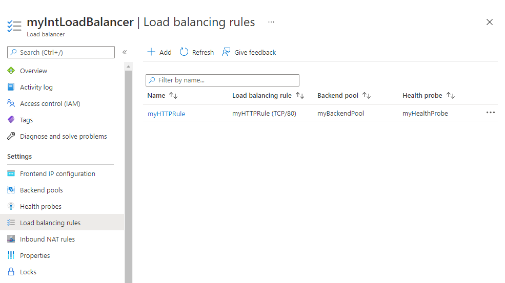
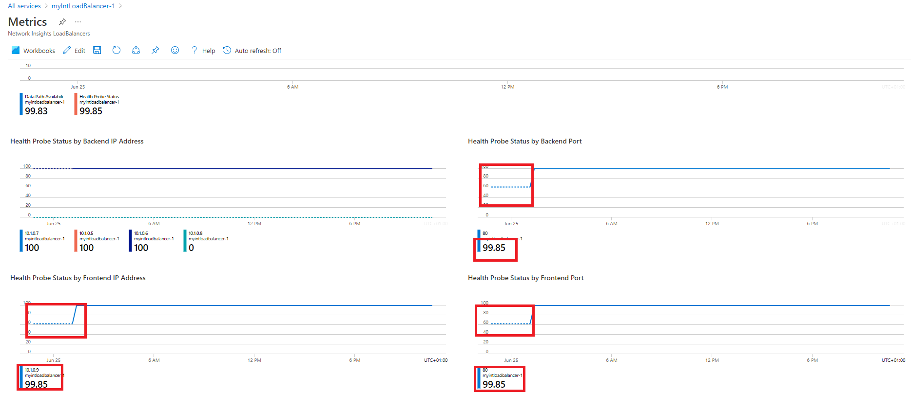
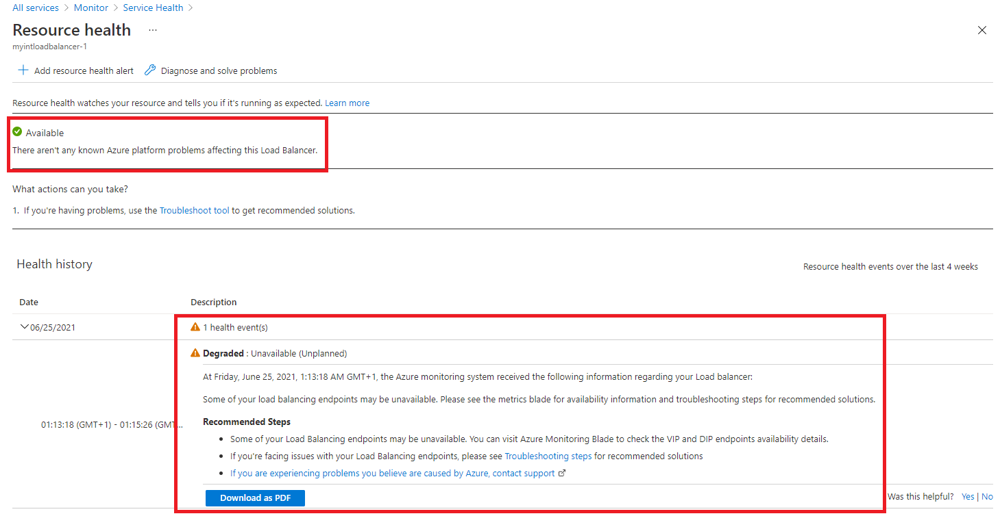

---
Exercise:
  title: M08 - Unidade 3 Monitorar um recurso do balanceador de carga usando o Azure Monitor
  module: Module 08 - Design and implement network monitoring
---

# M08-Unidade 3 Monitorar um recurso do balanceador de carga usando o Azure Monitor

## Cenário do exercício

Neste exercício, você vai criar um balanceador de carga interno para a organização fictícia Contoso Ltd. Em seguida, vai criar um workspace do Log Analytics e usar Insights do Azure Monitor para exibir informações sobre o balanceador de carga interno. Você verá a exibição de Dependência Funcional, métricas detalhadas para o recurso de balanceador de carga e informações de integridade de recursos para o balanceador de carga. Por fim, você vai definir as configurações de diagnóstico do balanceador de carga para enviar métricas para o workspace do Log Analytics que você criou.

O diagrama a seguir ilustra o ambiente que você vai implantar neste exercício.


### Habilidades de trabalho

 Neste exercício, você vai:

+ Tarefa 1: criar a rede virtual
+ Tarefa 2: Criar o balanceador de carga
+ Tarefa 3: Criar um pool de back-end
+ Tarefa 4: Criar uma investigação de integridade
+ Tarefa 5: Criar uma regra de balanceador de carga
+ Tarefa 6: criar servidores de back-end
+ Tarefa 7: adicionar VMs ao pool de endereços de back-end
+ Tarefa 8: testar o balanceador de carga
+ Tarefa 9: criar um workspace do Log Analytics
+ Tarefa 10: usar a exibição de dependência funcional
+ Tarefa 11: exibir métricas detalhadas
+ Tarefa 12: exibir a integridade do recurso
+ Tarefa 13: definir configurações de diagnóstico

### Simulações interativas de laboratório

>**Observação**: as simulações de laboratório fornecidas anteriormente foram desativadas.

### Tempo estimado: 55 minutos

## Tarefa 1: criar a rede virtual

Nesta seção, você vai criar uma rede virtual e uma sub-rede.

1. Faça logon no Portal do Azure.

1. No portal do Azure, pesquise e selecione as **Redes Virtuais**.

1. Selecione **+ Criar**.

   

1. Na guia **Noções Básicas**, use as informações na tabela abaixo para criar a rede virtual.

   | **Configuração**    | **Valor**                                           |
   | -------------- | --------------------------------------------------- |
   | Assinatura   | Selecionar sua assinatura                            |
   | Resource group | Selecione **Criar**<br /><br />Nome: **IntLB-RG** |
   | Nome           | **IntLB-VNet**                                      |
   | Região         | **(EUA) Oeste dos EUA**                                    |

1. Selecione **Avançar: Segurança**.

1. Em **BastionHost**, selecione **Habilitar** e insira as informações da tabela a seguir.

    | **Configuração**                       | **Valor**                                              |
    | --------------------------------- | ------------------------------------------------------ |
    | Nome do bastion                      | **myBastionHost**                                      |
    | Endereço IP público                 | Selecione **Criar**<br /><br />Nome: **myBastionIP** |

1. Selecione **Próximo: Endereços IP**.

1. **Exclua o endereço IP** e, em seguida, o **espaço de endereços IPv4**. Insira **10.1.0.0/16.**

1. Edite o **AzureBastionSubnet** e altere o **Endereço inicial** para **10.1.1.0**. **Salvar** a alteração. 

1. Selecione **+ Adicionar sub-rede**, o nome da sub-rede é `myBackendSubnet` e o intervalo de endereços da sub-rede é `10.1.0.0/24`. Selecione **Adicionar**.

1. Agora você deve ter uma rede virtual com duas sub-redes. 

1. Selecione **Examinar + criar**.

1. Selecione **Criar**.

## Tarefa 2: criar o balanceador de carga

Nesta seção, você vai criar um balanceador de carga de SKU Standard interno. O motivo pelo qual estamos criando um balanceador de carga de SKU Standard aqui no exercício, em vez de um balanceamento de carga de SKU Básico, é que exercícios posteriores exigem uma versão de SKU Standard do balanceador de carga.

1. No portal do Azure, pesquise e selecione o **Balanceadores de Carga**

1. Selecione **Criar** e, em seguida **, Standard Load Balancer**.

1. Na guia **Noções básicas**, use as informações na tabela abaixo para criar o balanceador de carga.

   | **Configuração**           | **Valor**                |
   | --------------------- | ------------------------ |
   | Guia Básico            |                          |
   | Assinatura          | Selecionar sua assinatura |
   | Resource group        | **IntLB-RG**             |
   | Nome                  | **myIntLoadBalancer**    |
   | Região                | **(EUA) Oeste dos EUA**         |
   | SKU                   | **Standard**             |
   | Tipo                  | **Interna**             |

1. Mova para a **Guia de configuração de IP de front-end** e selecione **+ Adicionar uma configuração de IP de front-end**.

   | **Configuração**            | **Valor**            |
   | Nome                  | `LoadBalancerFrontEnd` |
   | Rede virtual       | **IntLB-VNet**           |
   | Sub-rede                | **myBackendSubnet**      |
   | Atribuição de endereço IP | **Dinâmica**              |

1. **Salve** as alterações e, em seguida, selecione **Examinar + criar**.

1. Após uma validação bem-sucedida, selecione **Criar**.

## Tarefa 3: criar um pool de back-end

O pool de endereços de back-end contém os endereços IP de NICs virtuais conectados ao balanceador de carga.

1. No portal do Azure, pesquise e selecione o recurso **myIntLoadBalancer**.

1. Em **Configurações**, selecione **Pools de back-end** e, em seguida, **Adicionar**.

1. Na página **Adicionar pool de back-end**, insira as informações da tabela a seguir.

   | **Configuração**     | **Valor**            |
   | --------------- | -------------------- |
   | Nome            | **myBackendPool**    |
   | Rede virtual | IntLB-VNet    |
   | Configuração do pool de back-end   | **NIC** |

1. Selecione **Salvar**.

   

## Tarefa 4: criar uma investigação de integridade

O balanceador de carga monitora o status do seu aplicativo com uma investigação de integridade. A investigação de integridade adiciona ou remove VMs do balanceador de carga com base na resposta às verificações de integridade. Aqui você vai criar uma investigação de integridade e monitorar a integridade das VMs.

1. Para o recurso do balanceador de carga, selecione **Configurações**, **Investigações de integridade** e, em seguida, **Adicionar**.

1. Na página **Adicionar investigação de integridade**, insira as informações da tabela a seguir.

   | **Configuração**         | **Valor**         |
   | ------------------- | ----------------- |
   | Nome                | `myHealthProbe` |
   | Protocolo            | **HTTP**          |
   | Porta                | **80**            |
   | Caminho                | **/**             |
   | Intervalo            | **15**            |

1. Selecione **Salvar**.

   

## Tarefa 5: Criar uma regra de balanceador de carga

Uma regra de balanceador de carga é usada para definir como o tráfego é distribuído para as VMs. Você define a configuração de IP de front-end para o tráfego de entrada e o pool de IPs de back-end para receber o tráfego. A porta de origem e de destino são definidas na regra. Aqui, você vai criar uma regra de balanceador de carga.

1. Para o recurso do balanceador de carga, selecione **Configurações**, **Regras de balanceamento de carga** e, em seguida, **Adicionar**.

   | **Configuração**            | **Valor**                |
   | ---------------------- | ------------------------ |
   | Nome                   | **myHTTPRule**           |
   | Versão IP             | **IPv4**                 |
   | Endereço IP de front-end    | **LoadBalancerFrontEnd** |
   | Pool de back-end           | **myBackendPool**        |
   | Protocolo               | **TCP**                  |
   | Porta                   | **80**                   |
   | Porta de back-end           | **80**                   |
   | Investigação de integridade           | **myHealthProbe**        |
   | Persistência de sessão    | **Nenhuma**                 |
   | Tempo limite de ociosidade (minutos) | **15**                   |
   | IP flutuante            | **Desabilitada**             |

   

## Tarefa 6: criar servidores de back-end

Nesta seção, você criará três VMs para o pool de back-end do balanceador de carga, adicionará as VMs ao pool de back-end e instalará o IIS nas três VMs para testar o balanceador de carga.

1. No portal do Azure, clique no ícone do Cloud Shell (canto superior direito). Se necessário, configure o shell.  
    + Selecione **PowerShell**.
    + Selecione **Nenhuma Conta de Armazenamento necessária** e sua **Assinatura** e, em seguida, selecione **Aplicar**.
    + Aguarde até que o terminal seja criado e um prompt seja exibido. 

1. Na barra de ferramentas do painel do Cloud Shell, selecione o ícone **Gerenciar arquivos**, no menu suspenso, selecione **Upload** e faça o upload dos seguintes arquivos **azuredeploy.json** e **azuredeploy.parameters.json** no diretório base do Cloud Shell.

    > **Observação:** se você estiver trabalhando em sua própria assinatura, os [arquivos de modelo](https://github.com/MicrosoftLearning/AZ-700-Designing-and-Implementing-Microsoft-Azure-Networking-Solutions/tree/master/Allfiles/Exercises) estarão disponíveis no repositório do GitHub Lab.

1. Implante os seguintes modelos do ARM para criar a rede virtual, as sub-redes e as VMs necessárias para este exercício. T**Observação**: Você será solicitado a fornecer uma senha de Administrador.

   ```powershell
   $RGName = "IntLB-RG"
   New-AzResourceGroupDeployment -ResourceGroupName $RGName -TemplateFile azuredeploy.json -TemplateParameterFile azuredeploy.parameters.json
   ```
1. A implantação pode levar vários minutos. Você pode verificar o progresso no portal atualizando a página de recursos da máquina virtual.   

## Tarefa 7: Adicionar VMs ao pool de back-end

1. No portal do Azure, pesquise e selecione o recurso **myIntLoadBalancer**.

1. Em **Configurações**, selecione **Pools de back-end** e selecione **myBackendPool**.

1. Na seção **Configurações de IP**, selecione **Adicionar**.

1. Selecione todas as máquinas virtuais exibidas e, em seguida, **Adicionar**.

1. Marque as caixas de seleção para **myVM1** e **myVM2** e, em seguida, selecione **Adicionar**.

1. Na página **myBackendPool**, selecione **Salvar**.

## Tarefa 8: testar o balanceador de carga

Nesta seção, você criará uma VM de teste e testará o balanceador de carga.

### Conexão à VM de teste (VM3) para testar o balanceador de carga

1. No portal do Azure, pesquise e selecione o recurso **myIntLoadBalancer**.

1. Na página **Visão geral**, anote o **Endereço IP Privado** ou copie-o para a área de transferência. Observação: talvez seja necessário selecionar **Ver mais** para ver o **Endereço IP privado**.

1. Pesquise e selecione **myVM3**. 

1. Selecione **Conectar** e, em seguida, **Conectar via Bastion**.

1. Na caixa **Nome de usuário**, digite **TestUser** e, na caixa **Senha**, digite a senha fornecida durante a implantação e selecione **Conectar**.

1. A janela **myTestVM** será aberta em outra guia do navegador.

1. Se um painel **Redes** for exibido, selecione **Sim**.

1. Selecione o ícone **Internet Explorer** na barra de tarefas para abrir o navegador da Web.

1. Selecione **OK** na caixa de diálogo **Configurar o Internet Explorer 11**.

1. Insira (ou cole) o endereço IP do balanceador de carga (por exemplo, 10.1.0.4).

1. Uma das duas máquinas virtuais de servidores de back-end (myVM1 ou myVM2) responderá. Continue atualizando a página e observe que a resposta vem aleatoriamente dos servidores de back-end. 

## Tarefa 9: criar um workspace do Log Analytics

1. No portal do Azure, pesquise e selecione o recurso **Workspaces do Log Analytics**.
   
1. Selecione **Criar**.

1. Na página **Criar workspace do Log Analytics**, na guia **Noções básicas**, use as informações na tabela abaixo para criar o workspace.

   | **Configuração**    | **Valor**                |
   | -------------- | ------------------------ |
   | Assinatura   | Selecionar sua assinatura |
   | Resource group | **IntLB-RG**             |
   | Nome           | **myLAworkspace**        |
   | Região         | **Oeste dos EUA**              |

1. Selecione **Examinar + Criar** e **Criar**.

## Tarefa 10: usar a exibição de dependência funcional

1. No portal do Azure, pesquise e selecione o recurso **myIntLoadBalancer**. 

   

1. Em **Monitoramento**, selecione **Insights**.

1. O painel Métricas apresenta uma exibição rápida de algumas das principais métricas para esse recurso de balanceador de carga na forma de gráficos de barras e de linhas.

    

## Tarefa 11: exibir métricas detalhadas

1. Para exibir métricas mais abrangentes para esse recurso de rede, selecione **Exibir métricas detalhadas**.
   

1. Isso abre uma página grande de **Métricas** completa na plataforma de Insights de Rede do Azure. A primeira guia que você vê é **Visão geral**, que mostra o status de disponibilidade do balanceador de carga e a taxa de transferência de dados geral e a disponibilidade do front-end e do back-end para cada um dos IPs de front-end anexados ao Load Balancer. Essas métricas indicam se o IP de front-end está respondendo e se as instâncias de computação em seu conjunto de back-end são individualmente responsivas a conexões de entrada.
   

1. Selecione a guia **Disponibilidade de Frontend &amp; Backend** e role para baixo na página para ver os gráficos de status de investigação de integridade. Se você vir **valores inferiores a 100** para esses itens, isso indicará uma interrupção de algum tipo nesses recursos.
   

1. Selecione a guia **Taxa de Transferência de Dados** e role para baixo na página para ver os outros gráficos de taxa de transferência de dados.

1. Focalize alguns dos pontos de dados nos gráficos e você verá que os valores são alterados para mostrar o valor exato nesse ponto no tempo.
   

1. Selecione a guia **Distribuição de Fluxo** e role para baixo na página para ver os gráficos na seção **Criação de Fluxo da VM e Tráfego de Rede**.

   

## Tarefa 12: exibir a integridade do recurso

1. Para exibir a integridade de seus recursos do Balanceador de Cargas, na home page do portal do Azure, selecione **Todos os serviços** e selecione **Monitorar**.

1. Na página **Monitor&gt;Visão Geral**, no menu à esquerda, selecione **Integridade do Serviço**.

1. Na página **Integridade do Serviço&gt;Problemas de Serviço**, no menu à esquerda, selecione **Resource Health**.

1. Na página **Integridade do Serviço&gt;Integridade do recurso**, na lista suspensa **Tipo de recurso**, role para baixo na lista e selecione **Balanceador de carga**.

   

1. Então selecione o nome do balanceador de carga na lista.

1. A página **Integridade do recurso** identificará os principais problemas de disponibilidade com o recurso do balanceador de carga. Se houver eventos na seção **Histórico de Integridade**, você poderá expandir o evento de integridade para ver mais detalhes sobre o evento. Você pode até mesmo salvar os detalhes sobre o evento como um arquivo PDF para revisão posterior e para relatórios.

   

## Tarefa 13: definir configurações de diagnóstico

1. Na página inicial do portal do Azure, selecione **Grupos de recursos** e selecione o grupo de recursos **IntLB-RG** na lista.

1. Na página **IntLB-RG**, selecione o nome do recurso de balanceador de carga **myIntLoadBalancer** na lista de recursos.

1. Em **Monitoramento**, selecione **Configurações de diagnóstico** e, em seguida, selecione **Adicionar configuração de diagnóstico**.

   

1. Na página **Configuração de diagnóstico**, na caixa Nome, digite **myLBDiagnostics**.

1. Marque as caixas de seleção **AllMetrics** e **Enviar para workspace do Log Analytics**.

1. Selecione sua assinatura na lista e escolha **myLAworkspace (westus)** na lista suspensa do workspace.

1. Selecione **Salvar**.

   

## Limpar os recursos

>**Observação**: lembre-se de remover todos os recursos recém-criados do Azure que você não usa mais. Remover recursos não utilizados garante que você não veja encargos inesperados.

1. No portal do Azure, abra a sessão **PowerShell** no painel do **Cloud Shell**.

1. Exclua todos os grupos de recursos criados em todos os laboratórios deste módulo executando o seguinte comando:

   ```powershell
   Remove-AzResourceGroup -Name 'IntLB-RG' -Force -AsJob
   ```

>**Observação**: o comando é executado de maneira assíncrona (conforme determinado pelo parâmetro -AsJob), portanto, embora você possa executar outro comando do PowerShell imediatamente após na mesma sessão do PowerShell, levará alguns minutos antes dos grupos de recursos serem de fato removidos.
    
## Estender seu aprendizado com o Copilot

O Copilot pode ajudar você a aprender a usar as ferramentas de script do Azure. O Copilot também pode ajudar em áreas não cobertas no laboratório ou onde você precisar de mais informações. Abra um navegador do Edge e escolha Copilot (canto superior direito) ou navegue até *copilot.microsoft.com*. Reserve alguns minutos para experimentar essas solicitações.
+ Resuma as ferramentas do Azure disponíveis para monitorar redes virtuais.
+ Quais ferramentas de monitoramento do Observador de Rede do Azure estão disponíveis?

## Saiba mais com treinamento individual

+ [Introdução ao Azure Monitor](https://learn.microsoft.com/training/modules/intro-to-azure-monitor/). Neste módulo, você aprenderá a usar o Azure Monitor para fornecer insights sobre o desempenho e as operações de recursos do Azure.
+ [Monitorar e solucionar problemas de ponta a ponta na infraestrutura de rede do Azure usando ferramentas de monitoramento de rede](https://learn.microsoft.com/training/modules/troubleshoot-azure-network-infrastructure/). Neste módulo, você aprenderá a usar as ferramentas, os diagnósticos e os logs do Observador de Rede do Azure para ajudar a localizar e corrigir problemas de rede na infraestrutura do Microsoft Azure.

## Principais aspectos a serem lembrados

Parabéns por concluir o laboratório. Aqui estão as principais lições desse laboratório. 

+ O Azure Monitor fornece recursos e ferramentas para coletar, gerenciar e analisar dados de TI de todos os seus recursos do Azure, de outras nuvens e locais.
+ As métricas são medidas quantitativas que mostram instantâneos do desempenho do aplicativo ou do recurso. Normalmente, as métricas são valores numéricos que você pode medir ao longo do tempo.
+ Os logs são registros textuais de eventos, ações e mensagens que ocorrem em um recurso ou aplicativo. 
+ Os Insights, visualizações e painéis do Azure Monitor podem consumir e transmitir informações de monitoramento sobre seus aplicativos.
+ Os alertas o notificam sobre condições críticas e podem executar ações corretivas. As regras de alerta podem ser baseadas em dados de métrica ou de log.+ 
    
